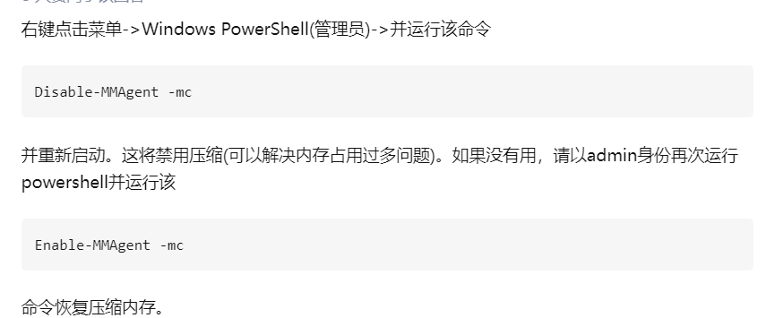

# **travel debug**

## 6.16

## 浏览器默认事件 被动，如执行则会报错


触发或者去修改了 浏览器已设置的被动事件， 会导致报错

> 该错误是由浏览器的事件监听机制引起的。在现代浏览器中，为了提高性能，浏览器默认将某些事件标记为被动（passive），以避免阻塞页面滚动等操作。
>
> 当一个被动事件监听器中调用了`event.preventDefault()`方法时，浏览器会抛出该错误，因为被动事件监听器不允许阻止默认行为。
>
> 解决这个问题的方法是使用`{ passive: false }`选项将事件监听器标记为非被动，以允许阻止默认行为。
>
> 例如，在添加事件监听器时，可以像这样使用`{ passive: false }`选项：
>
> ```javascript
> element.addEventListener('touchstart', handleTouchStart, { passive: false });
> ```
>
> 请注意，该错误可能会在浏览器的开发者工具中显示，并且通常不会影响网页的正常功能。它只是一个警告，提醒开发者在事件监听器中不要调用`event.preventDefault()`。
>
> 如果你不是开发网页，而是在浏览网页时遇到了该错误，请尝试使用最新版本的浏览器，并确保你的浏览器和相关插件都是最新的，以获得最佳的性能和兼容性。

Vue.config.productionTip = false fastClick.attach(document.body)

这个错误是在main.js添加这些代码后报错，请告诉我如何修改

>
>
>错误提示中提到无法在被动事件监听器内部调用`preventDefault()`，而`fastclick`库的工作原理是通过覆盖默认的点击事件来消除移动设备上的点击延迟。这导致在某些情况下，浏览器将事件标记为被动的，从而无法在事件处理程序中调用`preventDefault()`。
>
>为了解决这个问题，你可以尝试使用以下方法进行修改：
>
>1. 首先，确保你已经安装了`fastclick`库。可以通过运行以下命令安装：
>   ```
>   npm install fastclick
>   ```
>
>2. 打开你的`main.js`文件，并引入`fastclick`库：
>   ```javascript
>   import FastClick from 'fastclick'
>   ```
>
>3. 在`Vue`实例创建之前，使用`FastClick`库的`attach`方法来绑定到文档的`body`元素上。将以下代码添加到`main.js`文件的顶部：
>   ```javascript
>   document.addEventListener('DOMContentLoaded', function() {
>     FastClick.attach(document.body);
>   }, false);
>   ```
>
>4. 最后，确保在使用`Vue.config.productionTip = false`之前添加`fastclick`的引入和绑定代码。
>
>修改完成后，保存文件并重新运行你的Vue项目，应该能够解决该错误。


点入点击的默认行为，浏览器假如执行3ms才执行， 我们通过quickclick的作用将其重新设置为无延迟，这就触发了被动事件监听器，浏览器检测我们正在修改行为，所以我们的行为会被阻止是吗


> 是的，你的理解基本上是正确的。
>
> 浏览器在执行事件监听器时，会根据事件类型和执行环境来判断是否将监听器标记为被动监听器。被动监听器的特点是不能调用`preventDefault()`方法来阻止事件的默认行为，这是为了提高页面的性能和滚动的平滑度。
>
> 当你使用FastClick库或其他类似的库来消除移动设备上的点击延迟时，它们会在点击事件上调用`preventDefault()`来阻止默认行为，以达到无延迟的效果。然而，由于浏览器检测到你正在在被动监听器中调用`preventDefault()`，它会抛出一个警告，并阻止你的行为生效。
>
> 为了解决这个问题，你可以在`DOMContentLoaded`事件中使用`FastClick.attach()`来绑定FastClick库，这样它就会绕过被动事件监听器的限制。通过将FastClick绑定到`DOMContentLoaded`事件，它会在DOM加载完成后立即生效，而不会触发被动事件监听器。
>
> ```javascript
> document.addEventListener('DOMContentLoaded', function() {
>   FastClick.attach(document.body);
> }, false);
> ```
>
> 这样就可以确保FastClick库能够正常工作，消除移动设备上的点击延迟，并避免被浏览器的被动事件监听器阻止。


## preventDefault()就是指阻止默认行为， 并将默认行为修改， 浏览器的阻止则是表示我的默认行为不能被修改

> 几乎正确。`preventDefault()`方法用于阻止事件的默认行为，比如在点击链接时阻止浏览器打开链接，或者在提交表单时阻止页面刷新。
>
> 当调用`preventDefault()`时，你实际上是告诉浏览器不要执行事件的默认行为。然而，浏览器对于某些事件，如滚动事件、触摸事件等，会采用被动事件监听器的方式进行处理，以提高页面性能。被动事件监听器不允许在事件处理过程中调用`preventDefault()`方法，因为这可能导致滚动的不流畅或性能问题。
>
> 当你在被动事件监听器中调用`preventDefault()`时，浏览器会发出警告，因为它认为你在违反被动事件监听器的限制。浏览器可能会忽略你的`preventDefault()`调用，或者采取其他措施来保持页面的流畅性。
>
> 因此，你的理解基本是正确的。`preventDefault()`用于阻止默认行为，而浏览器的阻止是指它会限制在被动事件监听器中调用`preventDefault()`的效果，以保持页面的性能和流畅度。


## preventDefault()的作用

> `preventDefault()`是一个事件对象的方法，用于阻止事件的默认行为发生。默认行为指的是浏览器在特定事件发生时默认执行的操作，比如点击链接跳转页面、提交表单、按下回车键触发提交等。
>
> 通过调用`preventDefault()`方法，你可以告诉浏览器不要执行事件的默认行为，而是按照你的代码逻辑来处理事件。这可以用于在事件处理程序中自定义行为，阻止不必要的页面跳转或表单提交，或者修改事件的默认行为以满足特定需求。
>
> 例如，在处理点击事件时，你可以使用`preventDefault()`来阻止链接的跳转：
>
> ```javascript
> document.querySelector('a').addEventListener('click', function(event) {
>   event.preventDefault(); // 阻止链接跳转
>   // 执行自定义的逻辑
> });
> ```
>
> 另外，需要注意的是，并非所有的事件都可以通过`preventDefault()`来阻止默认行为，这取决于具体的事件类型和浏览器的实现。在某些情况下，浏览器可能对某些默认行为做了限制或禁止了阻止。


preventDefault()就是指阻止默认行为， 并将默认行为修改， 浏览器的阻止则是表示我的默认行为不能被修改

> 几乎正确。`preventDefault()`方法用于阻止事件的默认行为，比如在点击链接时阻止浏览器打开链接，或者在提交表单时阻止页面刷新。
>
> 当调用`preventDefault()`时，你实际上是告诉浏览器不要执行事件的默认行为。然而，浏览器对于某些事件，如滚动事件、触摸事件等，会采用被动事件监听器的方式进行处理，以提高页面性能。被动事件监听器不允许在事件处理过程中调用`preventDefault()`方法，因为这可能导致滚动的不流畅或性能问题。
>
> 当你在被动事件监听器中调用`preventDefault()`时，浏览器会发出警告，因为它认为你在违反被动事件监听器的限制。浏览器可能会忽略你的`preventDefault()`调用，或者采取其他措施来保持页面的流畅性。
>
> 因此，你的理解基本是正确的。`preventDefault()`用于阻止默认行为，而浏览器的阻止是指它会限制在被动事件监听器中调用`preventDefault()`的效果，以保持页面的性能和流畅度。


## 


### tip: 命令行快速删除 整个依赖包


> 当使用 `rmdir` 命令以管理员权限在 Windows 命令行中删除目录时，可以使用以下参数：
>
> - `/s`：指定删除目录时递归删除其所有子目录和文件。它会删除目录及其内容。
> - `/q`：指定静默模式，不会提示确认删除每个文件和目录的操作。
>
> 因此，当您运行 `rmdir /s /q node_modules` 命令时，它会在不询问每个文件和目录的情况下，递归删除 `node_modules` 目录及其所有子目录和文件。
>
> 请注意，此命令是无法恢复的操作，请谨慎使用。确保您在正确的路径下运行命令，并确保您希望删除的目录是正确的。


## vscode不能自动识别vue文件

> VS Code 默认情况下会根据文件的扩展名来自动识别文件的语言模式。对于 Vue 文件（`.vue`），它是一种包含 HTML、CSS 和 JavaScript 的组合文件，因此语言模式需要进行特殊处理。
>
> 如果 VS Code 未能正确地自动识别 Vue 文件的语言模式，可以尝试以下解决方法：
>
> 1. 安装 "Vetur" 扩展：Vetur 是一个针对 Vue 开发的扩展，它提供了对 Vue 文件的语法高亮、代码片段、错误检查等功能，同时还支持 Vue 单文件组件的编辑和调试。通过安装并启用 Vetur 扩展，VS Code 将能够更好地识别和支持 Vue 文件。
>
> 2. 设置文件关联：如果您已经安装了 Vetur 扩展但仍然无法自动识别 Vue 文件的语言模式，可以尝试手动设置文件关联。在 VS Code 的设置（Settings）中搜索 "File Associations"，找到 "Files: Associations" 设置，并点击 "Edit in settings.json" 链接。然后在 `settings.json` 文件中，添加以下内容：
>
> ```json
> "files.associations": {
>     "*.vue": "vue"
> }
> ```
>
> 这将告诉 VS Code 将所有扩展名为 `.vue` 的文件关联到 "vue" 语言模式，从而使其能够正确识别和处理 Vue 文件的内容。
>
> 3. 检查文件头部标签：确保您的 Vue 文件的头部有正确的标签指定语言模式。通常，Vue 文件的头部会包含以下标签：
>
> ```html
> <template>
>   <!-- HTML 模板内容 -->
> </template>
> 
> <script>
>   // JavaScript 代码
> </script>
> 
> <style>
>   /* CSS 样式 */
> </style>
> ```
>
> 请确保这些标签正确地出现在 Vue 文件的头部，并使用正确的语言模式（`html`、`javascript`、`css`）。
>
> 通过以上方法，您应该能够解决 VS Code 无法自动识别 Vue 文件的语言模式的问题，并获得适当的语法高亮、代码片段和错误检查等功能。


## Vetur提供了自动检验错误

> 是的，Vetur 提供了自动检验错误的能力。Vetur 是一个专门为 Vue.js 开发提供支持的插件，它具有语法高亮、智能感知、代码片段、错误检查等功能。
>
> Vetur 可以在您编辑 Vue 单文件组件时自动检查错误，并通过在编辑器中显示错误提示和下划线来指示问题所在的位置。这有助于提前发现并修复潜在的代码问题，提高开发效率和代码质量。
>
> 请确保您的项目中已安装 Vetur 插件，并在编辑器中启用了 Vetur。如果您的代码存在错误，Vetur 将会在编辑过程中实时检查并显示错误提示。您可以根据错误提示来修改代码，以解决问题。
>
> 另外，您还可以在 VS Code 的设置中对 Vetur 的错误检查行为进行配置。可以通过设置 "vetur.validation.template"、"vetur.validation.script" 和 "vetur.validation.style" 等选项来指定哪些类型的错误应该被检查和显示。
>
> 总而言之，Vetur 是一个强大的工具，可以帮助您提高 Vue.js 开发的效率和代码质量，并提供自动检验错误的能力。


### css检验错误错误解决方法：

CSS  validata: 关闭是因为一开始依赖报错


Vetur 

> 在 VS Code 中，要使语言模式自动匹配为 Vue 文件的拓展，可以通过以下步骤实现：
>
> 1. 打开 VS Code，进入设置（快捷键 `Ctrl+,` 或 `Cmd+,`）。
> 2. 在设置页面中，点击左上角的打开 JSON 按钮，以打开 `settings.json` 文件。
> 3. 在 `settings.json` 文件中，添加以下配置：
>
> ```
> jsonCopy code"files.associations": {
>   "*.vue": "vue"
> }
> ```
>
> 1. 保存文件并关闭设置。
>
> 配置中的 `"files.associations"` 字段允许您为特定的文件扩展名指定语言模式。上述配置表示将所有 `.vue` 文件的语言模式设置为 Vue。

 **自动识别文件 - > 并将语言模式 -> 设置为： vue文件**


> 


### Vue Language Features (Volar) v1.这个插件的作用


> Vue Language Features (Volar) 是一个针对 Vue.js 的语言特性插件，它提供了一些增强功能来改善在 Vue 项目中的开发体验。以下是 Volar 插件的一些主要作用：
>
> 1. 模板智能感知：Volar 提供了更强大的模板智能感知功能，可以实时检测模板中的语法错误，并提供代码补全、参数提示、跳转到定义等功能，以加速开发过程。
>
> 2. TypeScript 支持：Volar 针对 TypeScript 提供了更好的支持，可以实现更准确的类型推断和类型检查。它能够识别 Vue 文件中的 TypeScript 代码，并提供相关的代码补全、导航和重构功能。
>
> 3. 代码导航和跳转：Volar 允许您在 Vue 文件之间进行快速导航，跳转到组件定义、组件引用和组件选项等位置。这样可以方便地查看和修改相关代码。
>
> 4. 代码重构：Volar 支持代码重构操作，如重命名组件、提取组件、提取 Mixin 等。这些功能使得重构代码变得更加轻松和可靠。
>
> 5. 代码片段和代码片段智能感知：Volar 提供了一些常用的代码片段，可以帮助您更快速地编写 Vue 模板和组件代码。它还具有智能感知功能，可以根据上下文自动补全代码片段。
>
> 总之，Vue Language Features (Volar) 插件通过提供更强大的语言特性支持，使得在 Vue 项目中的开发更加高效和舒适。它提供了丰富的智能感知功能、导航功能和重构功能，以帮助开发人员更好地编写和维护 Vue 代码。


### Vetur 

> Vetur 是一个为 Vue.js 开发提供支持的 Visual Studio Code 扩展。它提供了许多功能，可以提高 Vue.js 项目的开发效率和体验。以下是 Vetur 提供的一些主要功能：
>
> 1. 语法高亮：Vetur 支持 Vue 单文件组件的语法高亮，使代码更加清晰易读。
>
> 2. 智能感知：Vetur 提供智能感知和自动补全功能，包括标签、属性、指令、组件和插槽等。
>
> 3. 代码片段：Vetur 内置了许多代码片段，可以快速生成常见的 Vue.js 代码块，减少手动输入的工作量。
>
> 4. 语法检查：Vetur 集成了 ESLint 和 Stylelint，可以对 Vue 单文件组件中的 JavaScript 和 CSS 进行语法检查，并在编辑器中实时显示错误和警告。
>
> 5. 模板预览：Vetur 可以在编辑器中实时预览 Vue 单文件组件中的模板内容，方便开发者快速调试和调整。
>
> 6. 代码格式化：Vetur 支持对 Vue 单文件组件进行代码格式化，帮助保持代码风格的一致性。
>
> 7. 跳转和导航：Vetur 提供了跳转到定义、查找引用、导航到相关组件和文件等导航功能，方便开发者在项目中进行代码导航和浏览。
>
> 8. 代码片段生成器：Vetur 还提供了一个代码片段生成器，可以根据用户的配置生成自定义的代码片段，以适应特定项目的需求。
>
> 通过安装和启用 Vetur 扩展，您可以在 Visual Studio Code 中获得更好的 Vue.js 开发体验，提高开发效率并减少常 见的错误。


### 运行内存过高



可能跟memory compression 有关系

power Shell 进入管理员权限

Disable-MMAgent -mc 禁用 内存压缩

Get-mmagent  查看状态

Enable-MMAgent -mc - 使用 内存压缩

谷歌浏览器- 使用休眠标签插件  

