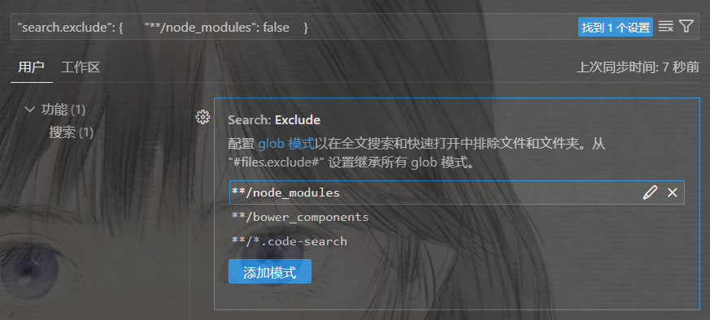

[TOC]


# 6.12   10:40

# 包管理工具与依赖包

## Node.js

>
>
>Node.js 提供了许多功能和模块，使得开发者能够在服务器端构建各种类型的应用程序。以下是 Node.js 的一些常见功能和用途：
>
>1. 服务器端开发：Node.js 提供了一个轻量级的、高效的服务器端运行环境，使开发者可以使用 JavaScript 构建服务器端应用程序，如 Web 应用程序、API、实时通信应用等。
>2. 命令行工具：Node.js 可以用于编写命令行工具，开发者可以使用 JavaScript 来构建自定义的命令行工具，用于自动化任务、构建流程、脚本等。
>3. 数据库操作：Node.js 可以与多种数据库进行交互，如 MongoDB、MySQL、PostgreSQL 等，使开发者可以通过 JavaScript 进行数据库操作。
>4. 文件操作：Node.js 提供了丰富的文件系统模块，使开发者可以读取、写入、修改和删除文件，进行文件和目录的操作。
>5. 实时通信：Node.js 具有非阻塞的 I/O 操作特性，使其非常适合构建实时通信应用，如聊天应用、协作工具、游戏等。
>6. 构建工具和任务自动化：Node.js 可以用于构建工具和任务自动化，如 Gulp、Grunt、Webpack 等，开发者可以使用 JavaScript 编写任务脚本，自动化构建和部署项目。
>7. 代理服务器：Node.js 可以作为代理服务器，将请求转发到不同的服务器，并对请求和响应进行处理和修改。
>
>这只是 Node.js 的一些常见用途，由于其灵活性和强大的生态系统，开发者可以根据需求使用 Node.js 进行各种类型的开发。


## npm

>
>
>是的，npm（Node Package Manager）是一个用于管理和分发JavaScript包的工具。它是Node.js生态系统的一部分，并且是最常用的包管理器之一。
>
>通过npm，开发人员可以方便地安装、更新和卸载各种JavaScript包和模块。npm提供了一个庞大的包仓库（Registry），其中包含了大量的开源JavaScript包供开发人员使用。您可以使用npm命令行工具来执行各种操作，如安装包、查看包信息、发布自己的包等。
>
>以下是npm的一些常用功能：
>
>1. 包管理：使用`npm install`命令可以安装项目所需的包。通过指定包的名称和版本，npm会自动下载并安装它们。还可以使用`npm uninstall`命令卸载已安装的包。
>
>2. 版本管理：npm使用语义化版本控制（Semantic Versioning）来管理包的版本。您可以通过指定特定版本号或使用版本范围来安装包，例如`npm install package@1.0.0`或`npm install package@^1.0.0`。
>
>3. 包发布：开发人员可以使用npm将自己编写的包发布到npm仓库，供其他开发人员使用。发布包需要一个npm账号，并使用`npm publish`命令完成发布过程。
>
>4. 脚本执行：通过在项目的`package.json`文件中定义`scripts`字段，您可以使用npm运行自定义的脚本命令。例如，可以定义一个`build`脚本用于构建项目，然后使用`npm run build`命令执行该脚本。
>
>5. 其他功能：npm还提供了其他一些功能，如包搜索、包更新、包依赖解析、包发布管理等。
>
>总的来说，npm是一个非常强大和方便的工具，可以帮助开发人员轻松管理和使用JavaScript包，提高开发效率，并促进代码共享和社区协作。


### npm理解为js的应用商城

>是的，将npm比喻为JavaScript的应用商城是一个很好的方式来理解它的作用。就像应用商城提供了各种应用程序供用户下载和使用一样，npm提供了大量的JavaScript包供开发人员在其项目中使用。
>
>类似于应用商城中的应用程序，npm中的包也是经过打包和发布的，具有特定的功能和用途。开发人员可以通过npm安装这些包，并将它们用于他们的项目中。这些包包含了各种功能，例如UI组件库、数据处理库、网络请求库、工具函数等，可以帮助开发人员加快开发速度，提高代码质量，避免重复劳动。
>
>类似于应用商城中的应用评分和评论，npm中的包也有版本号和用户评价，开发人员可以选择适合自己需求的包版本，并参考其他用户的评价和建议来选择可靠的包。
>
>因此，将npm比喻为JavaScript的应用商城是一种直观的方式，有助于理解npm的作用和重要性。


### npm: Node.js的包管理工具

>npm（Node Package Manager）属于 Node.js 生态系统中的包管理工具，它主要用于管理和发布 JavaScript 包。因此，可以将 npm 归类为以下功能之一：
>
>- 包管理：npm 提供了一种方便的方式来安装、更新、卸载和管理 JavaScript 包。开发者可以通过 npm 快速找到并安装所需的包，以便在自己的项目中使用。
>
>通过 npm，开发者可以从 npm 注册表（npm registry）中下载和安装包，也可以将自己的包发布到注册表中供其他开发者使用。npm 提供了丰富的命令行工具，如 `npm install`、`npm update`、`npm uninstall` 等，用于管理包的依赖关系、版本控制等。
>
>除了包管理外，npm 还提供了其他功能，如项目初始化、脚本执行、包版本控制等。它是 Node.js 开发过程中不可或缺的工具之一，为开发者提供了方便和便利。


### yarn可以通过node.js下载， npm相当于node自带的包管理工具， yarn为重新下载的工具

>
>
>Yarn 和 npm 都是基于 Node.js 平台的包管理工具，它们都可以通过 Node.js 来安装和运行。
>
>npm 是 Node.js 默认的包管理工具，随同 Node.js 的安装一起提供。它可以用来安装、更新和管理 JavaScript 包，并提供了一些命令行工具来帮助开发者进行包的管理和发布。
>
>Yarn 则是由 Facebook 创建的另一种包管理工具，它旨在改进 npm 的性能和可靠性。Yarn 通过并行下载和缓存机制来加快包的安装速度，并引入了锁定文件 `yarn.lock` 来确保在不同环境中使用相同的包版本。Yarn 在设计上更注重稳定性和可复现性，以及更好的依赖解析和版本控制。
>
>尽管 npm 是 Node.js 自带的包管理工具，但你也可以使用 npm 来下载和安装 Yarn。可以通过 npm 全局安装 Yarn，然后就可以使用 `yarn` 命令来运行 Yarn。
>
>总结来说，npm 和 Yarn 都是用于管理 JavaScript 包的工具，它们都可以通过 Node.js 下载和运行。npm 是 Node.js 自带的包管理工具，而 Yarn 是由 Facebook 创建的一种更快、更可靠的包管理工具，可以通过 npm 安装和使用 Yarn。


## npm和yarn和pnpm的优缺点

>
>
>下面是对 npm、Yarn 和 pnpm 的一些优缺点的总结：
>
>npm：
>- 优点：
>  - 默认随同 Node.js 安装，无需额外安装。
>  - 社区庞大，拥有广泛的开源包。
>  - 支持多个平台和操作系统。
>  - 提供了许多有用的命令和功能，如脚本执行、包版本管理等。
>
>- 缺点：
>  - 安装依赖包时速度较慢。
>  - 并行安装包的能力相对较弱。
>  - 包的安装位置较为分散，可能导致项目体积较大。
>  - 某些命令的输出信息较为冗长。
>
>Yarn：
>- 优点：
>  - 安装速度较快，使用了并行下载和缓存机制。
>  - 锁定包版本，确保团队成员之间安装的包版本一致。
>  - 提供了更简洁、易读的输出信息。
>  - 支持工作区（workspaces）特性，方便管理多包项目。
>
>- 缺点：
>  - 安装过程相对于 npm 复杂一些，需要先全局安装 Yarn。
>  - 部分情况下可能与某些 npm 工具不兼容。
>
>pnpm：
>- 优点：
>  - 安装速度快，采用了符号链接（symlink）的方式进行包管理。
>  - 每个包只安装一份，节省磁盘空间。
>  - 可以在多个项目之间共享包，提高效率。
>  - 与 npm 兼容，可以直接使用 npm 命令。
>
>- 缺点：
>  - 某些情况下可能存在兼容性问题。
>  - 社区相对较小，相比 npm 和 Yarn，可能更少的资源和支持。
>
>选择使用哪个包管理工具取决于个人或团队的需求和偏好。npm 是最常见和默认的选择，Yarn 和 pnpm 则提供了更快速、一致性管理和其他附加功能。可以根据项目的具体要求和团队的实际情况进行选择。


npm和yarn的锁定包功能差异

>
>
>虽然npm和Yarn都提供了锁定包版本的功能，但它们在锁定机制上存在一些差异。
>
>在npm中，锁定包的机制是通过`package-lock.json`文件来实现的。`package-lock.json`文件记录了当前项目中每个依赖包的精确版本和依赖关系。它还包括了每个包的下载地址和校验和等信息。当运行`npm install`时，npm会根据`package-lock.json`中的版本信息来确保安装的包与锁定文件中的版本一致。
>
>在Yarn中，锁定包的机制是通过`yarn.lock`文件来实现的。`yarn.lock`文件类似于`package-lock.json`，也记录了每个依赖包的精确版本和依赖关系。但与`package-lock.json`不同的是，`yarn.lock`文件还包含了每个包的完整解析树，即它会明确记录每个包的依赖树结构。这样可以确保在安装过程中使用相同的依赖树结构，而不仅仅是版本一致。
>
>这种差异导致了在处理依赖冲突时的行为不同。npm在解决依赖冲突时可能会选择更新依赖包的版本，以解决冲突。而Yarn会尽量保持依赖树结构的稳定性，尽量避免更新包的版本。这使得Yarn在处理依赖冲突时更加可预测和稳定。
>
>总的来说，虽然npm和Yarn的锁定机制都可以确保团队成员之间安装的包版本一致，但Yarn的锁定机制更加严格，可以提供更可靠的依赖管理。


## Yarn会尽量保持依赖树结构的稳定性，尽量避免更新包的版本

是的，依赖树指的是包与包之间的关系。在一个项目中，你可能会有多个依赖包，而这些依赖包之间可能存在着依赖关系。依赖树是指这些包之间的层次结构，其中每个包可以依赖于其他包。

例如，你的项目可能依赖于包A，而包A又依赖于包B和包C。那么在这个依赖树中，包A就是根节点，包B和包C是A的子节点。如果包B还依赖于包D和包E，那么包D和包E就是B的子节点。

当使用包管理工具进行安装时，工具会根据依赖树的结构来确定哪些包需要被安装，并且按照正确的顺序安装它们，以满足依赖关系。

Yarn的锁定机制会尽量保持依赖树的稳定性，这意味着它会尽量避免更新包的版本，以保持依赖树的结构不变。这样做的目的是确保依赖关系不被破坏，减少可能的冲突和不一致性。这使得Yarn在处理依赖冲突时更加可预测和稳定。


### yarn的包依赖机制更加稳定

>
>
>NPM也使用依赖树来管理包之间的依赖关系，类似于Yarn。当你使用NPM进行包安装时，它会解析项目的依赖关系，并构建一个依赖树来确定需要安装的包和版本。
>
>然而，NPM和Yarn在锁定机制上存在一些差异。在NPM中，它使用的是`package-lock.json`文件来记录确切的包版本。这个文件包含了项目中每个包的精确版本信息，包括它们的依赖关系。当运行`npm install`时，NPM会根据`package-lock.json`中的版本信息来安装包，以确保每个开发人员或构建环境都安装相同的版本。
>
>然而，**NPM在锁定版本时可能存在一些问题。由于包的版本更新频繁，如果在安装过程中没有正确更新`package-lock.json`文件，可能会导致依赖版本不一致或冲突的问题。**
>
>相比之下，Yarn的锁定机制更加严格，它会生成一个名为`yarn.lock`的锁定文件，记录了确切的包版本和依赖关系。这种机制更加可靠，能够提供更一致的依赖解析和版本控制。
>
>综上所述，尽管NPM也使用依赖树来管理包的依赖关系，但在锁定机制和版本控制方面，Yarn的实现更加可靠和严格。


### npm解析package.json

当使用 npm 安装依赖时，它会解析项目的 package.json 文件并根据其中的依赖项列表下载所需的包。默认情况下，npm 会尝试下载最新的符合要求的包版本，并在每次安装时更新 package-lock.json 文件。

如果想要确保每次安装时都使用相同的依赖版本，可以在项目中使用 package-lock.json 文件。package-lock.json 文件会记录每个包的确切版本号，以及其依赖关系树的详细信息。这样，在安装依赖时，npm 会根据 package-lock.json 文件来确定要安装的确切版本，从而保证每次安装时依赖版本的一致性。

通过这种方式，即使多个开发者在不同的环境中安装依赖，也可以保证它们使用的是相同的版本，减少依赖冲突和不一致性的问题。


## 依赖失效

>
>
>依赖失效可能导致某些模块无法正常工作。依赖失效通常是由以下几种情况引起的：
>
>1. 版本不一致：如果依赖的版本与当前使用的模块不兼容，可能会导致模块无法正常工作。
>2. 依赖冲突：当两个或多个依赖模块依赖于同一个模块的不同版本时，可能会导致依赖冲突。这可能会导致模块无法正确加载或发生运行时错误。
>3. 被删除或迁移的依赖：有时，某些依赖可能会被开发者删除或迁移，导致原本依赖这些模块的代码无法找到对应的依赖而出现错误。
>
>为了避免依赖失效的问题，确保在项目中使用准确的依赖版本，并尽可能使用锁定依赖版本的机制（如 package-lock.json 或 yarn.lock）。此外，定期更新依赖项，确保使用最新的稳定版本，以修复可能存在的问题和漏洞。


### npm尝试更新最新的依赖包，可能会导致原依赖关系失效

>
>
>npm 在每次安装依赖时会尝试下载最新符合要求的包版本，并更新 package-lock.json 文件。这意味着如果某个依赖包的新版本引入了不兼容的更改或有依赖关系的变动，可能会导致原项目的功能失效。
>
>依赖包之间的关系是一个非常重要的因素。当一个依赖包更新到一个新版本时，它可能会依赖于其他的包的不同版本或者引入一些不兼容的更改，这可能会导致依赖关系冲突或功能的破坏。
>
>为了避免依赖关系导致的问题，可以使用锁定依赖版本的机制，如 package-lock.json 或 yarn.lock 文件。这样可以确保每个人安装的依赖版本一致，减少依赖关系的不一致性带来的问题。
>
>此外，定期进行依赖更新和测试也是很重要的，以确保项目的依赖关系保持稳定和兼容。可以使用工具来自动检测和解决依赖关系的问题，如 npm-check 或者 npm audit。


### 最大程度地避免依赖失效的方法

要最大程度地避免依赖失效的情况，可以考虑以下几个方面：

1. 锁定依赖版本：使用锁定依赖版本的机制，如 npm 的 package-lock.json 或者 yarn 的 yarn.lock 文件，确保团队成员之间安装的依赖版本一致。

2. 定期更新依赖：定期检查并更新项目的依赖，可以使用工具如 npm-check 或者 npm audit 来检测依赖的更新和安全问题。及时更新依赖可以获得更好的兼容性和安全性。

3. 仔细选择依赖包：在选择依赖包时，可以考虑其稳定性、维护活跃度和社区支持等因素。优先选择受欢迎、可靠的依赖包，并查看其文档、GitHub 上的问题和解决方案，了解其质量和稳定性。

4. 进行充分的测试：在引入新的依赖包或者更新现有的依赖包后，进行充分的测试，确保项目的功能和兼容性没有受到影响。

npm-check 可以帮助检查项目中的依赖更新，并提供与当前版本不兼容的依赖的警告。它可以列出哪些依赖包需要更新，并提供更新命令。然而，它并不会自动更新依赖包的版本，需要手动执行相应的更新命令。

在更新依赖包时，需要谨慎评估更新带来的潜在影响，并在更新前进行充分的测试。


## 存在依赖包要求用户必须更新

> 是的，有时候依赖包可能会要求用户必须更新到某个特定版本或者更新到符合一定范围的版本。这通常是因为新版本可能包含了重要的 bug 修复、安全性改进或者功能增强等。如果用户不更新到要求的版本，可能会导致依赖包的功能失效、性能问题或者安全漏洞。
>
> 在这种情况下，依赖包通常会在其文档或者发布说明中明确指出要求的版本范围，并提供相应的更新指南。用户需要根据依赖包的要求来更新相应的版本，以确保项目的正常运行。
>
> 在使用 npm 或者 yarn 等包管理工具时，可以使用命令来更新特定的依赖包版本，例如使用 `npm update <package-name>` 或者 `yarn upgrade <package-name>` 命令来更新特定依赖包的版本。
>
> 需要注意的是，在更新依赖包版本时，也要注意可能引入的兼容性问题和潜在的影响。因此，在更新依赖包之前，最好先阅读相关的更新说明、文档和社区反馈，以便了解更新可能带来的变化和注意事项，并进行适当的测试和验证。


### 依赖包可以被理解为项目所依赖的外部软件包或库

> 它们是为了提供特定功能或者实现特定需求而被引入到项目中的。依赖包可以包含 JavaScript 代码、样式表、图像文件等资源，以及必要的配置和元数据。
>
> 依赖包可以是开源的或者商业的，它们可以由个人开发者、组织或者社区维护。通过使用依赖包，开发者可以在项目中利用已有的功能和代码，避免重复劳动，提高开发效率。
>
> 依赖包可以通过包管理工具（如 npm、Yarn 或 pnpm）进行下载和安装。这些工具会根据项目的需求和配置，自动解析项目所需的依赖关系，并下载对应的依赖包到指定的目录中。项目在运行时可以引入这些依赖包，以使用其中提供的功能和资源。
>
> 因此，可以将依赖包视为项目所使用的应用程序的组成部分，通过引入适当的依赖包，开发者可以利用这些功能丰富和扩展项目的能力。


### 依赖包如果不被维护，会导致依赖失效

> 是的，如果一个依赖包不再被维护或更新，可能会导致依赖失效的问题。这种情况下，依赖包可能存在安全漏洞、功能缺陷或与其他依赖包的不兼容性等问题。如果项目依赖的包不再得到维护，这些问题可能无法得到修复，从而对项目的稳定性、安全性和可用性产生影响。
>
> 在选择依赖包时，最好考虑一些因素，例如依赖包的活跃度、维护者的声誉、社区支持和更新频率等。选择广受支持和维护良好的依赖包可以降低依赖失效的风险，并确保项目能够保持最新的功能和安全性。
>
> 此外，如果某个依赖包确实不再维护或存在严重问题，开发团队可能需要寻找替代方案或者考虑自行开发相关功能，以避免项目受到依赖失效的影响。定期检查和更新依赖包，及时处理依赖包的问题也是保持项目健康和可靠的重要步骤。


## 扩展知识： webView2 

WebView2 是一种现代化的 Web 内容呈现控件，它是 Microsoft Edge 浏览器的嵌入式版本，可用于在应用程序中显示 Web 内容。它提供了一个可嵌入的浏览器引擎，使开发人员能够在自己的应用程序中加载和显示网页内容。

webView2 具有以下作用和优势：

1. 显示网页内容：通过 WebView2，您可以在**应用程序的界面中嵌入一个浏览器控件**，用于加载和显示网页内容。这使得应用程序能够以更丰富的方式呈现信息，包括网页、在线文档、媒体内容等。

2. 支持现代 Web 技术：WebView2 使用 Microsoft Edge 的浏览器引擎，因此它支持最新的 Web 标准和技术。这意味着您可以在应用程序中使用最新的 HTML、CSS 和 JavaScript 特性，以及支持响应式设计、动态内容和交互性。

3. 可自定义和扩展：WebView2 提供了丰富的 API 和事件，使开发人员能够对其进行自定义和扩展。您可以控制浏览器的行为、样式和交互方式，以适应应用程序的需求，并与应用程序的其他部分进行集成。

4. 与本地应用程序集成：WebView2 可以与本地应用程序进行无缝集成，使得应用程序能够通过 JavaScript 和 .NET/C++ 的互操作性，实现与网页内容的交互。您可以在应用程序中调用 JavaScript 函数、监听网页事件，甚至在应用程序和网页之间传递数据。

综上所述，webView2 是一种功能强大的工具，可将 Web 内容嵌入到应用程序中，为开发人员提供了更丰富的界面和交互体验。


### 安装过程中没有正确更新package-lock.json文件，可能会导致依赖版本不一致或冲突

> 是的，如果在项目开发过程中没有正确更新或管理 package-lock.json 文件，可能会导致依赖版本不一致或冲突的问题。这种情况下，你的本地环境可能能够正常运行项目，但将项目打包给别人时，由于依赖关系未正确更新，别人的环境中可能会出现项目启动失效的情况。
>
> 为了避免这种问题，你可以采取以下措施：
>
> 1. 确保在安装或更新依赖包时使用准确的命令，如使用 `npm install` 或 `npm update`。这将自动更新 package-lock.json 文件，并确保依赖版本的一致性。
>
> 2. 提交项目时，一并提交 package-lock.json 文件。这样，其他人在拉取项目时将得到与你本地相同的依赖版本。
>
> 3. 在项目开发过程中，定期检查和更新依赖包。可以使用工具如 npm-check 或 npm outdated 来检查依赖包的最新版本，并及时更新。
>
> 4. 在团队协作中，建议使用相同的包管理工具和版本控制工具，以确保依赖的一致性。
>
> 总之，正确管理和更新依赖关系是保证项目可靠性和可移植性的重要步骤。通过遵循最佳实践和使用合适的工具，可以最大程度地减少依赖版本不一致导致的问题。


### package.json和yarn.lock 这两个可以同时存在


> 是的，`package.json`和`yarn.lock`这两个文件可以同时存在，并且在使用Yarn管理依赖时通常会同时生成它们。
>
> `package.json`是一个包含项目元数据和依赖项列表的文件，它描述了项目的配置信息、脚本命令和依赖项等。无论使用npm还是Yarn，都会生成一个`package.json`文件来记录项目的配置信息。
>
> `yarn.lock`是Yarn特有的文件，用于确保在不同环境下安装的依赖版本一致。它记录了项目依赖项的精确版本号，以及依赖项之间的依赖关系，从而保证了在执行`yarn install`命令时安装的依赖版本与之前一致。
>
> 因此，在使用Yarn管理依赖时，建议同时提交`package.json`和`yarn.lock`文件到版本控制系统，以便其他人可以根据这两个文件来安装和管理项目的依赖。这样可以确保其他人在执行`yarn install`命令时获得与你在开发环境中使用的相同的依赖版本。


### 个人开发一般只使用一种包工具


> 个人开发时一般可以选择使用一种包管理工具，如npm或Yarn，以简化项目的依赖管理和构建流程。选择哪种包管理工具主要取决于个人的喜好和项目需求。
>
> npm是JavaScript生态系统中最常用的包管理工具，具有广泛的支持和社区。它提供了丰富的功能和命令，能够满足大多数项目的需求。如果你对npm较为熟悉，并且你的项目没有特殊需求，那么使用npm是一个不错的选择。
>
> Yarn是由Facebook开发的另一种包管理工具，旨在提供更快速、安全和可靠的依赖管理体验。它具有与npm类似的功能，同时还提供了一些额外的功能，如离线模式、并行安装等。如果你对Yarn感兴趣，或者你的项目需要利用Yarn的特定功能，那么使用Yarn也是可以的。
>
> 在选择包管理工具时，还可以考虑项目团队的共识和一致性。如果你与其他开发者合作，那么最好与他们协商一致，选择一种共同使用的包管理工具，以确保项目的一致性和协作效率。
>
> 无论选择使用npm还是Yarn，重要的是在项目中始终保持一致，遵循相同的依赖管理流程，并将相关的配置文件（如`package.json`和`yarn.lock`）提交到版本控制系统中，以便团队成员可以轻松地获取项目所需的依赖项。


## Webpack

> Webpack是一个现代的静态模块打包工具，用于构建前端项目。它可以将各种类型的文件（如JavaScript、CSS、图片等）视为模块，并将它们打包成一个或多个优化的静态资源文件。
>
> Webpack的主要功能包括：
>
> 1. 模块化支持：Webpack可以将项目中的各个模块进行依赖分析，并按需加载和组合它们。这使得开发者可以使用模块化的方式编写代码，提高代码的可维护性和复用性。
>
> 2. 资源打包：Webpack可以处理各种类型的文件，并通过加载器（Loader）将它们转换为合适的模块。例如，可以使用Babel加载器将ES6+的JavaScript代码转换为浏览器可识别的ES5代码，或使用CSS加载器处理CSS文件。
>
> 3. 代码分割：Webpack支持将代码分割成多个块，可以实现按需加载，提高页面加载性能。这样可以将常用的代码和不常用的代码分割开来，减小初始加载的文件大小。
>
> 4. 插件系统：Webpack拥有丰富的插件生态系统，开发者可以通过插件来扩展和定制Webpack的功能。常见的插件用于优化、压缩、提取公共代码等。
>
> 5. 开发环境支持：Webpack提供了开发环境的工具和配置，例如热模块替换（Hot Module Replacement）、源映射（Source Maps）等，方便开发者在开发过程中进行调试和测试。
>
> 通过适当配置Webpack，开发 者可以将多个模块和资源打包成一个或多个静态文件，并优化这些文件的大小和加载速度，从而提高前端项目的性能和用户体验。
>
> 使用Webpack需要编写配置文件（通常为webpack.config.js），配置入口文件、输出路径、加载器、插件等信息。然后可以使用命令行工具或集成到构建工具中进行打包操作。
>
> 总结起来，Webpack是一个功能强大的前端打包工具，用于将各种资源打包成优化的静态 文件，实现模块化开发和优化性能。


## jquery的$.语法表示什么

> 在 jQuery 中，`$` 是 jQuery 对象的别名或缩写。它是一个全局函数，用于访问和操作 jQuery 库提供的功能和方法。
>
> 通过 `$` 可以快速访问 jQuery 库中的功能，例如选择器、DOM 操作、事件处理、动画效果等。使用 `$` 可以简化代码，并提供更简洁的语法来操作和处理页面元素。
>
> 例如，`$("#btn")` 表示选取页面上 id 为 "btn" 的元素，`$(".container")` 表示选取所有类名为 "container" 的元素，`$("ul li")` 表示选取所有 ul 元素下的 li 元素。
>
> 总之，`$` 是 jQuery 的主要入口，使用它可以方便地使用 jQuery 提供的功能和方法。


## $.proxy()

> `$.proxy()` 是 jQuery 提供的一个方法，用于修改函数的上下文（也就是函数内部的 `this` 指向）。
>
> 在你的代码中，`$.proxy(this.handleBtnClick, this)` 的作用是将 `this.handleBtnClick` 函数的上下文（即 `this` 指向）设置为 `this`，也就是 `Page` 对象的实例。
>
> 这是因为在 JavaScript 中，函数的执行上下文（`this`）是根据调用方式确定的。在事件处理函数中，常常会遇到上下文丢失的问题，即事件处理函数中的 `this` 不再指向原来的对象。为了确保事件处理函数中的 `this` 指向正确，可以使用 `$.proxy()` 方法来修改函数的上下文。
>
> 通过 `$.proxy(this.handleBtnClick, this)`，你将 `this.handleBtnClick` 函数的上下文设置为当前 `Page` 对象的实例，这样在 `handleBtnClick` 函数中，`this` 就可以正确地指向 `Page` 对象的实例，从而可以访问和操作 `Page` 对象中的属性和方法。


## vue中组件概念

>
>
>在Vue.js中，组件是构建用户界面的基本单元。它们可以独立地封装和重用，并具有自己的模板、样式和逻辑。Vue组件提供了一种组织和管理代码的方式，使开发者能够将复杂的应用程序拆分为更小、更可维护的部分。
>
>Vue组件具有以下特点：
>
>1. **模板**: 组件使用Vue的模板语法来定义其结构和内容。模板可以包含HTML标记和Vue特定的指令，用于绑定数据和处理事件。
>
>2. **数据**: 组件可以拥有自己的数据对象，用于存储和管理组件内部的状态。数据可以通过插值表达式和指令在模板中进行绑定。
>
>3. **生命周期钩子**: 组件具有生命周期钩子函数，可以在组件的不同阶段执行特定的操作，例如创建前、创建后、更新前、更新后等。这些钩子函数可以用于执行初始化逻辑、数据获取、清理等操作。
>
>4. **样式**: 组件可以拥有自己的样式，可以使用CSS或预处理器（如Sass、Less）来定义组件的样式规则。样式可以通过作用域或CSS模块化来确保组件样式的隔离性和可重用性。
>
>5. **事件与方法**: 组件可以定义自己的方法，并使用Vue的事件系统来处理DOM事件和自定义事件。组件内部的方法可以通过绑定到模板中的事件指令来触发。
>
>6. **组件通信**: 组件之间可以通过属性传递和事件触发进行通信。父组件可以通过属性将数据传递给子组件，子组件可以通过事件将数据发送给父组件或其他组件。
>
>7. **组件复用**: 组件可以被复用，可以在同一个应用程序的不同地方使用多次。通过提供不同的属性和配置，可以在不同的上下文中使用同一个组件。
>
>Vue组件的概念使得前端开发更加模块化、可维护和可扩展，提供了一种组织代码的有效方式，同时也增强了应用程序的可重用性和可测试性。


## component

> 在Vue.js中，组件（Component）是构建用户界面的可复用模块。组件可以包含 HTML、CSS 和 JavaScript，用于定义特定的功能和外观。
>
> 在Vue中，可以通过 Vue.component() 方法或者单文件组件（.vue 文件）的方式来创建组件。
>
> 以下是创建和使用组件的一般步骤：
>
> 1. 创建组件：
>    - 使用全局注册方式：
>      ```javascript
>      Vue.component('my-component', {
>        // 组件选项
>      });
>      ```
>    - 使用单文件组件方式：创建一个以 `.vue` 扩展名的文件，其中包含模板、样式和脚本：
>      ```html
>      <template>
>        <!-- 模板内容 -->
>      </template>
>                                              
>      <script>
>      export default {
>        // 组件选项
>      };
>      </script>
>                                              
>      <style scoped>
>        /* 组件样式 */
>      </style>
>      ```
>
> 2. 使用组件：
>    - 在另一个组件的模板中使用：
>      ```html
>      <template>
>        <div>
>          <my-component></my-component>
>        </div>
>      </template>
>      ```
>    - 使用单文件组件方式：在父组件中引入并注册子组件：
>      ```javascript
>      import MyComponent from './MyComponent.vue';
>                                              
>      export default {
>        components: {
>          MyComponent
>        },
>        // ...
>      };
>      ```
>
> 组件可以具有自己的数据、方法、生命周期钩子等。通过组件的 props 属性，可以向子组件传递数据和参数。
>
> 组件化是 Vue.js 的核心概念之一，它提供了一种模块化的方式来构建复杂的用户界面，使得应用程序的代码更易于理解、维护和重用。


## 被渲染的为父组件， 接受数据并将数据进行渲染返回的为子组件


> 在 Vue.js 中，父组件是指包含子组件的组件，而子组件是被包含在父组件中的组件。
>
> 在你提供的代码中，父组件是包含 `<todo-item>` 组件的组件。父组件通过使用 `<todo-item>` 组件，并传递数据给它的 `content` 属性，将数据传递给子组件。
>
> 父组件负责创建和管理子组件，并可以通过传递 props 给子组件，将数据或状态传递给子组件。子组件可以使用这些 props 接收并使用父组件传递的数据。
>
> 通常情况下，父组件负责整体页面的布局和逻辑控制，而子组件负责特定功能模块的实现。通过将应用程序拆分为父组件和子组件的层次结构，可以使代码更具可维护性和可复用性。
>
> 因此，父组件是包含子组件的组件，而子组件是被包含在父组件中的组件。父组件通过 props 将数据传递给子组件，并控制子组件的行为和显示。
>
> 

指将todo-item标签渲染为li标签

> 是的，你所给的代码中通过 Vue.component 定义了一个名为 "TodoItem" 的组件，并将其注册到 Vue 实例中。然后在父组件的模板中使用 `<todo-item>` 标签来使用这个组件。
>
> `<todo-item v-bind:content="content" v-for="item in list"></todo-item>` 这句代码的作用是将 `<todo-item>` 组件渲染为 `<li>` 标签，并且通过 `v-for` 指令遍历 `list` 数组的每个元素，为每个元素创建一个 `<todo-item>` 组件实例。
>
> 在这里，通过 `v-bind:content="content"` 将父组件的 `content` 数据传递给子组件的 `content` 属性。子组件通过定义 `props: ["content"]` 来接收父组件传递的数据，并在模板中使用 `{{ content }}` 将数据渲染到 `<li>` 标签中。
>
> 因此，这段代码的作用是将父组件中的 `list` 数组的每个元素渲染为一个 `<li>` 标签，并使用 `<todo-item>` 组件来实现渲染和数据传递的功能。


### 注册是类似身份标识

>
>
>是的，可以将组件的注册理解为给组件一个身份标识，以便在模板中使用该组件时能够正确识别并渲染它。
>
>通过使用 `Vue.component` 方法注册组件时，需要提供一个组件名称作为参数，并将组件选项传递给该方法。注册后，该组件就可以在其他组件的模板中通过其名称来引用。
>
>例如，在给定的代码中，使用 `Vue.component` 方法注册了一个名为 "TodoItem" 的组件，然后在父组件的模板中使用 `<todo-item>` 标签来引用该组件。这样，Vue 就能识别并渲染出正确的子组件。
>
>所以，注册组件可以被看作是给组件分配一个身份标识，以便在模板中引用和使用该组件。


### 解析时为识别为父组件， 通过全局组件注册的方法后， 被渲染变成了子组件

>你理解得很对。当你在父组件的模板中使用一个组件标签（例如 `<todo-item>`），这个标签在解析阶段会被识别为父组件，但在渲染阶段，如果这个组件在全局或局部中被注册，它会被实例化成子组件并进行渲染。这是因为在 Vue 的组件系统中，父组件负责使用和嵌套子组件，而子组件是被父组件所包含和管理的。
>
>所以，在父组件的模板中使用 `<todo-item>` 标签时，它被解析为对注册的组件（即子组件）的使用，并且被视为父组件中的子组件。实际渲染时，子组件会在父组件的上下文中进行渲染和展示。


## `this.$emit` 是 Vue 实例的一个方法，用于触发自定义事件

>
>
>`this.$emit` 是 Vue 实例的一个方法，用于触发自定义事件。
>
>在 Vue 组件中，你可以使用 `this.$emit` 方法来触发一个自定义事件，并传递数据给父组件或其他监听该事件的组件。
>
>语法如下：
>
>```javascript
>this.$emit(eventName, payload);
>```
>
>- `eventName` 是自定义事件的名称，可以自定义为你喜欢的名称。
>- `payload` 是要传递给监听事件的组件的数据，可以是**任意类型的数据**。
>
>当调用 `this.$emit` 方法时，Vue 会在组件实例上触发指定的事件，并将 `payload` 数据传递给监听该事件的组件。
>
>在父组件中，你可以通过在子组件的标签上使用 `v-on` 或简写 `@` 来监听该自定义事件，并在对应的方法中处理传递过来的数据。
>
>以下是一个示例：
>
>```vue
><template>
>  <button @click="handleButtonClick">点击触发事件</button>
></template>
>
><script>
>export default {
>  methods: {
>    handleButtonClick() {
>      // 触发自定义事件并传递数据
>      this.$emit('custom-event', 'Hello from child component!');
>    }
>  }
>};
></script>
>```
>
>在父组件中监听该自定义事件：
>
>```vue
><template>
>  <div>
>    <child-component @custom-event="handleCustomEvent"></child-component>
>  </div>
></template>
>
><script>
>export default {
>  methods: {
>    handleCustomEvent(data) {
>      console.log(data); // 输出：Hello from child component!
>    }
>  }
>};
></script>
>```
>
>在上述示例中，当子组件的按钮被点击时，会触发自定义事件 `custom-event`，并将字符串 `'Hello from child component!'` 作为数据传递给父组件的 `handleCustomEvent` 方法。
>
>父组件中的 `handleCustomEvent` 方法会接收到传递的数据，并进行处理。
>


## v-bind 、v-for、 @click参数

>
>
>在Vue中，`v-bind`、`v-for`和`@click`是Vue的模板指令，用于在模板中绑定数据、循环遍历和处理事件。下面是它们的具体含义：
>
>- `v-bind`：用于绑定数据到元素的属性或组件的props上。它的作用是将模板中的数据和Vue实例中的数据进行绑定，实现数据的动态更新。使用方式为`v-bind:属性名`或简写为`:属性名`。例如，`<div v-bind:class="className"></div>`将`className`变量的值绑定到`class`属性上。
>
>- `v-for`：用于循环遍历数组或对象，生成重复的元素或组件。它可以遍历数组、对象的属性或者整数范围。使用方式为`v-for="item in items"`，其中`item`是每次遍历的元素，`items`是要遍历的数据源。例如，`<li v-for="item in items">{{ item }}</li>`将遍历`items`数组，生成多个`<li>`元素。
>
>- `@click`：用于监听元素的点击事件。它的作用是在元素被点击时执行指定的方法或表达式。使用方式为`@click="method"`，其中`method`是要执行的方法名。例如，`<button @click="handleClick">Click Me</button>`将在按钮被点击时执行`handleClick`方法。
>
>这些指令可以在Vue的模板中使用，通过对应的语法来实现数据绑定、循环渲染和事件处理。它们是Vue提供的强大工具，使得开发者可以更方便地处理数据和交互逻辑。


## vue的模板指令

>Vue的模板指令提供了丰富的功能和语法，用于在模板中进行数据绑定、条件渲染、循环遍历、事件处理等操作。以下是一些常用的Vue模板指令：
>
>- `v-bind`（简写为`:`）：用于绑定数据到元素的属性或组件的props上。
>- `v-if`：根据表达式的值来条件性地渲染元素。
>- `v-else`：作为`v-if`的“else”块，只在前一个兄弟元素的`v-if`为假时渲染。
>- `v-show`：根据表达式的值来条件性地显示或隐藏元素，与CSS的`display`属性相对应。
>- `v-for`：用于循环遍历数组或对象，**生成重复的元素或组件。**
>- `v-on`（简写为`@`）：用于监听元素的事件，执行相应的方法。
>- `v-model`：用于在表单元素上实现双向数据绑定。
>- `v-text`：将元素的`textContent`属性设置为绑定的表达式的值。
>- `v-html`：将元素的`innerHTML`属性设置为绑定的表达式的值，可以渲染HTML代码。
>- `v-cloak`：用于防止页面闪动，当Vue实例准备完毕时自动移除。
>
>除了以上指令，Vue还提供了更多的指令和扩展，用于处理表单验证、过渡动画、组件通信等方面的需求。你可以参考Vue的官方文档了解更多关于模板指令的详细信息。


# 6.13  13：10

## vue生命周期钩子

>Vue组件的生命周期钩子是一些特定的函数，它们会在组件的不同生命周期阶段被调用。这些生命周期钩子函数可以让你在组件的不同阶段执行特定的操作和逻辑。下面是Vue的生命周期钩子及其执行顺序：
>
>1. beforeCreate：在实例被创建之前调用，此时组件的数据和方法都还未初始化。
>
>2. created：在实例创建完成后调用，此时组件的数据和方法已经初始化完成。
>
>3. beforeMount：在组件挂载到DOM之前调用，此时模板已经编译完成，但尚未将组件挂载到页面上。
>
>4. mounted：在组件挂载到DOM后调用，此时组件已经被渲染到页面上，可以进行DOM操作和异步请求等操作。
>
>5. beforeUpdate：在组件更新之前调用，当组件的数据发生变化时会触发该钩子函数。
>
>6. updated：在组件更新完成后调用，此时组件的DOM已经更新完成。
>
>7. beforeDestroy：在组件销毁之前调用，可以在这里进行清理工作和取消事件监听等操作。
>
>8. destroyed：在组件销毁之后调用，此时组件的实例已经被销毁，不再可用。
>
>除了上述的常用生命周期钩子函数，Vue还提供了一些其他的生命周期钩子，如activated和deactivated（用于Vue的keep-alive组件）、errorCaptured（用于捕获子组件错误）等。
>
>通过使用这些生命周期钩子函数，你可以在不同的阶段执行相应的逻辑，比如初始化数据、发送请求、监听事件、清理资源等，以实现更精细的控制和交互。


##  computed: 计算属性

> 计算属性（Computed Properties）是 Vue.js 中用于处理数据计算的一种特殊属性。它们是基于其他数据属性计算而来的属性，具有缓存机制，只有在依赖的数据发生变化时才会重新计算。计算属性可以提供简洁和高效的数据计算方式，常用于对响应式数据进行复杂的逻辑运算或过滤操作。
>
> 在 Vue 组件中定义计算属性，需要在 `computed` 对象中添加属性，并指定一个函数来计算属性的值。这个函数会在每次访问该计算属性时被调用，返回计算后的值。
>
> 以下是一个示例：
>
> ```html
> <div id="app">
>   <p>原始值：{{ value }}</p>
>   <p>计算属性：{{ computedValue }}</p>
> </div>
> 
> <script>
>   var app = new Vue({
>     el: "#app",
>     data: {
>       value: 10,
>     },
>     computed: {
>       computedValue: function () {
>         // 在计算属性中对数据进行计算并返回结果
>         return this.value * 2;
>       },
>     },
>   });
> </script>
> ```
>
> 在上面的示例中，我们定义了一个计算属性 `computedValue`，它通过将 `value` 的值乘以 2 来计算属性的值。每当 `value` 发生变化时，`computedValue` 会自动重新计算。
>
> 在模板中，我们可以像访问普通属性一样访问计算属性，例如 `{{ computedValue }}`。当 `value` 的值改变时，`computedValue` 会自动更新并显示新的计算结果。
>
> 计算属性的特点是具有缓存机制，只有当计算属性依赖的数据发生改变时才会重新计算，否则会直接返回之前缓存的计算结果。这样可以提高性能，避免不必要的计算。


### Computed内的set和get函数

> 在 Vue.js 的计算属性 `computed` 中，可以使用 `get` 和 `set` 来定义属性的获取和设置操作。
>
> - `get` 函数用于获取计算属性的值。当访问计算属性时，会执行 `get` 函数，并返回计算属性的值。
>
> - `set` 函数用于设置计算属性的值。当对计算属性进行赋值时，会执行 `set` 函数，并将新的值作为参数传递给 `set` 函数。
>
> 下面是一个示例：
>
> ```html
> <div id="app">
>   <p>原始值：{{ value }}</p>
>   <input v-model="value" />
> </div>
> 
> <script>
>   var app = new Vue({
>     el: "#app",
>     data: {
>       inputValue: 0,
>     },
>     computed: {
>       value: {
>         get: function () {
>           // 获取计算属性的值
>           return this.inputValue;
>         },
>         set: function (newValue) {
>           // 设置计算属性的值
>           this.inputValue = newValue;
>         },
>       },
>     },
>   });
> </script>
> ```
>
> 在上面的示例中，我们定义了一个计算属性 `value`，其中包含 `get` 和 `set` 函数。当访问 `value` 时，会执行 `get` 函数并返回 `inputValue` 的值。当对 `value` 进行赋值时，会执行 `set` 函数并将新的值传递给 `set` 函数，然后将新的值赋给 `inputValue`。
>
> 通过使用 `get` 和 `set`，我们可以在计算属性中对数据的读取和设置进行自定义操作。这样可以方便地实现对计算属性的定制化逻辑，例如对值进行格式化、对依赖属性进行处理等。


### set设置后会在执行 get函数

在设置计算属性的值时，会先执行 `set` 函数进行赋值操作，然后再执行 `get` 函数获取更新后的计算属性的值。

这是因为在 Vue.js 中，计算属性的值是基于其依赖的响应式数据进行计算得出的。当依赖的数据发生变化时，计算属性会重新计算，并返回新的值。因此，在设置计算属性的值后，会触发计算属性的重新计算过程，然后执行 `get` 函数来获取最新的计算属性值。

举个例子，假设我们有一个计算属性 `fullName`，它依赖于 `firstName` 和 `lastName` 这两个响应式数据。当我们通过 `set` 函数设置 `fullName` 的值时，会触发计算属性重新计算，然后执行 `get` 函数获取最新的计算属性值。

```javascript
computed: {
  fullName: {
    get: function () {
      return this.firstName + ' ' + this.lastName;
    },
    set: function (value) {
      var names = value.split(' ');
      this.firstName = names[0];
      this.lastName = names[1];
    }
  }
}
```

总结起来，设置计算属性的值会先执行 `set` 函数进行赋值操作，然后会触发计算属性的重新计算过程，最后再执行 `get` 函数获取最新的计算属性值。


##  watch Vue.js 中用于观察（监听）数据变化的一个选项

> `watch` 是 Vue.js 中用于观察（监听）数据变化的一个选项。通过定义 `watch` 选项，我们可以监听指定的数据，并在数据发生变化时执行相应的操作。
>
> 在 Vue 组件中使用 `watch`，需要在 `watch` 对象中添加属性，每个属性对应一个要观察的数据，并指定一个处理函数来处理数据变化的操作。当被观察的数据发生变化时，对应的处理函数会被调用。
>
> 以下是一个示例：
>
> ```html
> <div id="app">
>   <p>原始值：{{ value }}</p>
>   <button v-on:click="increment">增加</button>
> </div>
> 
> <script>
>   var app = new Vue({
>     el: "#app",
>     data: {
>       value: 10,
>     },
>     methods: {
>       increment: function () {
>         this.value++;
>       },
>     },
>     watch: {
>       value: function (newValue, oldValue) {
>         // 在 value 发生变化时执行相应的操作
>         console.log("value 变化了，新值为：" + newValue + "，旧值为：" + oldValue);
>       },
>     },
>   });
> </script>
> ```
>
> 在上面的示例中，我们定义了一个 `watch` 对象，并添加了一个属性 `value`，表示要观察的数据。当 `value` 的值发生变化时，对应的处理函数会被调用，并接收两个参数：`newValue` 表示变化后的新值，`oldValue` 表示变化前的旧值。在示例中，我们在处理函数中打印出了新值和旧值。
>
> 当点击按钮时，`increment` 方法会增加 `value` 的值，触发数据变化，从而触发对应的 `watch` 处理函数。
>
> 使用 `watch` 可以监听数据的变化，并在变化时执行自定义的操作，例如发起异步请求、更新其他数据等。它比计算属性更适用于处理数据变化时需要执行一些额外操作的情况。


## v-if   和 v-show

>
>
>`v-show` 和 `v-if` 是 Vue.js 中用于条件性地显示或隐藏元素的指令。
>
>`v-show` 是一种基于 CSS 的显示/隐藏控制方式。当表达式的值为 `true` 时，元素会显示出来；当表达式的值为 `false` 时，元素会隐藏起来。底层实现是通过修改元素的 `display` CSS 属性来控制显示状态，因此元素仍然存在于 DOM 中，只是不可见。
>
>```html
><div v-show="isVisible">This element is shown or hidden based on the value of `isVisible`.</div>
>```
>
>`v-if` 是一种基于 DOM 元素的插入/移除控制方式。当表达式的值为 `true` 时，元素会被插入到 DOM 中；当表达式的值为 `false` 时，元素会从 DOM 中移除。每次条件发生变化时，Vue.js 会重新渲染 DOM。
>
>```html
><div v-if="isVisible">This element is inserted or removed based on the value of `isVisible`.</div>
>```
>
>在选择 `v-show` 还是 `v-if` 时，可以考虑以下因素：
>
>- 如果需要频繁切换显示状态，并且元素初始状态很少改变，使用 `v-show` 可以避免频繁的 DOM 操作，性能较好。
>- 如果需要根据条件动态地插入或移除元素，并且元素的初始状态可能会频繁改变，使用 `v-if` 更适合，因为它会根据条件重新渲染 DOM，但性能上可能略逊于 `v-show`。
>
>需要注意的是，`v-if` 有更高的切换开销，而 `v-show` 有更高的初始渲染开销。因此，根据具体的场景和性能需求，选择适合的指令进行条件渲染。


## === 和 ==之间的区别

>
>
>在 JavaScript 中，`===` 和 `==` 是比较运算符，用于比较两个值是否相等。它们之间的区别如下：
>
>1. `===`（严格相等）：进行严格的相等比较，要求比较的两个值不仅在值上相等，而且类型也必须相同。只有当值和类型都相等时，比较结果才为 `true`，否则为 `false`。
>
>2. `==`（相等）：进行宽松的相等比较，允许在比较时进行类型转换。在比较之前，会先进行类型转换，然后再进行值的比较。类型转换规则较为复杂，可能会导致一些意外的比较结果。
>
>主要区别如下：
>
>- `===` 比较更严格，要求值和类型都相等，不进行类型转换。
>- `==` 比较更宽松，允许进行类型转换，可能会产生意外的结果。
>
>示例：
>
>```javascript
>var a = 1;
>var b = '1';
>
>console.log(a === b);  // false，类型不同
>console.log(a == b);   // true，进行类型转换后值相等
>```
>
>建议在进行比较时，优先使用 `===` 进行严格相等比较，避免类型转换带来的意外结果。只在明确需要类型转换的情况下，才考虑使用 `==`。


##   元素身份标识： 一般用id（唯一且固定）


> 元素身份标识在 Vue 中非常重要。为了实现高效的渲染和更新，Vue 需要能够准确地追踪和识别每个元素的身份。
>
> 使用 id 是一种常见的元素身份标识方式，因为它们通常是唯一且固定的。Vue 可以使用 id 来追踪元素，并且在更新视图时能够快速找到需要更新的元素。
>
> 相比之下，使用数组下标作为元素身份标识是不推荐的，因为数组的顺序可能会改变，导致元素身份标识发生变化。这会导致 Vue 需要重新渲染整个列表，而不仅仅是更新变化的部分，从而降低性能。
>
> 因此，建议在 Vue 中使用唯一且固定的元素身份标识，例如使用 id 属性或其他唯一标识符，以提高渲染和更新的性能。


## vm. $ 表示 Vue 实例的一个内置方法

在 Vue.js 中，属性名称前面带有 `$` 符号的方法和属性通常是为了区分用户自定义的方法和属性。这样的命名约定可以避免与用户自定义的方法和属性发生命名冲突。

`vm.$set` 是 Vue 实例的一个内置方法，用于在响应式对象上设置属性。通过在方法名称前加上 `$` 符号，Vue.js 提供了一种清晰的命名方式，使其与用户自定义的方法和属性区分开来。

此外，Vue.js 还提供了许多其他的内置方法和属性，它们也都以 `$` 符号开头，比如 `$watch`、`$emit`、`$props` 等。这些内置方法和属性的命名方式可以帮助开发者更好地理解其作用和来源，避免命名冲突，并提高代码的可读性。


## Vue.set 和实例后对象 vm.set 不同之处

> 在 Vue 中，`Vue.set` 和实例后对象的 `vm.$set` 方法都用于在响应式对象中添加新属性或修改已有属性。它们的使用有一些不同之处：
>
> 1. `Vue.set` 是全局方法，可以在任何地方使用，而 `vm.$set` 是实例方法，只能在 Vue 实例内部使用。
>
> 2. 用法不同：
>    - `Vue.set` 的语法是 `Vue.set(obj, key, value)`，其中 `obj` 是要修改的对象，`key` 是要设置的属性名，`value` 是要设置的属性值。
>    - `vm.$set` 的语法是 `vm.$set(obj, key, value)`，其中 `vm` 是 Vue 实例，其他参数和 `Vue.set` 相同。
>
> 3. 应用场景不同：
>    - `Vue.set` 主要用于全局或跨组件的操作，比如在组件之间共享的状态对象上添加新属性。
>    - `vm.$set` 主要用于当前 Vue 实例内部的操作，比如在组件的响应式数据对象上添加新属性。
>
> 总的来说，`Vue.set` 和 `vm.$set` 的功能是相同的，都是用于在响应式对象中设置属性。它们的区别在于使用方式和应用场景。你可以根据具体的使用场景选择合适的方法来操作响应式对象。


## table标签 （复习）

> `<table>` 标签用于创建 HTML 表格，它可以包含多个子标签来定义表格的结构和内容。下面是一些常用的 `<table>` 标签及其作用：
>
> 1. `<table>`: 定义整个表格。
> 2. `<thead>`: 定义表格的表头部分。
> 3. `<tbody>`: 定义表格的主体部分。
> 4. `<tfoot>`: 定义表格的页脚部分。
> 5. `<tr>`: 定义表格的行。
> 6. `<th>`: 定义表格的表头单元格。
> 7. `<td>`: 定义表格的数据单元格。
>
> 这些标签的嵌套关系如下所示：
>
> ```html
> <table>
>   <thead>
>     <tr>
>       <th>表头单元格1</th>
>       <th>表头单元格2</th>
>     </tr>
>   </thead>
>   <tbody>
>     <tr>
>       <td>数据单元格1</td>
>       <td>数据单元格2</td>
>     </tr>
>     <tr>
>       <td>数据单元格3</td>
>       <td>数据单元格4</td>
>     </tr>
>   </tbody>
>   <tfoot>
>     <tr>
>       <td>页脚单元格1</td>
>       <td>页脚单元格2</td>
>     </tr>
>   </tfoot>
> </table>
> ```
>
> 在上面的示例中，`<thead>` 标签用于定义表格的表头部分，其中的 `<tr>` 标签表示表头的一行，`<th>` 标签定义表头的单元格。`<tbody>` 标签用于定义表格的主体部分，其中的 `<tr>` 标签表示表格的一行，`<td>` 标签定义数据单元格。`<tfoot>` 标签用于定义表格的页脚部分，其中的 `<tr>` 标签表示页脚的一行，`<td>` 标签定义页脚的单元格。
>
> 通过使用这些标签的组合，可以创建具有合适结构的表格，并在其中填充内容。


## 组件的数据属性必须以函数的形式返回


Vue 的规范要求组件的数据属性必须以函数的形式返回，而不是直接定义为对象。这样做的目的是为了确保每个组件实例都拥有独立的数据空间，以避免数据在不同组件之间相互干扰。


### vue中的ref属性 

>在 Vue 中，`ref` 是用于给元素或组件添加引用的特殊属性。通过 `ref`，你可以在 Vue 实例中访问到被引用的元素或组件。
>
>使用 `ref` 的步骤如下：
>
>1. 在模板中的元素或组件上添加 `ref` 属性，并指定一个名称，如 `ref="myRef"`。
>
>```html
><template>
>  <div>
>    <button ref="myButton">Click me</button>
>    <input ref="myInput" type="text" />
>    <my-component ref="myComponent"></my-component>
>  </div>
></template>
>```
>
>2. 在 Vue 实例中，可以通过 `$refs` 对象来访问被引用的元素或组件。`$refs` 对象是一个包含了所有被引用的元素或组件的属性的对象。
>
>```javascript
><script>
>export default {
>  mounted() {
>    const button = this.$refs.myButton;
>    const input = this.$refs.myInput;
>    const component = this.$refs.myComponent;
>
>    // 使用引用的元素或组件进行操作
>    button.innerText = 'Clicked!';
>    input.focus();
>    component.someMethod();
>  },
>};
></script>
>```
>
>通过 `$refs` 对象，你可以获取到被引用元素或组件的 DOM 节点，或者调用组件的方法。请注意，`$refs` 是一个响应式属性，当元素或组件在 DOM 中更新时，`$refs` 也会相应地更新。
>
>需要注意的是，`ref` 只在组件内部有效，不能在子组件中通过 `ref` 引用父组件的元素或组件。此外，`ref` 的值应该是唯一的，在同一个组件中不应该使用相同的引用名称。

### ref 的应用场景

>
>
>在开发项目中，可以利用 `ref` 来完成以下任务：
>
>1. DOM 操作：通过 `ref` 可以获取到特定元素的 DOM 节点，从而可以直接对其进行 DOM 操作，比如修改样式、添加/移除类名、获取/设置属性值等。
>
>2. 表单操作：通过 `ref` 可以获取表单元素的值，从而可以进行表单数据的处理、校验和提交等操作。
>
>3. 组件通信：通过 `ref` 可以获取到子组件的实例，从而可以直接调用子组件的方法、访问子组件的属性，实现组件之间的通信和协作。
>
>4. 动态组件切换：通过 `ref` 可以控制动态组件的切换，根据条件动态加载不同的组件，实现动态页面的构建。
>
>5. 第三方库集成：在集成第三方库或插件时，有时需要直接访问其底层 DOM 节点或实例对象，这时可以使用 `ref` 来获取对应的引用。
>
>总之，`ref` 提供了一种直接访问和操作元素或组件的方式，可以在需要直接操作 DOM 或组件实例的场景下使用，但需要注意在大部分情况下，应该优先使用 Vue 的数据驱动和组件通信机制，避免过多地使用 `ref`。


## 单向数据流,  子组件不直接对父组件传递的数据进行修改

> 是的，单向数据流的设计目的是为了维护数据的安全性和可预测性。在 Vue 中，数据流是单向的，从父组件向子组件传递数据，子组件不能直接修改父组件的数据。这样的设计有以下几个好处：
>
> 1. 数据安全性：通过限制子组件只能读取父组件传递的数据，可以避免意外修改父组件的数据，确保数据的完整性和一致性。
>
> 2. 可预测性：由于只有父组件可以修改数据，子组件的状态更易于理解和追踪。当数据修改发生时，你可以直接查找到哪个父组件对数据进行了修改。
>
> 3. 组件独立性：通过将数据作为 props 传递给子组件，可以使子组件更加独立和可复用。子组件不依赖于特定的数据来源，可以在不同的上下文中使用，并且父组件的变化不会对子组件产生意外的影响。
>
> 虽然子组件不能直接修改父组件的数据，但是可以通过向父组件发送事件（使用 `$emit` 方法）来通知父组件进行相应的修改。这样可以保持数据的单向流动，同时实现子组件与父组件之间的通信。
>
> 总之，单向数据流的设计有助于提高应用程序的可维护性和可预测性，确保数据的安全性，并促进组件的独立性和复用性。


### **也可以重新定义属性来接收属性，并用副本进行数据返回，而原数据不变**

> 是的，你可以在子组件中通过定义一个新的属性来接收父组件传递的属性，并在子组件内部使用副本来处理数据，从而保持父组件的属性不变。
>
> 这种做法可以确保子组件内部的数据操作不会影响到父组件的原始数据，同时也提供了更大的灵活性和可控性，因为你可以在子组件中对数据进行处理、转换或者衍生出新的数据，而不会对父组件的数据造成影响。
>
> 以下是一个示例：
>
> ```vue
> <template>
>   <div>
>     <p>{{ copiedData }}</p>
>     <button @click="modifyCopiedData">Modify Data</button>
>   </div>
> </template>
> 
> <script>
> export default {
>   props: ['originalData'],
>   data() {
>     return {
>       copiedData: null
>     };
>   },
>   mounted() {
>     this.copiedData = this.originalData; // 使用副本初始化 copiedData
>   },
>   methods: {
>     modifyCopiedData() {
>       // 在子组件内部修改 copiedData，而不会影响 originalData
>       this.copiedData = 'Modified Data';
>     }
>   }
> };
> </script>
> ```
>
> 在上面的示例中，子组件接收父组件传递的 `originalData` 属性，并在 `mounted` 钩子中将其赋值给 `copiedData` 属性，从而创建了一个副本。然后，在子组件内部修改 `copiedData` 的值，而不会对父组件的 `originalData` 造成任何改变。
>
> 这种方式允许你在子组件中独立地操作数据，同时保持父组件的数据不变，以实现更好的数据封装和隔离。


## 标签向子组件传递数据，不加冒号和加冒号的区别

> 在 Vue 中，标签向子组件传递数据时，使用冒号 `:` 进行属性绑定可以实现动态绑定，而不加冒号则表示传递的是静态的属性。
>
> 1. 使用冒号 `:` 进行属性绑定：
> ```html
> <child-component :propName="parentData"></child-component>
> ```
> 这种写法表示将父组件中的 `parentData` 属性的值动态绑定到子组件的 `propName` 属性上。当父组件中的 `parentData` 发生变化时，子组件的 `propName` 属性也会相应更新。
>
> 2. 不使用冒号进行属性绑定：
> ```html
> <child-component propName="staticData"></child-component>
> ```
> 这种写法表示将一个静态的属性值 "staticData" 直接传递给子组件的 `propName` 属性。无论父组件中的数据如何变化，子组件的 `propName` 属性始终保持为 "staticData"。
>
> 总结：
> 使用冒号 `:` 进行属性绑定能够实现动态绑定，使子组件能够响应父组件中数据的变化。而不使用冒号则表示传递的是静态属性，子组件的属性值将保持不变。根据具体需求，选择适合的方式进行属性传递。


## 子组件的属性值将保持不变请给出示例，并指出哪里不变


> 假设有一个父组件和一个子组件，父组件向子组件传递一个静态的属性值 "**staticData**"，并在子组件中进行展示。在子组件中，我们可以通过计算属性将传递的属性值展示出来
>
> 父组件：
> ```html
> <template>
>   <div>
>     <child-component propName="staticData"></child-component>
>   </div>
> </template>
> ```
>
> 子组件：
> ```html
> <template>
>   <div>
>     <p>{{ computedProp }}</p>
>   </div>
> </template>
> 
> <script>
> export default {
>   props: ['propName'],
>   computed: {
>     computedProp() {
>       return this.propName;
>     }
>   }
> }
> </script>
> ```
>
> 在这个例子中，父组件向子组件传递的属性值 "staticData" 是静态的，即在父组件中定义时就确定了，不会随着父组件的变化而改变。子组件接收到该属性后，在计算属性 `computedProp` 中将其展示出来。
>
> 即使在父组件中更改了属性的值，子组件接收到的值仍然是最初传递的 "staticData"，它不会随着父组件的变化而改变。这就是在不使用冒号进行属性绑定时，子组件的属性值保持不变的情况


## 动态绑定加冒号后，如果”12“，引号内部为数字的话会传递子组件时是数字

>
>
>在 Vue 中，使用冒号 `:` 进行动态绑定时，属性值会被解析为 JavaScript 表达式。如果引号内部为数字，它会被解析为一个数字类型，而不是字符串类型。
>
>例如，考虑以下代码：
>
>父组件：
>```html
><template>
>  <div>
>    <child-component :propName="12"></child-component>
>  </div>
></template>
>```
>
>子组件：
>```html
><template>
>  <div>
>    <p>{{ typeof propName }}: {{ propName }}</p>
>  </div>
></template>
>
><script>
>export default {
>  props: ['propName']
>}
></script>
>```
>
>在这个例子中，父组件向子组件动态绑定了属性 `propName`，值为 `12`。在子组件中，我们通过 `typeof` 运算符获取到 `propName` 的类型，并展示在模板中。
>
>当渲染子组件时，输出将是 `number: 12`，表示 `propName` 是一个数字类型的属性值。
>
>这是因为在动态绑定时，Vue 会对表达式进行求值，将其解析为实际的 JavaScript 类型。因此，如果你在引号内部传递的是一个数字，它会被解析为数字类型而不是字符串类型。


## props特性和非props特性的区别

> 在 Vue 中，组件的属性可以分为两类：props 特性和非 props 特性。
>
> 1. Props 特性：
>    - Props 特性是通过在组件上声明 `props` 选项来定义的。它用于接收父组件传递的数据，并在子组件中使用。
>    - Props 特性是响应式的，即当父组件的数据发生变化时，子组件会自动更新相应的 props 数据。
>    - Props 特性是单向数据流的，只能由父组件向子组件传递数据，子组件不能直接修改 props 的值。
>    - Props 特性可以定义默认值和类型验证，以确保接收到的数据符合预期。
>
> 2. 非 Props 特性：
>    - 非 Props 特性是指在组件上使用的除了 props 之外的其他属性。
>    - 非 Props 特性不会自动响应数据的变化，它们只是被传递给组件，组件可以直接使用这些属性，但不会与父组件的数据保持关联。
>    - 非 Props 特性可以用于传递事件、样式、类名等信息给子组件，但不会像 props 一样触发子组件的更新。
>
> 总结：
> Props 特性用于父子组件之间的数据传递，是单向且响应式的，具有类型验证和默认值的特性。非 Props 特性则是一种直接传递信息给子组件的方式，但不会触发子组件的更新。两者在用途和特性上有明显的区别，应根据需求选择适合的方式来传递数据和信息。


### 非pros元素会在dom上显示


>非 props 特性会在 DOM 上显示，而 props 特性不会直接在 DOM 上显示。 
>
>非 props 特性是指在组件标签上使用的除了 props 之外的属性，例如 `class`、`style`、`id`、`data-*` 等。这些属性会直接应用到组件所对应的 DOM 元素上，从而影响组件的样式、行为或其他方面的展示。
>
>举个例子，假设有一个自定义的 `<my-component>` 组件，除了接收 `text` 这个 props，还有一个非 props 特性 `color`。在使用组件的时候，可以这样写：
>
>```html
><my-component text="Hello" color="red"></my-component>
>```
>
>在渲染时，`text` 会作为 props 传递给子组件，而 `color` 则会直接应用到组件所对应的 DOM 元素上，如 `<div>` 或其他元素。在这个例子中，`<my-component>` 的 DOM 元素会有 `style="color: red;"` 的属性，从而将文本显示为红色。
>
>需要注意的是，非 props 特性的值在组件内部是无法直接访问的，它们只是影响组件渲染时的表现，但不会成为组件实例的属性。


## validator的实用场景

 

> 自定义验证器在 Vue 组件中的 props 验证中非常有用。它允许你对传递给组件的 prop 值进行自定义的验证逻辑，以确保数据的准确性和完整性。
>
> 以下是一些自定义验证器的实用场景示例：
>
> 1. 数据类型验证：你可以使用自定义验证器来验证传递给 prop 的数据类型是否符合预期。例如，你可以验证一个 prop 是否为字符串、数字、布尔值等特定的数据类型。
>
> 2. 数据范围验证：你可以使用自定义验证器来验证传递给 prop 的数据是否在指定的范围内。例如，你可以验证一个数字 prop 是否在特定的最小值和最大值之间。
>
> 3. 数据格式验证：你可以使用自定义验证器来验证传递给 prop 的数据是否符合特定的格式要求。例如，你可以验证一个日期 prop 是否符合特定的日期格式。
>
> 4. 依赖关系验证：你可以使用自定义验证器来验证传递给 prop 的数据与其他 prop 或组件的状态之间的依赖关系。例如，你可以验证两个相关的 prop 是否一起存在或符合特定的条件。
>
> 自定义验证器允许你根据项目的需求添加额外的验证逻辑，确保传递给组件的数据满足特定的要求。这样可以提高代码的可靠性和健壮性，防止不正确或不合法的数据进入组件。


### validator的主要作用

>
>
>验证器的主要作用是在组件接收到 prop 数据时对其进行验证，并提供错误提示，以便开发人员在开发和调试过程中发现潜在的数据传输错误。验证器可以用于检查数据的类型、范围、格式以及其他自定义规则，并通过抛出错误或返回布尔值的方式指示是否通过验证。
>
>验证器通常用于提醒开发人员有关传递给组件的数据是否满足预期，并帮助他们识别和修复潜在的问题。验证器本身并不执行实际的数据操作，而是用于验证数据的正确性和完整性。
>
>然而，开发人员可以在验证器中执行一些额外的操作，例如数据转换、数据处理或触发其他逻辑。这取决于具体的业务需求和验证器的设计。验证器的主要目的是确保传递给组件的数据满足预期，并提供反馈和错误提示，以便开发人员能够进行必要的调整和修正。


##  自定义事件和原生事件

>

自定义事件和原生事件是两种不同类型的事件。

1. 自定义事件：自定义事件是在 Vue 组件中定义的事件，它们用于组件内部的通信和交互。通过使用 `$emit` 方法在子组件中触发自定义事件，父组件可以通过在子组件上使用 `v-on` 或 `@` 来监听和响应这些事件。自定义事件的使用可以方便组件之间的通信和数据传递。

   例如，在子组件中可以使用 `$emit` 触发一个自定义事件：
   ```vue
   // 子组件
   <template>
     <button @click="$emit('custom-event', data)">Click me</button>
   </template>
   ```
   然后在父组件中监听该自定义事件：
   ```vue
   // 父组件
   <template>
     <child-component @custom-event="handleCustomEvent"></child-component>
   </template>
   <script>
   export default {
     methods: {
       handleCustomEvent(data) {
         // 处理自定义事件的回调逻辑
       }
     }
   }
   </script>
   ```

2. 原生事件：原生事件是由浏览器提供的常规事件，例如点击、滚动、键盘输入等。在 Vue 中，可以使用 `v-on` 或 `@` 来监听和响应原生事件。

   例如，在父组件中监听一个原生的 `click` 事件：
   ```vue
   // 父组件
   <template>
     <button @click="handleClick">Click me</button>
   </template>
   <script>
   export default {
     methods: {
       handleClick() {
         // 处理点击事件的回调逻辑
       }
     }
   }
   </script>
   ```

总结：自定义事件主要用于组件内部的通信，而原生事件主要用于响应浏览器提供的常规事件。它们在使用方式和应用场景上有一些区别，但都可以用于处理交互和响应用户操作。


### 自定义事件+.native变成原生事件>

>
>
>在 Vue 中，可以通过添加 `.native` 修饰符将自定义事件转换为原生事件。
>
>当你在父组件中使用 `v-on` 或 `@` 监听一个自定义事件时，添加 `.native` 修饰符可以使该事件成为一个原生事件。这样就可以在父组件中监听到子组件触发的原生事件。
>
>例如，在子组件中定义一个自定义事件 `custom-event`，然后在父组件中将其转换为原生事件：
>```vue
><!-- 子组件 -->
><template>
>  <button @click="$emit('custom-event')">Click me</button>
></template>
>```
>
>```vue
><!-- 父组件 -->
><template>
>  <child-component @custom-event.native="handleNativeEvent"></child-component>
></template>
><script>
>export default {
>  methods: {
>    handleNativeEvent(event) {
>      // 处理子组件触发的原生事件
>    }
>  }
>}
></script>
>```
>
>在上面的例子中，父组件使用 `@custom-event.native` 监听子组件触发的 `custom-event` 事件，并在 `handleNativeEvent` 方法中处理该事件。
>
>通过添加 `.native` 修饰符，Vue 会将自定义事件转换为与原生事件相同的方式进行处理，从而使父组件能够捕获到子组件触发的原生事件。


### 如果不加.native，只能由子组件进行emit触发是吗

>
>
>是的，如果在父组件中没有使用 `.native` 修饰符监听自定义事件，那么该事件只能由子组件通过 `$emit` 方法触发，并且只能在子组件的作用域内进行监听。
>
>在这种情况下，父组件无法直接捕获子组件触发的自定义事件，而是需要在子组件内部使用 `$emit` 触发事件，并在子组件内部或其父组件中进行相应的处理。
>
>```vue
><!-- 子组件 -->
><template>
>  <button @click="handleClick">Click me</button>
></template>
><script>
>export default {
>  methods: {
>    handleClick() {
>      this.$emit('custom-event');
>    }
>  }
>}
></script>
>```
>
>```vue
><!-- 父组件 -->
><template>
>  <child-component @custom-event="handleCustomEvent"></child-component>
></template>
><script>
>export default {
>  methods: {
>    handleCustomEvent() {
>      // 处理子组件触发的自定义事件
>    }
>  }
>}
></script>
>```
>
>在上述示例中，子组件通过 `handleClick` 方法触发自定义事件 `custom-event`，然后父组件使用 `@custom-event` 监听该事件，并在 `handleCustomEvent` 方法中处理它。
>
>所以，如果你想要父组件能够捕获到子组件触发的事件，可以选择使用 `.native` 修饰符将自定义事件转换为原生事件。否则，事件只能由子组件通过 `$emit` 方法触发。


## 非父子组件传值方法

>
>
>在 Vue 中，非父子组件之间传值可以通过以下几种方式实现：
>
>1. 使用事件总线（Event Bus）：创建一个全局的 Vue 实例，用于充当中央事件总线，通过该实例进行事件的派发和监听，从而实现组件间的通信。
>
>```javascript
>// 创建事件总线实例
>const bus = new Vue();
>
>// 在发送方组件中触发事件
>bus.$emit('event-name', data);
>
>// 在接收方组件中监听事件
>bus.$on('event-name', data => {
>  // 处理接收到的数据
>});
>```
>
>2. 使用 Vuex：Vuex 是 Vue 官方提供的状态管理库，用于集中管理应用程序的状态。通过在 Vuex 中定义和修改状态，不同组件可以共享和访问这些状态数据。
>
>```javascript
>// 在 Vuex 中定义状态
>const store = new Vuex.Store({
>  state: {
>    data: ''
>  },
>  mutations: {
>    updateData(state, payload) {
>      state.data = payload;
>    }
>  }
>});
>
>// 在发送方组件中触发状态更新
>this.$store.commit('updateData', data);
>
>// 在接收方组件中获取状态数据
>computed: {
>  data() {
>    return this.$store.state.data;
>  }
>}
>```
>
>3. 使用第三方状态管理库：除了 Vuex，还有其他一些第三方状态管理库可以用于非父子组件间的数据传递，如 Vue-Observe-Visibility、Vue-Bus、Vue-Event-Proxy 等。
>
>这些方法都可以实现非父子组件之间的数据传递和通信，选择哪种方式取决于你的具体需求和项目规模。


### 总线模式

>
>
>事件总线模式（Event Bus Pattern）是一种在 Vue 中实现非父子组件通信的常用方式。它通过创建一个全局的 Vue 实例作为中央事件总线，用于组件之间的事件派发和监听。
>
>下面是使用事件总线模式的步骤：
>
>1. 创建事件总线实例：在你的应用程序中，创建一个全局的 Vue 实例作为事件总线。
>
>```javascript
>// main.js 或其他入口文件
>import Vue from 'vue';
>
>// 创建事件总线实例
>export const bus = new Vue();
>```
>
>2. 在发送方组件中触发事件：在发送方组件中，使用事件总线实例的 `$emit` 方法触发自定义事件，并传递需要传递的数据。
>
>```javascript
>import { bus } from './main';
>
>// 在发送方组件中触发事件
>bus.$emit('event-name', data);
>```
>
>3. 在接收方组件中监听事件：在接收方组件中，使用事件总线实例的 `$on` 方法监听事件，并处理接收到的数据。
>
>```javascript
>import { bus } from './main';
>
>// 在接收方组件中监听事件
>bus.$on('event-name', data => {
>  // 处理接收到的数据
>});
>```
>
>通过事件总线模式，不同组件之间可以通过事件进行解耦的通信。任何一个组件都可以成为发送方或接收方，只需要使用相同的事件名称进行绑定即可。
>
>需要注意的是，事件总线是一个全局的实例，因此请确保命名事件名称的唯一性，以避免命名冲突。另外，由于事件总线是一个全局实例，不适合在大型应用中频繁使用，因为过多的全局事件可能会导致代码可读性和维护性的问题。在这种情况下，可以考虑使用状态管理库如 Vuex 来进行更强大和可预测的状态管理。


### 总线模式原理

通过创建一个全局的 Vue 实例作为事件总线，所有组件共享该实例。

在创建事件总线时，我们使用 `new Vue()` 创建了一个全局的 Vue 实例 `bus`，并将其导出，使其他组件能够访问它。这个 `bus` 实例并不是 Vue 原型链上的一个特殊对象，而是一个普通的 Vue 实例。

因为 `bus` 是一个 Vue 实例，所以它具有 Vue 实例的常用方法，包括 `$emit` 和 `$on`。通过 `$emit` 方法，我们可以在任何组件中触发自定义事件，并通过 `$on` 方法在其他组件中监听和处理这些事件。

当一个组件触发了自定义事件并通过 `bus.$emit` 发送数据时，其他组件通过 `bus.$on` 来监听相同的事件，并在事件被触发时执行相应的回调函数。

总结起来，事件总线模式是通过创建一个全局的 Vue 实例作为事件中心，使所有组件都可以访问和使用该实例，从而实现组件间的非父子通信。这种通信方式不依赖于原型链，而是利用共享的事件总线实例进行数据的传递和监听。


### 回调函数 this指向

var this_ = this;          this.bus.$on("change", function (msg) {            this_.selfContent = msg;

>
>
>是的，这种情况下需要使用变量来保存 `this` 的引用，因为在回调函数中，`this` 的指向会发生改变。
>
>在 Vue 的生命周期钩子函数（如 `mounted`）中，`this` 指向的是当前组件实例，但在回调函数内部，`this` 的指向会根据函数的执行上下文而改变，可能指向其他对象或者是 `undefined`。
>
>为了解决这个问题，可以在外部使用一个变量（如 `this_`）来保存 `this` 的引用，然后在回调函数中使用该变量来访问当前组件实例的属性或方法。
>
>这样做是因为 JavaScript 中的函数作用域和执行上下文的特性导致的，通过保存 `this` 的引用，可以在回调函数内部正确地访问到组件实例的成员。


### 使用挂载函数监听 总线上的信息的好处

>使用挂载函数（如 `mounted`）来监听总线上的信息的好处是可以确保在组件实例已经被完全挂载到 DOM 上之后再进行监听。这样可以避免在组件还未完全初始化或挂载到 DOM 上时就进行事件监听，确保监听的准确性和有效性。
>
>具体的好处包括：
>
>1. 可以确保组件已经完成初始化和挂载，避免监听到不完整或不准确的数据。
>2. 可以确保组件的 DOM 元素已经存在，可以正确地处理事件绑定和操作 DOM 元素。
>3. 在挂载函数中进行监听，可以提高代码的可读性和维护性，因为监听总线的代码会集中在一个特定的生命周期钩子中，方便查找和管理。
>
>总的来说，使用挂载函数来监听总线上的信息可以确保监听的时机是在组件已经准备就绪的情况下，可以更可靠地处理数据和事件。


### 在挂载函数添加监听器后， 组件能实时监听信息是吗

>是的，当在挂载函数中添加监听器后，组件能够实时监听信息的变化。这意味着当总线上的信息发生变化时，监听器会立即执行相应的回调函数，从而更新组件的状态或执行其他操作。
>
>通过在挂载函数中添加监听器，你可以确保组件在挂载后就开始监听信息，从而实现实时更新。这在需要根据总线上的信息来动态更新组件状态或执行相应操作的情况下非常有用。


## 插槽slot是给父组件标签的占位符吗


是的，插槽（slot）可以被认为是父组件中为子组件提供的占位符。它允许父组件在使用子组件时，向子组件传递一些内容，并在子组件内部进行展示。

通过使用插槽，父组件可以在子组件的特定位置插入自定义的内容，从而实现灵活的组件复用和定制化。父组件可以在插槽中放置文本、HTML标记、其他组件甚至是动态生成的内容，而这些内容将被子组件接收并在对应位置进行渲染。

插槽为组件提供了一种灵活的方式来自定义其内容，让父组件能够对子组件进行更多的定制和扩展。


### 插槽与具名插槽

插槽： 父组件被渲染标签 内部所包含的信息， 可保留并取代于子标签内部 插槽位置， 如果不对标签及插槽进行命名， 则多个标签对应一个插槽位置

具名标签： 通过对标签及插槽进行命名， 可实现具体标签 对应 具体插槽 ， 对标签进行分类放置于 子组件所渲染的dom 元素上


 

### 插槽实例

>
>
>当父组件中使用子组件，并为子组件提供插槽时，可以这样定义和使用：
>
>父组件模板：
>```html
><template>
>  <div>
>    <h2>父组件</h2>
>    <child-component>
>      <p>这是插槽的内容</p>
>      <span>这也是插槽的内容</span>
>    </child-component>
>  </div>
></template>
>```
>
>子组件模板：
>```html
><template>
>  <div>
>    <h3>子组件</h3>
>    <slot></slot>
>  </div>
></template>
>```
>
>在上述示例中，父组件通过`<child-component>`标签使用了子组件，并在标签内部提供了插槽的内容。子组件通过`<slot></slot>`标签定义了插槽的位置。
>
>最终渲染结果会是父组件中的插槽内容被放置在子组件的插槽位置，如下所示：
>```html
><div>
>  <h2>父组件</h2>
>  <div>
>    <h3>子组件</h3>
>    <p>这是插槽的内容</p>
>    <span>这也是插槽的内容</span>
>  </div>
></div>
>```
>
>可以看到，父组件通过插槽向子组件传递了自定义的内容，并且这些内容被子组件在插槽位置进行了渲染。这样的方式使得子组件可以根据不同的父组件使用场景来展示不同的内容，实现了灵活的组件复用和定制化。


### 具名插槽实例

>
>
>具名插槽（Named Slots）是 Vue 中一种更灵活的插槽方式，它允许父组件在子组件中定义多个具名插槽，并向这些插槽提供具体的内容。
>
>具名插槽通过在子组件中使用 `<slot>` 标签并设置 `name` 属性来定义，然后在父组件中使用 `<template>` 标签的 `v-slot` 指令来向具名插槽提供内容。
>
>下面是一个示例，展示了具名插槽的使用：
>
>```html
><!-- 子组件模板 -->
><template>
>  <div>
>    <h3>子组件</h3>
>    <slot name="header"></slot>
>    <slot></slot>
>    <slot name="footer"></slot>
>  </div>
></template>
>
><!-- 父组件模板 -->
><template>
>  <div>
>    <h2>父组件</h2>
>    <child-component>
>      <template v-slot:header>
>        <p>这是头部插槽的内容</p>
>      </template>
>      <p>这是默认插槽的内容</p>
>      <template v-slot:footer>
>        <p>这是底部插槽的内容</p>
>      </template>
>    </child-component>
>  </div>
></template>
>```
>
>在子组件中，使用 `<slot>` 标签并设置 `name` 属性来定义具名插槽。在父组件中，使用 `<template>` 标签和 `v-slot` 指令来向具名插槽提供具体的内容。
>
>注意，在父组件中使用 `<template>` 标签时，可以使用 `v-slot` 或者 `slot` 属性来指定具名插槽的名称，如 `v-slot:header` 或者 `slot="header"`。
>
>通过使用具名插槽，父组件可以更精确地控制子组件内不同插槽的内容，从而实现更灵活的组件组合和渲染。


### 插槽解决：

​	**如果不使用插槽会导致父组件被渲染标签内部信息被覆盖**

>是的，如果不使用插槽，在父组件的被渲染标签内部的内容将会被子组件的模板完全覆盖。
>
>当父组件使用子组件时，子组件的模板会完全替换父组件标签的内容，而不会保留父组件标签内部原有的内容。这可能导致父组件的信息被覆盖或丢失。
>
>使用插槽可以解决这个问题，因为插槽提供了一种灵活的方式，允许父组件在子组件的特定位置插入内容，而不会覆盖子组件的模板。通过使用插槽，可以保留父组件被渲染标签内部的内容，并与子组件的模板进行组合显示。
>
>因此，如果需要在子组件中保留父组件被渲染标签内部的内容，应该使用插槽来定义和使用子组件，以确保父组件的信息不会被覆盖。


# 6.14  14:10


## 作用域插槽

> Vue 的作用域插槽（Scoped Slots）是一种特殊的插槽类型，允许父组件向子组件传递可复用的模板内容，并在子组件中根据自己的数据进行渲染。
>
> 作用域插槽的主要目的是允许子组件在父组件的上下文中使用插槽内容，并且可以访问父组件的数据。这样，子组件可以根据自己的数据对插槽内容进行个性化的渲染。
>
> 使用作用域插槽时，父组件可以将数据传递给子组件，并通过插槽的方式将数据暴露给父组件。子组件在渲染插槽内容时，可以使用这些数据进行个性化的渲染。
>
> 以下是使用作用域插槽的示例：
>
> 父组件模板：
> ```html
> <div id="app">
>   <child>
>     <template v-slot:default="slotProps">
>       <span>{{ slotProps.message }}</span>
>     </template>
>   </child>
> </div>
> ```
>
> 子组件模板：
> ```html
> <template>
>   <div>
>     <slot :message="message"></slot>
>   </div>
> </template>
> 
> <script>
> export default {
>   data() {
>     return {
>       message: 'Hello from child component',
>     };
>   },
> };
> </script>
> ```
>
> 在上述示例中，父组件通过 `v-slot:default` 定义了一个作用域插槽，并将 `slotProps` 作为参数接收插槽数据。子组件使用 `slot` 元素定义了一个匿名插槽，并通过 `:message` 将数据传递给插槽内容。
>
> 当父组件渲染时，插槽内容将被渲染为 `<span>Hello from child component</span>`，并显示在父组件的 DOM 中。
>
> 作用域插槽允许父组件向子组件传递更灵活的模板内容，并在子组件中进行个性化的渲染，提供了更强大的组件组合能力。


## v-once与动态组件

动态组件: 通过动态改变组件名 来实现组件的动态渲染。当切换组件时，Vue 会销毁之前渲染的组件实例，并创建新的组件实例进行渲染。

当你使用动态组件切换时，旧组件会被销毁，即它的生命周期钩子会被调用，包括 `beforeDestroy` 和 `destroyed`。同时，Vue 会创建并渲染新的组件实例，它会经历创建、挂载和更新的生命周期过程。

这种动态切换组件的机制允许你在应用中灵活地根据条件渲染不同的组件，并且在切换时可以执行相应的销毁和初始化操作。这样可以确保组件在切换时的状态和数据是完全独立和隔离的，避免潜在的数据混乱和冲突。

因此，使用动态组件切换时，原组件会被销毁并重新创建新的组件实例。这样可以确保组件之间的状态和数据是独立的，避免可能的冲突和问题。

>
>
>动态组件和`v-once`指令是 Vue.js 中的两个不同的特性。
>
>1. 动态组件：动态组件允许根据组件的名称动态地渲染不同的组件。你可以使用特殊的 `<component>` 元素，并通过 `is` 属性来指定要渲染的组件名称。这样，根据不同的条件或用户操作，可以动态地切换显示不同的组件。
>
>   示例：
>   ```html
>   <component :is="componentName"></component>
>   ```
>
>   在上述示例中，`componentName` 是一个动态的组件名称，可以根据需要进行更改。
>
>2. `v-once`指令：`v-once`指令用于将元素或组件标记为只渲染一次，即在首次渲染后不再更新。一旦使用了`v-once`指令，元素或组件的内容将被缓存，并且不会再随后的数据变化而重新渲染。这对于静态内容或不需要频繁更新的内容非常有用，可以提高渲染性能。
>
>   示例：
>   ```html
>   <div v-once>{{ staticContent }}</div>
>   ```
>
>   在上述示例中，`staticContent` 是一个静态的内容，使用了`v-once`指令，确保它只会渲染一次，并且不会再随后的数据变化而更新。
>
>这两个特性在不同的场景下有不同的用途。动态组件用于根据条件或用户操作动态渲染不同的组件，而`v-once`指令用于将内容标记为只渲染一次，提高渲染性能。


### v-once标记的组件不会因为 v-if而销毁是吗

>
>
>对的，使用 `v-once` 标记的组件不会因为 `v-if` 指令的条件切换而销毁和重新创建。当使用 `v-once` 标记一个组件时，它会在首次渲染时被渲染并缓存，之后的更新中会跳过该组件的重新渲染。
>
>这意味着，如果一个组件被标记为 `v-once` 并且当前处于显示状态（`v-if` 条件为 `true`），那么无论后续 `v-if` 条件如何变化，该组件都不会被销毁和重新创建。它会保持在DOM中，仅在首次渲染时进行渲染，后续更新中会保持不变。
>
>这种行为可以提高性能，因为跳过不必要的组件销毁和重新创建过程，只进行数据的更新。然而，需要注意的是，`v-once` 标记的组件在条件不满足时仍然会保留在DOM中，可能占用一定的内存和资源。因此，在使用 `v-once` 时需要谨慎考虑是否需要保留这些组件，避免出现不必要的内存占用。
>
>总结起来，`v-once` 标记的组件在条件切换时不会被销毁，仅在首次渲染时进行渲染，后续更新中会保持不变。


### v-once

是的，使用 `v-if` 条件渲染时，如果条件为 `false`，Vue 会将该组件从 DOM 中移除，并将其销毁。当条件再次为 `true` 时，Vue 会重新生成该组件并插入到 DOM 中。

当使用 `v-once` 标记的组件被移除后，下次重新生成时，Vue 会直接使用之前缓存的静态 VNode，而不需要重新计算和渲染组件内容。这意味着组件的内容会被快速地展示，而不需要再次渲染生成。

因此，通过结合使用 `v-if` 和 `v-once`，可以在满足条件时生成组件并进行缓存，以便在下次条件满足时快速展示，并避免重新渲染和计算组件内容。这样可以提高性能和渲染效率。


## transition标签 (内部类名)

> `<transition>` 是 Vue 提供的内置组件，用于在元素的插入或移除过程中应用过渡效果。它可以用来实现动画效果或平滑地过渡元素的出现和消失。
>
> `<transition>` 组件可以包裹要过渡的元素，并使用不同的 CSS 类名来触发过渡效果。它包含以下属性和使用方式：
>
> - `name`：指定过渡的名称，可以用于定义过渡效果的 CSS 类名，默认为 `"v"`。
> - `appear`：指定是否在初始渲染时就应用过渡效果，默认为 `false`。
> - `appear-class`：指定初始渲染时应用的 CSS 类名。
> - `appear-to-class`：指定初始渲染过渡结束时应用的 CSS 类名。
> - `appear-active-class`：指定初始渲染过渡过程中应用的 CSS 类名。
> - `enter-class`：指定插入过渡开始时应用的 CSS 类名。
> - `enter-to-class`：指定插入过渡结束时应用的 CSS 类名。
> - `enter-active-class`：指定插入过渡过程中应用的 CSS 类名。
> - `leave-class`：指定移除过渡开始时应用的 CSS 类名。
> - `leave-to-class`：指定移除过渡结束时应用的 CSS 类名。
> - `leave-active-class`：指定移除过渡过程中应用的 CSS 类名。
>
> 使用 `<transition>` 组件的示例代码如下：
>
> ```html
> <transition name="fade" appear>
>   <p v-if="show">Hello, Vue!</p>
> </transition>
> ```
>
> 在上面的代码中，我们定义了一个名为 `"fade"` 的过渡效果，并将其应用于 `<transition>` 组件包裹的 `<p>` 元素。当 `show` 的值为 `true` 时，`<p>` 元素会以渐变的方式显示出来；当 `show` 的值为 `false` 时，`<p>` 元素会以渐变的方式消失。
>
> 你可以通过在 CSS 样式中定义相应的过渡类名来实现具体的过渡效果，例如：
>
> ```css
> .fade-enter-active, .fade-leave-active {
>   transition: opacity 0.5s;
> }
> 
> .fade-enter, .fade-leave-to {
>   opacity: 0;
> }
> ```
>
> 上面的 CSS 样式中定义了淡入淡出的过渡效果，其中 `.fade-enter-active` 和 `.fade-leave-active` 控制过渡的持续时间和属性，`.fade-enter` 和 `.fade-leave-to` 控制过渡的起始和结束状态。
>
> 通过 `<transition>` 组件的使用，你可以轻松地为元素添加过渡效果，使页面更加生动和流畅。


vue_27代码解析

>
>
>这段代码使用了 Vue.js 的过渡效果和动画特性。下面是代码的解析：
>
>1. `@keyframes bounce-in` 定义了一个名为 `bounce-in` 的关键帧动画。它在动画过程中使用了三个关键帧：
>   - 在 0% 的关键帧，元素的缩放比例为 0。
>   - 在 50% 的关键帧，元素的缩放比例为 1.5。
>   - 在 100% 的关键帧，元素的缩放比例恢复为 1。
>
>2. `.active` 类选择器用于定义进入过渡的元素状态。它指定了元素的变换原点为左侧中心，并且应用了 `bounce-in` 动画，持续时间为 1 秒。
>
>3. `.leave` 类选择器用于定义离开过渡的元素状态。它指定了元素的变换原点为左侧中心，并且应用了反向的 `bounce-in` 动画，持续时间为 1 秒。
>
>4. `<transition>` 组件包裹了一个条件渲染的 `<div>` 元素。根据 `v-if="show"` 的值，这个 `<div>` 元素会根据条件进行进入或离开的过渡动画。
>
>5. `enter-active-class="active"` 指定了进入过渡的元素在过渡期间应用的类名为 `active`，从而触发相应的动画效果。
>
>6. `leave-active-class="leave"` 指定了离开过渡的元素在过渡期间应用的类名为 `leave`，从而触发相应的动画效果。
>
>7. `<button>` 元素绑定了 `@click` 事件，当点击按钮时会调用 `handleClick` 方法。
>
>8. `handleClick` 方法在每次点击按钮时切换 `show` 数据的值，从而触发条件渲染的过渡效果。
>
>综上所述，这段代码实现了一个简单的过渡效果，通过点击按钮切换元素的显示和隐藏，并应用了定义的关键帧动画效果。


总结： active 和leave 是设置过渡时期的状态参数， v-if设置此元素的存在与否， 过程使用 动画- 淡入淡出 - 变大缩小 - 提高用户体验


## @keyframes


> `@keyframes` 是 CSS 中用于定义关键帧动画的规则。它允许您指定元素在动画过程中的不同状态，并定义每个状态的样式属性。
>
> 具体来说，`@keyframes` 规则允许您定义一个或多个关键帧，每个关键帧表示动画的某个特定状态。在每个关键帧中，您可以设置元素的样式属性，例如位置、尺寸、颜色、透明度等。通过在关键帧之间定义过渡效果，浏览器会自动计算并呈现中间的过渡帧，从而创建平滑的动画效果。
>
> `@keyframes` 的语法如下：
>
> ```css
> @keyframes animation-name {
>   keyframe-selector-1 {
>     /* 样式属性 */
>   }
>   keyframe-selector-2 {
>     /* 样式属性 */
>   }
>   /* 更多关键帧 */
> }
> ```
>
> - `animation-name`：为动画定义一个名称，您可以在后面的 CSS 规则中引用它。
> - `keyframe-selector`：表示动画的某个关键帧，可以使用百分比或关键词（如 `from` 和 `to`）指定关键帧的位置。
>
> 在 `keyframe-selector` 中，您可以设置元素在该关键帧时的样式属性。通过定义不同的关键帧和属性值，您可以创建从一个状态到另一个状态的平滑过渡效果。
>
> 在示例代码中的 `@keyframes bounce-in` 规则中，定义了三个关键帧，分别是 0%、50% 和 100%。每个关键帧设置了不同的缩放比例，从而实现元素从无到放大再到正常大小的弹跳效果。通过应用这个关键帧动画，您可以为元素创建一个自定义的动画效果。
>
> 总结来说，`@keyframes` 规则提供了一种定义关键帧动画的方式，让您可以精确控制元素在动画过程中的不同状态和样式，从而实现各种各样的动画效果。


## Velocity.js （轻量级的 JavaScript 动画库


> Velocity.js 是一个轻量级的 JavaScript 动画库，用于创建流畅的动画效果。它提供了一组简单易用的 API，可以用来控制元素的属性变化，例如位置、大小、颜色等，从而实现各种动画效果。
>
> Velocity.js 具有以下特点：
>
> 1. 性能优化：Velocity.js 通过使用原生 JavaScript 动画引擎，避免了使用 CSS 过渡和动画的性能开销，使得动画更加流畅。
> 2. 功能强大：Velocity.js 支持丰富的动画选项和方法，可以实现各种复杂的动画效果，如缓动动画、序列动画、循环动画等。
> 3. 轻量级：Velocity.js 的文件大小相对较小，压缩后仅约 14KB，因此加载和使用都非常快捷。
>
> 使用 Velocity.js，你可以通过选择器选择需要进行动画的元素，并使用链式调用来定义动画的属性和选项。例如，你可以使用以下代码使用 Velocity.js 实现一个简单的动画：
>
> ```javascript
> Velocity(document.getElementById('myElement'), {
>   opacity: 0.5,
>   translateX: '200px'
> }, {
>   duration: 1000,
>   easing: 'easeOutQuad',
>   complete: function() {
>     console.log('Animation complete');
>   }
> });
> ```
>
> 上述代码会将 `myElement` 元素的透明度设置为 0.5，并沿 X 轴向右平移 200 像素，动画持续时间为 1 秒，并且使用 `easeOutQuad` 缓动函数进行动画。动画完成后，会执行回调函数输出 "Animation complete"。
>
> 总而言之，Velocity.js 是一个功能强大且易于使用的 JavaScript 动画库，适用于创建各种动态效果的网页和应用程序。


## `<transition>` 组件的 `mode` 属性

mode: in-out ,  新元素先进入， 再隐藏旧元素

mode: out-in ,   先隐藏旧元素， 再进入新元素

默认的为 -  in-out模式


# 6.15  12:00

## vueCli

> Vue CLI 是一个由 Vue.js 团队开发的命令行工具，用于快速搭建和管理 Vue.js 项目的工具集合。它提供了一套标准化的**工程化脚手架**，帮助开发者快速初始化、开发和构建 Vue.js 项目。
>
> Vue.js 是一个流行的 JavaScript 前端框架，用于构建用户界面。它采用了基于组件的开发方式，使得构建交互性的单页面应用（Single-Page Application）变得更加简单和高效。Vue.js 具有轻量级、灵活性和易用性等特点，广泛应用于现代的 Web 开发。
>
> Vue CLI 作为 Vue.js 的官方脚手架工具，它的主要功能包括：
>
> 1. 快速创建项目：Vue CLI 提供了一个命令来初始化新的 Vue 项目，自动生成基本的项目结构和配置文件。
>
> 2. 开发服务器：Vue CLI 集成了一个开发服务器，可以在开发过程中自动编译和热重载代码，并支持在多个浏览器中同步查看应用程序。
>
> 3. 插件系统：Vue CLI 支持插件系统，可以通过插件扩展和定制项目的功能，例如添加路由、状态管理等。
>
> 4. 集成构建和打包工具：Vue CLI 集成了现代化的构建工具（如 webpack）和打包工具，帮助开发者优化项目代码，减少文件大小，并生成可部署的生产版本。
>
> 总之，Vue CLI 是一个用于创建、开发和构建 Vue.js 项目的命令行工具，它简化了 Vue.js 项目的搭建和开发流程，提供了一套标准化的工程化脚手架，并与现代化的构建工具集成，使得开发者能够更加高效地开发 Vue.js 应用程序。


### 脚手架理解为应用吗， 比如vueCLi相当于一个应用，管理vue项目，自动配置vue项目

是的，你可以将脚手架理解为一个应用程序，用于管理特定类型的项目的创建、配置和维护。

Vue CLI 就是一个脚手架工具，它专门用于管理 Vue.js 项目。通过 Vue CLI，你可以轻松创建新的 Vue 项目，并提供了许多开箱即用的特性和配置选项。

Vue CLI 提供了一个命令行界面，使你可以使用命令行交互式地创建和管理 Vue 项目。它可以自动设置基本的项目结构、配置文件和依赖项，并提供了开发服务器、构建工具、单元测试工具等功能，帮助你更高效地开发 Vue 应用程序。

除了自动生成项目的基本结构和配置外，Vue CLI 还提供了插件系统，允许你根据需求添加和管理各种插件，扩展项目的功能和能力。这些插件可以用于处理 CSS 预处理器、代码格式化、状态管理库集成等等，让你能够按需定制和配置你的 Vue 项目。

因此，可以将 Vue CLI 视为一个应用程序，用于管理和配置 Vue 项目，并提供了一整套开发工具和特性，使你能够更轻松地开发和维护 Vue 应用程序。


### vue的命令行界面

> 是的，Vue CLI 的命令行界面提供了一系列的命令和选项，用于快速创建和管理 Vue 项目，并帮助你安装所需的依赖项。
>
> 通过 Vue CLI 的命令行界面，你可以执行以下操作：
>
> 1. 创建新的 Vue 项目：使用 `vue create` 命令可以创建一个新的 Vue 项目。在创建过程中，你可以选择使用默认的预设配置或自定义配置，例如选择使用特定的插件、配置包管理工具等。
>
> 2. 添加插件和工具：使用 `vue add` 命令可以添加 Vue CLI 插件和工具，扩展项目的功能。这些插件可以用于集成 CSS 预处理器、添加路由、状态管理库等等。
>
> 3. 启动开发服务器：使用 `vue serve` 命令可以启动一个开发服务器，用于在开发过程中预览和调试你的 Vue 应用程序。
>
> 4. 构建项目：使用 `vue build` 命令可以将 Vue 项目构建为生产环境所需的静态文件，用于部署和发布你的应用程序。
>
> 5. 运行单元测试：使用 `vue test` 命令可以运行项目的单元测试，以确保代码的质量和功能的正确性。
>
> 除了上述命令之外，Vue CLI 还提供了其他一些有用的命令和选项，用于项目的配置、依赖管理和自定义模板等。
>
> 通过这些命令行指令和选项，Vue CLI 提供了一个方便快捷的方式来创建、配置和管理 Vue 项目，并自动处理项目的依赖项安装和构建过程，简化了 Vue 应用程序的开发流程。


## 扩展知识： window命令行无法跨盘访问文件

在某些操作系统中，如Windows系统，每个驱动器被视为独立的存储设备，因此默认情况下无法直接在命令行中跨盘访问。这意味着如果你当前在C盘（例如，命令行提示符显示为`C:\>`），你无法使用`cd`命令直接切换到D盘或执行D盘上的命令。

要在命令行中跨盘访问，你可以尝试以下两种方法：

1. 使用**驱动器标签**（仅适用于Windows）：
   - 在命令行中，输入驱动器标签（例如`D:`）。
   - 这将切换到具有指定标签的驱动器，而不是使用当前工作目录。
   - 例如，**输入`D:`并按下回车键，你将切换到D盘**。

2. 使用绝对路径：
   - 在命令行中，使用绝对路径来执行跨盘操作。
   - 例如，要列出D盘上的文件，可以输入`dir D:\`。

请注意，这些方法仅适用于在命令行中进行临时操作。如果你想在脚本或批处理文件中执行跨盘操作，你需要相应地调整命令或使用其他技术（如使用PowerShell）来实现。

另外，如果你在D盘中进行操作时仍然受到权限限制，可能需要检查你的用户账户是否具有足够的权限来访问和操作D盘上的文件。


> 确实，在命令行中，默认情况下是无法直接跨盘访问的。你提到的通过文件地址栏形式进入命令行，也就是在资源管理器的文件地址栏中输入 "cmd" 命令来打开命令行窗口。
>
> 这种方式可以通过在资源管理器中打开命令行，然后在命令行中执行跨盘操作。你可以尝试以下步骤：
>
> 1. 打开资源管理器（文件资源管理器）。
>
> 2. 在地址栏中输入 "cmd" 并按下回车键。
>
> 3. 这将在资源管理器的当前目录下打开命令行窗口。
>
> 4. 在打开的命令行窗口中，你可以输入 "D:" 命令切换到D盘。
>
> 通过这种方式打开的命令行窗口会自动定位到资源管理器当前所在的路径，因此你可以直接进行跨盘操作。
>
> 请注意，这种方式只适用于通过资源管理器打开的命令行窗口。如果你在其他方式下打开的命令行窗口（如通过开始菜单或快捷方式），则仍然无法直接跨盘访问，需要通过其他方法来实现。


### C盘和D盘对应两个驱动器

>是的，在Windows系统中，通常将不同的物理磁盘或分区分配给不同的驱动器号。例如，C盘和D盘通常对应着两个不同的驱动器。
>
>在命令行中，使用`cd`命令只能在当前驱动器内切换目录，而无法直接跨驱动器切换。要切换到D驱动器，你可以直接输入驱动器号加上冒号（例如，`D:`），然后按下回车键。这将更改命令行的当前工作驱动器为D驱动器，使你可以在D盘上执行操作。
>
>示例：
>```
>C:\> D:
>D:\>
>```
>
>在切换到D驱动器后，你可以使用命令行的其他指令来操作D盘上的文件和目录。请注意，在切换驱动器后，你需要使用该驱动器的相对路径或绝对路径来引用D盘上的文件和目录。例如，`D:\folder\file.txt` 表示D盘上的文件路径。
>
>需要注意的是，跨驱动器操作时，每个驱动器具有自己的当前目录。因此，在C盘切换到D盘后，D盘的当前目录将不受C盘的影响。如果需要在不同驱动器之间切换并保持相同的当前目录，可以使用完整的路径来引用目标文件或目录。


### .vuerc 是全局配置

>是的，`.vuerc` 是一个全局配置文件，用于保存 Vue CLI 的全局配置选项。
>
>在 Windows 系统上，`.vuerc` 文件通常位于用户的主目录下，路径为 `C:\Users\用户名\.vuerc`。该文件保存了全局配置选项，如包管理工具、预设模板等。
>
>通过修改 `.vuerc` 文件中的配置选项，可以自定义全局的 Vue CLI 设置。例如，你可以更改全局的包管理工具，设置默认的预设模板等。
>
>需要注意的是，修改全局配置文件可能对所有 Vue CLI 项目生效，因此在修改之前请确保理解和考虑其影响。此外，修改全局配置需要管理员权限或适当的用户权限。
>
>如果你只想在特定的项目中更改配置，可以在项目的根目录中创建一个名为 `.vuerc` 的文件，并在其中定义项目特定的配置选项。这样，该配置文件将覆盖全局配置，仅对当前项目生效。
>
>在进行任何修改之前，请确保备份相关文件，以防止意外情况发生。


###   "useTaobaoRegistry": true,  "packageManager": "npm"

根据提供的信息，执行了 `vue config packageManager npm` 命令后，输出结果显示了配置文件 `.vuerc` 的解析结果。

解析的结果显示了以下内容：
- `"useTaobaoRegistry": true`：表示使用淘宝镜像源进行包的安装。
- `"packageManager": "npm"`：表示当前项目使用 Npm 作为默认的包管理工具。

这些配置项是 Vue CLI 的全局配置选项，它们会影响到使用 Vue CLI 创建的项目的行为。

通过配置文件 `.vuerc`，可以设置一些全局的选项，例如包管理工具、镜像源、预设模板等。这样，在创建新的 Vue 项目时，Vue CLI 将会使用这些全局配置。

需要注意的是，`.vuerc` 文件是一个 JSON 格式的文件，它保存了 Vue CLI 的全局配置选项。你可以手动编辑该文件来修改全局配置。

当你执行 `vue config packageManager npm` 命令时，Vue CLI 会解析 `.vuerc` 文件，并显示解析后的结果。

这些配置选项可以影响你的项目的行为，例如使用哪个包管理工具、从哪个镜像源下载包等。

请确保在进行任何配置更改之前备份相关文件 ，以防止意外情况发生。同时，了解配置选项的含义和影响对于正确配置项目非常重要。


## Babel 编译器的作用

> Babel 编译器的作用是将使用了较新版本 JavaScript 语言特性的代码转换为向后兼容的代码，以便在不支持这些新特性的环境中运行。以下是 Babel 编译器的几个主要作用：
>
> 1. **语法转换**：Babel 可以将使用了最新 ECMAScript 标准中的语法特性的代码转换为支持更旧 JavaScript 版本的语法。例如，将使用了箭头函数、模板字符串、解构赋值等语法的代码转换为使用 ES5 语法的等效代码。
>
> 2. **转换新特性**：Babel 可以将使用了最新 ECMAScript 标准中的新特性（如 async/await、装饰器、类属性等）的代码转换为可以在旧版本 JavaScript 运行时中执行的代码。这样，开发者可以在现代 JavaScript 特性的基础上编写代码，而不必担心它们是否被目标环境支持。
>
> 3. **平台兼容性**：Babel 可以根据目标环境的配置来选择性地转换特定的语法和新特性。这样，你可以根据你的项目需要选择性地支持不同的浏览器、运行时或平台。
>
> 4. **插件扩展**：Babel 的插件系统使开发者能够根据需要添加自定义转换规则或使用第三方插件来扩展 Babel 的功能。这样，你可以根据项目的需求，通过插件来处理更特定的转换逻辑或支持特定的功能。
>
> 总而言之，Babel 编译器的作用是将使用了最新 JavaScript 特性的代码转换为向后兼容的代码，以便在不同的 JavaScript 运行时环境中执行。它使开发者能够使用最新的语言特性，同时保持代码在各种环境中的兼容性。


## render函数

`render` 函数的作用是返回虚拟 DOM。在 Vue 中，通过调用 `render` 函数来生成应用程序的 DOM 结构。

在 Vue 2 中，`render` 函数使用 `createElement` 参数来创建虚拟 DOM 元素。可以使用 `createElement` 方法来定义和组合虚拟 DOM 元素，并最终返回一个根级别的虚拟 DOM 元素。这个根级别的虚拟 DOM 元素会被 Vue 用于渲染实际的 DOM，并呈现在浏览器中。

在你提供的代码中，箭头函数 `(h) => h(App)` 作为 `render` 函数的实现。这个函数简写的形式实际上是接收一个参数 `h`，它是 `createElement` 方法的别名。在函数体中，直接调用 `h(App)` 创建了一个根级别的虚拟 DOM 元素，并将其作为返回值。这个虚拟 DOM 元素将被用于渲染应用程序的根 DOM 节点。

所以，是的，`render` 函数的作用是返回虚拟 DOM 元素，它定义了应用程序的整体结构和内容。


### render函数返回u虚拟dom

返回虚拟 DOM 的主要用途是为 Vue 的渲染函数提供描述应用程序界面的代码结构。通过使用虚拟 DOM，Vue 可以更高效地跟踪和更新应用程序的视图。

以下是使用虚拟 DOM 的几个好处：

1. 性能优化：Vue 使用虚拟 DOM 来跟踪 DOM 的变化，并通过 diff 算法进行高效地更新。只有真正发生变化的部分会被重新渲染，这样可以减少不必要的 DOM 操作，提高性能。

2. 跨平台：虚拟 DOM 是与平台无关的，可以用于渲染到不同的目标环境，如浏览器、服务器、移动设备等。

3. 组件化开发：虚拟 DOM 允许将界面拆分为独立的组件，每个组件都可以具有自己的虚拟 DOM 结构。这种组件化开发的方式使得代码的可维护性和复用性更高。

4. 状态管理：通过返回虚拟 DOM，Vue 可以更好地跟踪应用程序的状态变化，并在需要时更新界面。这使得状态管理更加简单和可控。

总之，返回虚拟 DOM 可以帮助 Vue 更好地管理和更新应用程序的界面，提高性能和开发效率。


`render` 函数用于返回一个虚拟 DOM 元素，而不是直接在页面上生成 DOM 元素。

在 Vue 中，虚拟 DOM 是通过 `createElement` 方法创建的，它表示一个描述真实 DOM 结构的 JavaScript 对象。`render` 函数接收 `createElement` 方法作为参数，通过调用 `createElement` 方法创建虚拟 DOM 元素，并返回给 Vue，然后 Vue 会将虚拟 DOM 转化为真实 DOM，并将其渲染到页面上。

使用 `render` 函数的好处是可以在运行时动态生成虚拟 DOM，根据组件的状态、属性等进行灵活的渲染。同时，虚拟 DOM 的比较和更新过程也可以更高效地进行。

相比之下，直接在模板中生成 DOM 元素是使用模板语法的方式，它将模板编译为渲染函数，并最终生成虚拟 DOM。模板语法相对简单，更适合静态的 DOM 结构。

无论是使用 `render` 函数还是模板语法，最终都会生成虚拟 DOM，并通过 Vue 的内部机制将其转化为真实 DOM 并进行渲染。


**new Vue({  render: h => h(App), }).$mount('#app') ，这行是直接返回一个dom元素，并挂载到app是吗?**


是的，这行代码的作用是创建一个 Vue 实例，并将其挂载到指定的 DOM 元素上。

首先，通过 `new Vue()` 创建了一个 Vue 实例，传入的配置对象中包含了 `render` 属性，其值是一个函数 `h => h(App)`。这里的 `h` 是 `createElement` 函数的简写形式，用于创建虚拟 DOM 元素。

`h(App)` 表示调用 `createElement` 创建一个虚拟 DOM 元素，该元素对应的是根组件 `App`。这个根组件会作为整个 Vue 应用的顶层组件。

然后，通过调用 `$mount('#app')` 方法将 Vue 实例挂载到指定的 DOM 元素上。`'#app'` 表示挂载到具有 `id` 为 `app` 的 DOM 元素上。

最终，Vue 实例会根据 `render` 函数生成的虚拟 DOM，将其转化为真实 DOM，并将其渲染到挂载的 DOM 元素上，完成组件的渲染和挂载过程。


## return 和 render

这两种方式创建 Vue 实例的方式在功能上是等效的，它们都可以用于创建 Vue 应用并将其挂载到指定的 DOM 元素上。

区别在于配置对象的不同：

- 使用 `render` 函数的方式是 Vue 2.x 版本中的写法，它使用了 Vue 的渲染函数，通过函数的方式来生成虚拟 DOM 元素，并将其渲染到指定的 DOM 元素上。
- 使用配置对象的方式是 Vue 2.x 版本中的常见写法，其中的 `el` 属性指定了要挂载的 DOM 元素的选择器，`data` 属性定义了组件的响应式数据，`methods` 属性定义了组件的方法。

从功能上来说，两种方式都能实现相同的效果。但是使用 `render` 函数的方式更加灵活，可以实现更复杂的组件渲染逻辑，例如动态生成组件、条件渲染等。

所以，如果你需要更灵活的渲染逻辑，或者你习惯使用函数式的写法，可以选择使用 `render` 函数的方式。如果你更习惯使用配置对象的方式，并且应用的渲染逻辑相对简单，那么可以使用配置对象的方式。


### 组件的插入，一种间接代替的路由跳转功能

>
>
>在 Vue 应用中，组件的插入可以实现页面内容的切换，这可以被视为一种间接的路由跳转功能。
>
>通常情况下，使用 Vue Router 是更常见和灵活的方式来实现路由跳转。Vue Router 是 Vue.js 官方提供的路由管理库，它能够帮助你实现单页应用中的路由功能。通过 Vue Router，你可以定义路由规则，并在不同的路由之间进行切换，实现页面的动态更新。
>
>然而，对于简单的应用或者特定的场景，你也可以通过组件的插入来实现类似的效果。在你提供的代码中，通过在 `<template>` 部分插入 `<HelloWorld>` 组件，可以在应用中显示该组件的内容。这种方式可以用于简单的页面切换，但在涉及到更复杂的路由逻辑、传参和状态管理时，使用 Vue Router 是更为推荐的选择。


# 6.15 日总结

环境配置： 需要依照视频教学观看， 由于环境配置失败 ， 浪费了2-3小时

手脚架版本不同， 执行语句不同会导致最终的编译环境不同，导致失败


 Vue CLI 高版本 的创建项目 逐渐抛弃旧版本的初始化，快捷生成，这也是导致环境配置失败的原因，失败指搭建的环境： 跟项目环境不同，目前能力暂时未能解决

>
>
>从 Vue CLI 3.0 版本开始，`vue create` 命令创建项目时不再提供初始化选项。相反，它会引导你通过一系列提示来配置和选择项目的特性。
>
>当你运行 `vue create` 命令时，它会提示你选择一个预设（preset），预设是一组预配置的项目选项，包括了常用的配置和插件。你可以选择默认的预设，也可以选择手动配置项目。
>
>下面是 `vue create` 命令的常见工作流程：
>
>1. 运行 `vue create` 命令，在命令行中选择一个项目名称。
>2. 然后，Vue CLI 会询问你想要使用的预设。你可以选择默认的预设（默认选项），也可以选择手动配置项目。
>3. 如果选择手动配置项目，Vue CLI 会询问你想要的特性，例如使用 Babel、TypeScript、CSS 预处理器、Linter 等。
>4. 根据你的选择，Vue CLI 会为你安装所需的依赖项，并生成项目的初始文件结构。
>
>请注意，Vue CLI 4.5.0 及更高版本引入了“快速原型”（Vue 2）和“快速原型（TypeScript）”（Vue 3）预设，它们提供了一个简化的项目设置，适用于快速原型开发。你可以选择其中一个预设，它会为你创建一个简单的项目结构，并启用 Vue 的开发服务器。
>
>因此，通过使用 `vue create` 命令并按照提示进行配置，你可以创建一个自定义的 Vue 项目。


比如今天开局的生成项目： 生成的包下载工具， 由于版本不同，默认为yarn,vuecc文件中自动配置- 导致创建的项目也为 yarn


##  Vue.js : 构建方式: "Runtime + Compiler" 和 "Runtime-only"

>
>
>"Runtime + Compiler" 和 "Runtime-only" 是 Vue.js 构建方式的两种选择。
>
>- "Runtime + Compiler" 构建方式包含了模板编译器。它能够在运行时编译模板，并将其转换为渲染函数。这种构建方式适用于使用完整的 Vue 模板语法（包括模板中的动态内容和指令）的项目。它提供了更灵活的模板编写方式，但会增加应用的体积。
>
>- "Runtime-only" 构建方式没有模板编译器，只包含运行时的 Vue.js。它假设你使用了预编译的渲染函数或者使用了单文件组件 (SFC)。这种构建方式适用于使用 Vue 单文件组件或者手动编写渲染函数的项目。它能够减小应用的体积，但会限制模板语法的灵活性。
>
>要选择使用哪种构建方式，需要在创建项目或构建项目时进行相应的配置。在 Vue CLI 中，你可以在创建项目时选择 "Default"（默认）配置，它会使用 "Runtime + Compiler" 构建方式。如果你需要使用 "Runtime-only" 构建方式，可以选择手动配置并去掉模板编译器的选项。
>
>需要注意的是，选择哪种构建方式取决于你的项目需求和性能要求。如果你需要更灵活的模板语法并愿意承受一些额外的体积，可以选择 "Runtime + Compiler"。如果你的项目使用了预编译的渲染函数或者单文件组件，并且希望减小应用的体积，可以选择 "Runtime-only"。


### vue.runtime.esm.js:4605 [Vue warn]: You are using the runtime-only build of Vue where the template compiler is not available. Either pre-compile the templates into render functions, or use the compiler-included build. (found in <Root>)


> 这个警告信息是因为你正在使用 Vue 的 runtime-only 构建，而没有包含模板编译器。在 Vue 2.x 版本中，有两种构建方式可供选择：
>
> 1. Runtime + Compiler 构建：这个构建包含了 Vue 的运行时和模板编译器，可以直接使用 `<template>` 标签编写模板。你可以通过在 `<script>` 标签中导入完整的 Vue 库来使用这个构建方式：
>
>    ```javascript
>    import Vue from 'vue'
>    ```
>
> 2. Runtime-only 构建：这个构建不包含模板编译器，需要使用渲染函数来编写模板。它体积更小，运行时性能更高。在这种构建方式下，你需要在代码中手动编写渲染函数来生成组件的内容。
>
>    ```javascript
>    import Vue from 'vue/dist/vue.runtime.esm.js'
>    ```
>
> 根据你的警告信息，你正在使用的是 runtime-only 构建，但在代码中却使用了模板。要解决这个问题，你可以按照以下方法之一进行修改：
>
> 1. 将 `import Vue from 'vue/dist/vue.runtime.esm.js'` 改为 `import Vue from 'vue'`，使用 Runtime + Compiler 构建。
> 2. 将模板代码转换为渲染函数，以适应 runtime-only 构建。你可以在 Vue 官方文档中查找有关渲染函数的详细信息和示例。
>
> 根据你的需求和项目配置，选择适合的构建方式，并相应地调整代码。


### 报错会导致内容不显示


> 是的，当出现这个警告并且未解决时，可能会导致组件的内容无法正确显示。警告信息表明你正在使用的是 Vue 的 runtime-only 构建，而模板编译器不可用。在 Vue 2.x 中，如果你想使用模板编写组件的内容，需要使用 Runtime + Compiler 构建。
>
> 由于 runtime-only 构建不包含模板编译器，它无法直接解析和渲染 `<template>` 标签中的模板内容。因此，如果你在代码中使用了模板，并且没有正确配置编译器，可能会导致组件的内容不显示。
>
> 要解决这个问题，你可以选择以下其中一种方法：
> 1. 使用 Runtime + Compiler 构建，即将 `import Vue from 'vue/dist/vue.runtime.esm.js'` 改为 `import Vue from 'vue'`。这样，你就可以使用模板来编写组件的内容。
> 2. 将模板代码转换为渲染函数，以适应 runtime-only 构建。你需要手动编写渲染函数来生成组件的内容。在 Vue 官方文档中可以找到有关渲染函数的详细信息和示例。
>
> 确保按照适合你的项目需求和配置的方式来调整代码，以确保组件的内容能够正确显示。


# 6.16     11:10fen

## 单页应用（Single-Page Application，SPA）和多页应用（Multiple-Page Application

> 单页应用（Single-Page Application，SPA）和多页应用（Multiple-Page Application，MPA）是两种常见的前端应用程序架构方式。
>
> 1. 单页应用（SPA）：
>    - 单页应用是指在加载初始页面后，所有的页面内容都在同一个页面中进行动态切换和加载，不需要重新加载整个页面。
>    - SPA 通常使用前端框架（如 Vue、React、Angular）进行开发，利用框架提供的路由机制来实现页面切换和内容加载。
>    - 单页应用使用 AJAX 和前端路由来实现页面的异步加载和切换，提供了更流畅的用户体验。
>    - 由于单页应用只需加载一次初始页面，后续的页面切换只需加载数据和局部更新，所以相对较快。
>
> 2. 多页应用（MPA）：
>    - 多页应用是指每个页面都是一个独立的 HTML 文件，点击链接时会重新加载整个页面。
>    - MPA 中每个页面都有自己的 URL，点击不同的链接会跳转到不同的页面。
>    - 多页应用适用于传统的网站架构，每个页面都是独立的，不需要复杂的前端路由机制。
>    - MPA 可以方便地实现 SEO（搜索引擎优化），因为每个页面都有自己的 URL，搜索引擎可以直接访问和索引每个页面。
>
> 选择使用单页应用还是多页应用取决于项目需求和开发团队的技术栈。以下是一些考虑因素：
>
> - 用户体验：如果需要实现较为流畅的页面切换和交互效果，可以选择单页应用。
> - 页面加载速度：如果页面间切换较为频繁且需要加载大量资源，可以选择单页应用以减少加载时间。
> - SEO：如果项目对搜索引擎的优化要求较高，需要搜索引擎能够直接访问和索引每个页面，可以选择多页应用。
> - 开发复杂度：单页应用通常需要使用前端框架进行开发，需要熟悉框架的路由和状态管理机制，开发复杂度相对较高。
> - 项目规模：对于小型项目或简单的页面，多页应用可能更加简洁和高效。
>
> 需要根据具体的项目需求和考虑因素来选择适合的应用架构。有时候也可以结合两者，采用混合应用的方式，在某些页面使用单页应用，在某些页面使用多页应用。


### 单页应用（SPA） 加载更快的原因

> 相比于加载整个多页应用，使用路由跳转机制的单页应用（SPA）可以提供更快的页面切换速度。这是由于以下几个原因：
>
> 1. 部分加载：SPA 只需加载初始页面和必要的资源，后续的页面切换只需要加载数据和局部更新页面内容，而不需要重新加载整个页面。这减少了网络请求和资源加载的时间，提高了页面切换的速度。
>
> 2. 前端路由：SPA 使用前端路由机制，将不同的路由与对应的组件或页面关联起来。当用户进行页面切换时，只需更新路由，而不需要向服务器发送请求和重新加载整个页面。这样可以快速切换页面，并且保持应用的状态。
>
> 3. 缓存：SPA 可以利用浏览器的缓存机制，将页面的部分或全部内容缓存起来。当用户再次访问相同的页面时，可以直接从缓存中加载页面，而不需要再次请求服务器。这提高了页面加载的速度。
>
> 4. 异步加载：SPA 可以将页面的不同部分进行按需加载，例如使用懒加载（Lazy Loading）技术，只在需要时加载相关的组件和资源。这样可以减少初始加载的文件大小，加快页面的加载速度。
>
> 需要注意的是，SPA 的初始加载时间可能会较长，因为需要加载初始页面和必要的资源。但是一旦初始加载完成，后续的页面切换就会更加迅速和流畅。
>
> 相比之下，多页应用（MPA）每次页面切换都需要重新加载整个页面，包括重新请求服务器获取页面内容和资源，因此相对于 SPA，页面切换的速度较慢。
>
> 总体而言，SPA 的路由跳转机制可以提供更快的页面切换速度和更好的用户体验，特别是在需要频繁切换页面或加载大量资源的场景下。


### 单页应用和多页应用的结合使用

我可以理解，单页应用适用于资源属于同一块，无需变化，比如应用内部之间功能块的跳转，而类如淘宝，是多页应用，是因为每块模块，商城都是一个独立的个体，所以需要url多页访问？


> 是的，你的理解基本正确。
>
> 单页应用（SPA）适用于那些在同一个页面中切换不同的功能模块或视图，并且这些模块或视图之间有较多的交互和数据更新。SPA的特点是通过前端路由来实现无刷新的页面切换，提供流畅的用户体验。
>
> 多页应用（MPA）适用于那些每个页面都具有独立的功能和内容，并且这些页面之间的关系较为独立。每个页面都有自己的URL地址，可以直接通过URL进行访问，适合于那些需要独立访问和分享的场景。
>
> 淘宝作为一个电商平台，每个商家店铺和每个商品都是独立的个体，具有独立的页面和URL地址。因此，淘宝采用了多页应用的架构，每个店铺和商品都有自己的独立页面，可以通过URL直接访问和分享。
>
> 需要根据具体的业务需求、功能模块的关系和用户体验要求来选择适合的应用架构。有时候也可以在单页应用的基础上使用前端路由来实现一些独立的功能模块或页面的切换，灵活组合不同的架构方式。


### 单页作用和多页作用的优缺点


> 单页应用（SPA）和多页应用（MPA）都有各自的优点和缺点。
>
> 单页应用（SPA）的优点：
> 1. 用户体验好：SPA采用前后端分离的架构，通过异步加载数据和局部更新页面，提供了流畅的用户交互体验，避免了页面刷新的延迟。
> 2. 快速响应：由于只需要加载一次页面，在用户与应用进行交互时，响应速度更快，用户体验更好。
> 3. 路由切换：SPA通过前端路由实现页面间的无刷新切换，可以实现快速导航和页面切换。
> 4. 节省带宽：由于只需要加载一次页面和静态资源，减少了服务器和客户端之间的数据传输量，节省了带宽成本。
> 5. 开发效率高：前后端分离的架构使得前端开发人员可以专注于页面交互和用户体验，后端开发人员可以专注于数据接口的开发。
>
> 单页应用（SPA）的缺点：
> 1. 初次加载耗时：由于需要加载整个应用的代码和资源，初次加载的时间较长，可能会导致用户等待时间增加。
> 2. SEO难度较高：由于页面内容是动态生成的，搜索引擎的抓取和索引困难，需要额外的优化措施。
> 3. 浏览器兼容性：SPA使用了大量的JavaScript和前端技术，对于一些旧版本的浏览器可能存在兼容性问题。
> 4. 内存占用较高：由于SPA需要将整个应用的代码和资源加载到内存中，对于一些资源较大的应用，可能会占用较多的内存。
>
> 多页应用（MPA）的优点：
> 1. SEO友好：每个页面都是独立的HTML页面，搜索引擎可以直接抓取和索引，对于网站的SEO效果更好。
> 2. 页面独立性：每个页面之间相对独立，一个页面出现问题不会影响其他页面的正常运行。
> 3. 兼容性好：多页应用相对于SPA来说，在各种浏览器上的兼容性更好，对于一些低版本浏览器的支持更好。
> 4. 页面加载快：每个页面只加载所需的代码和资源，减少了初次加载的时间，对于用户来说页面加载速度更快。
>
> 多页应用（MPA）的缺点：
> 1. 用户体验相对较差：每次页面跳转都需要重新加载整个页面，用户体验相对较差。
> 2. 代码冗余：由于每个页面都有独立的HTML、CSS和JavaScript
>
> 代码，可能会造成代码冗余和维护困难。
> 3. 开发效率较低：多页应用需要开发多个独立的页面，前后端耦合性较高，开发效率相对较低。
>
> 需要根据具体的项目需求、用户体验要求和开发团队技术情况，综合考虑选择合适的应用架构。有时候也可以根据具体场景将单页应用和多页应用结合使用，既保留了SPA的优点，又兼顾了MPA的优势。


### 单页应用初次加载比较缓慢的原因


是的，单页应用在初次加载时需要下载整个应用的代码和静态资源，因此初次加载可能会比较慢。但是一旦应用加载完成，后续的页面切换和路由跳转就会非常快速，因为只需要进行前端路由的切换，不需要再次向服务器请求页面和资源。

这是因为单页应用将所有页面和相关的代码都一次性加载到浏览器中，之后的页面切换都是在前端进行，不需要重新加载整个页面。这种前端路由切换的方式可以提供流畅的用户体验，避免了每次切换页面时的闪烁和加载延迟。

相比之下，多页应用在每次页面切换时都需要向服务器请求新的页面和资源，因此每次切换都会有一定的加载时间。但是多页应用的优势在于每个页面都是独立的，可以独立地进行缓存和访问，适用于那些需要直接访问和分享独立页面的场景。

因此，选择单页应用还是多页应用需要考虑具体的业务需求和用户体验要求。如果你的应用需要频繁切换页面和提供快速的交互体验，那么单页应用可能更适合。如果你的应用是由多个独立的页面组成，并且需要直接访问和分享这些页面，那么多页应用可能更适合。


### 单页应用和多页应用的混合适用

> 是的，在实际开发中，可以结合单页应用和多页应用的方式来提高性能和用户体验。
>
> 一种常见的方式是将应用的主要功能模块设计为单页应用，这样可以实现快速的页面切换和交互体验。同时，对于一些相对独立的页面或功能，可以采用多页应用的方式，以实现直接访问和独立缓存的需求。
>
> 这种混合的方式可以根据具体的业务需求来灵活选择，以达到最佳的性能和用户体验。例如，一个电商网站可以将商品列表、商品详情和购物车等主要功能设计为单页应用，提供快速的页面切换和交互体验；同时，订单结算和支付等独立的功能可以设计为多个独立的页面，以方便直接访问和分享。
>
> 通过结合单页应用和多页应用，可以充分发挥它们各自的优势，并根据不同的场景和需求进行灵活的选择，以提高应用的性能和用户体验。


## debug 文件 -6.16 


# 第七章- 首页开发

## npm下载原理

   "fastclick": "^1.0.6", **这是pack-json的一个依赖**

版本号前面的符号 "^" 表示允许安装相同主版本号的后续版本。例如，如果当前可用的版本是 1.0.6，那么 "^1.0.6" 允许安装任何 1.x.x 版本的 fastclick，包括 1.0.7、1.1.0、1.2.0 等。


"node_modules/fastclick": {      "version": "1.0.6",      "resolved": "http://r.cnpmjs.org/fastclick/download/fastclick-1.0.6.tgz", 

"integrity": "sha1-FhYlsnsaWAZAWTa9qaLBkm0Gvmo="    },

 **这是pack-lock-json-的对应依赖信息，**

它和上句所提到的pack-json有什么关系，是由于我下载了npm install  fastclick --save后， 它保存在packJson后，又在pack-lockjson记录了版本信息是吗


> 是的，你理解得很正确。当你运行 `npm install fastclick --save` 命令时，fastclick 包会被下载并添加到 package.json 的依赖列表中。同时，npm 会生成或更新 package-lock.json 文件，其中记录了项目当前安装的精确版本及其依赖关系。
>
> package-lock.json 文件的作用是锁定项目的依赖版本，确保在不同环境中安装的依赖版本一致。它会记录每个包的版本号、下载地址、安全性校验等信息，以及它们之间的依赖关系。这样，在将项目的源代码和 package.json 文件分享给他人时，他们可以根据 package-lock.json 文件中的信息，快速下载并安装与你相同版本的依赖，确保代码在不同环境中的可靠性和一致性。
>
> 总结起来，package.json 文件是用来定义项目的依赖列表，而 package-lock.json 文件是记录了实际安装的依赖版本及其详细信息。这两个文件在共享和部署项目时起到了重要的作用。


### 项目打包时，pack-lock-json一并给出，能加快项目构建时间


请给下npm的下载原理， 当它下载某个依赖时比如quickClick， 它需要根据版本号，去请求服务器给出url是吗，然后根据url下载， 如果有了pack-lockjson文件，就能省略去请求服务器给出目标依赖url是吗

> 是的，你理解得很正确。下面是 npm 的下载原理的简要解释：
>
> 1. 当你运行 `npm install` 命令时，npm 会读取项目的 package.json 文件，其中包含了项目的依赖列表和对应的版本号。
>
> 2. 对于每个依赖项，npm 会根据指定的版本号或范围，去查询依赖项的下载地址（Registry）。**Registry** 是 npm 的官方服务器，它存储了各个依赖包的信息。
>
> 3. 如果项目的 package-lock.json 文件存在，npm 会优先使用其中记录的依赖版本信息，而不是再次向 Registry 发送请求。package-lock.json 文件中包含了每个依赖项的精确版本号、下载地址等信息。
>
> 4. 如果 package-lock.json 文件不存在或需要更新依赖版本，npm 会向 Registry 发送请求，获取依赖项的下载地址。
>
> 5. 根据下载地址，npm 会下载依赖项的压缩包（通常是一个 tar 包），并将其解压到项目的 `node_modules` 目录中。
>
> 通过使用 package-lock.json 文件，npm 可以避免重复向 Registry 发送请求获取依赖项的下载地址。这样可以节省时间，并确保在不同环境中安装的依赖版本一致性。当你将项目分享给他人时，他们可以根据 package-lock.json 中的信息，快速下载并安装相同版本的依赖，而无需再次向 Registry 发送请求。
>
> 需要注意的是，package-lock.json 文件是为了确保项目的依赖版本一致性而生成的，并不是必须共享或发布的文件。当你发布你的项目时，通常会忽略 package-lock.json 文件，让使用者根据 package.json 中的依赖信息进行安装。


## node.js 

ode.js的版本和下载的依赖包的版本是有关系的

node.js 版本对应 npm版本（包管理工具）， 有些依赖包对npm的版本有要求（需要满足在一定范围）， 因此 有些项目的启动也需要 对应的 npm版本

​	这时候需要下载对应的版本，可以下载nvm**（Node Version Manager）**


> nvm（Node Version Manager）是一个用于管理多个Node.js版本的工具，它可以让你在同一台机器上轻松切换不同的Node.js版本。下面是使用nvm的基本步骤：
>
> 1. 安装nvm：首先，你需要在你的系统上安装nvm。nvm支持不同的操作系统，例如Windows、macOS和Linux。你可以从nvm的官方仓库中获取适合你操作系统的安装方法。按照指示完成nvm的安装。
>
> 2. 安装Node.js版本：安装nvm后，你可以使用nvm命令来安装和管理不同的Node.js版本。运行以下命令安装所需的Node.js版本：
>
>    ```shell
>    nvm install <node_version>
>    ```
>
>    其中，`<node_version>`是你想要安装的Node.js版本，例如`12.18.4`。nvm会从官方的Node.js版本库中下载和安装指定的版本。
>
> 3. 切换Node.js版本：安装多个Node.js版本后，你可以使用以下命令来切换当前使用的版本：
>
>    ```shell
>    nvm use <node_version>
>    ```
>
>    这将把当前的Node.js版本切换为指定的版本。
>
> 4. 确认Node.js版本：使用以下命令来确认当前使用的Node.js版本：
>
>    ```shell
>    node -v
>    ```
>
>    这将显示当前正在使用的Node.js版本号。
>
> 通过以上步骤，你可以使用nvm来安装和管理多个Node.js版本，并在需要时轻松切换版本。请注意，nvm只是一种方便的工具，它并不会影响你的项目本身，你仍然需要在项目中正确配置所需的Node.js版本。

（已下载）


## 卡了很久的点（挂载与模板）

  template: '<App/>'，加了这行后意思为以根组件的内容覆盖index.html文件，不加表示使用原html文件内容为模板是吗

> 是的，你理解得很正确。
>
> 当你在 Vue 实例中指定了 `template` 选项时，它会将该模板内容作为根组件的内容来替代挂载点（例如 `<div id="app"></div>`）中的内容。换句话说，Vue 会将模板中的内容渲染到挂载点中，覆盖原有的内容。
>
> 如果你不指定 `template` 选项，Vue 将使用挂载点中的内容作为模板。也就是说，Vue 不会对挂载点中的内容进行替换，而是将其作为根组件的内容进行渲染。
>
> 因此，当你加上 `template: '<App/>'` 这行代码时，Vue 将使用 `<App/>` 这个组件作为根组件的内容，并将其渲染到挂载点中。而如果不加这行代码，Vue 将使用挂载点中的内容作为根组件的内容进行渲染


其它组件通过根组件挂载dom元素后， 间接显现在页面上是吗，如单页文件应用，通过router的作用

> 是的，你理解得很对。
>
> 在单页应用中，通过 Vue Router 实现页面的切换和组件的加载。当路由切换时，Vue Router 会根据配置的路由规则，动态加载相应的组件，并将其渲染到根组件所挂载的 DOM 元素中。
>
> 在这种情况下，根组件充当了容器的角色，通过 Vue Router 将不同的组件渲染到不同的路由地址上。当用户访问不同的路由地址时，相应的组件会被加载并渲染到页面上，从而实现了页面的切换和内容的变化，但整个页面的结构和布局仍由根组件决定。
>
> 通过这种方式，不同的组件可以通过根组件的容器间接显现在页面上，实现了单页应用的动态效果和交互体验。


## 6.18   晚上	20点

height: 设置 div 块 高度， 如20像素， 并且未设置line-height, 那么文本所处的位置为20像素

line-hight: 设置块内元素（文本框（包裹文本））的高度， 并且内部文本位置 跟设置高度有关

并居中

​	如设置的 line-height 高度为 20像素， 那么文本所处位置为10元素


只设置了 `line-height` 属性而没有设置 `height` 属性

> 如果只设置了 `line-height` 属性而没有设置 `height` 属性，块级元素的高度将由其内容的高度以及 `line-height` 属性共同决定。
>
> `line-height` 属性定义了行内元素的行高，它会影响到文本在行内元素中的垂直对齐方式。当块级元素内没有行内元素时，`line-height` 属性会影响到块级元素自身的高度，使其垂直撑开，以适应指定的行高。
>
> 但是需要注意的是，如果块级元素内部存在具有显式高度的子元素，或者通过其他方式显式设置了块级元素的高度（例如使用 `height` 属性），那么 `line-height` 属性不会改变块级元素的实际高度。此时，块级元素的高度将由其子元素的高度或显式设置的高度决定。
>
> 因此，如果你希望完全控制块级元素的高度，应该使用 `height` 属性进行显式设置。而 `line-height` 属性主要用于调整文本的行间距和垂直对齐方式，并对块级元素内部没有具体高度的情况下起作用。


## 矢量图标的绘制

矢量图标通常不是以图片的形式直接引入，而是通过 CSS 文件进行绘制和显示。

矢量图标是使用矢量图形描述的，其定义了图标的形状、路径和样式等信息。这些信息可以用来动态地创建和渲染图标，而无需依赖预先生成的图片文件。

在使用矢量图标时，一般会引入相应的 CSS 文件，其中定义了图标的样式和绘制方式。通过将 CSS 类应用到 HTML 元素上，就可以在页面中显示出相应的矢量图标。

因此，当您引入矢量图标的 CSS 文件后，可以通过在 HTML 元素上添加相应的类名来显示矢量图标。这样的做法有许多优点，例如可以灵活调整图标的大小、颜色和样式，而且图标在不同设备和分辨率下保持清晰度和可缩放性。

请确保在引入矢量图标的 CSS 文件后，按照相应的使用方式将类名应用到合适的 HTML 元素上，以正确显示矢量图标。如果您仍然无法看到图标，可能需要检查相关的 CSS 代码和文件路径，确保引入和使用的正确性。


## 在stylus中 ~的作用

>在 Stylus 中，使用 `~` 前缀可以帮助解析导入路径，以便正确地引入包或模块。
>
>默认情况下，Stylus 使用相对路径来解析导入语句。但是，当您需要导入来自第三方包或模块的文件时，相对路径可能无法正确解析。为了解决这个问题，您可以在导入语句中使用 `~` 前缀，告诉 Stylus 使用模块解析器来查找包或模块。
>
>使用 `~` 前缀时，通常会将其与包名或模块名组合在一起，以指示要导入的包或模块。例如，假设您安装了一个名为 `normalize.css` 的包，并希望在 Stylus 文件中导入它，您可以这样写：
>
>```stylus
>@import '~normalize.css';
>```
>
>在上述示例中，`~normalize.css` 表示导入的是 `normalize.css` 包，而不是相对于当前文件的相对路径。
>
>通过使用 `~` 前缀，Stylus 将使用模块解析器来查找包或模块，确保正确导入所需的文件。请确保在导入语句中正确使用 `~` 前缀，并确保已安装要导入的包或模块。


## alias为路径起别名

>
>
>是的，`alias` 在这里用于为路径起别名。在 Webpack 的配置中，您可以使用 `alias` 字段来为指定的路径创建别名。这样做的目的是为了简化模块导入时的路径书写，使代码更加清晰和易于维护。
>
>通过在 Webpack 配置文件中设置 `alias`，您可以将较长或复杂的路径映射为一个简短的别名。当您在模块中引用这些路径时，可以直接使用别名而不必指定完整的路径。
>
>以下是一个示例 Webpack 配置文件的部分内容，展示了如何使用 `alias`：
>
>```javascript
>const path = require('path');
>
>module.exports = {
>  // 其他配置项...
>  
>  resolve: {
>    alias: {
>      '@components': path.resolve(__dirname, 'src/components'),
>      '@styles': path.resolve(__dirname, 'src/styles')
>    }
>  }
>};
>```
>
>在上面的配置中，我们为 `src/components` 路径和 `src/styles` 路径分别创建了别名 `@components` 和 `@styles`。这样，在模块中引用这些路径时，可以使用别名来代替完整路径。
>
>例如，在您的代码中，可以这样使用别名引入模块：
>
>```javascript
>import Button from '@components/Button';
>import styles from '@styles/main.css';
>```
>
>通过使用 `alias` 别名，您可以更简洁地引用模块，提高代码的可读性和可维护性。


### 将搜索node-moudle 的排除去除



**"search.exclude": {    "**/node_modules": false   }


# 6.21  凌晨2：30

## 图片使用轮播图插件

图片使用轮播图插件时（放入容器时为等比例缩放，不影响照片）： 原图片大小为946 ^ 285时， 放到容器宽度为375时， 通过计算原宽高比是30.5%， 所以在设置样式时， 将width: 100%, padding-bottom: 30.5%, 因为padding-bottom是相对于宽度所生成的，由宽度自动撑开


flow: hidden  表示将溢出的图片部分进行剪切，在轮播图实现中，由于轮播图底部为 所在图片 点排列 显示图，比例计算错， 导致隐藏时， 将该组件也一并隐藏


# 6.21  下午3点半

## 问

字符组件通信不太理解： 在swiper组件传递数组的作用


## 子父元素- 绝对定位和相对定位的应用场景

> 当父元素设置为绝对定位，并且子元素也设置为绝对定位时，通常用于创建复杂的布局和定位效果，例如：
>
> 1. 图片幻灯片轮播：父元素作为容器，子元素作为轮播的图片，通过设置子元素的位置和动画效果，实现图片的切换和过渡效果。
>
> 2. 悬浮菜单或工具栏：父元素作为菜单或工具栏的容器，子元素作为菜单项或工具项，通过设置子元素的位置和样式，实现悬浮菜单或工具栏的显示和隐藏效果。
>
> 3. 绝对定位的遮罩层：父元素作为容器，子元素作为遮罩层，通过设置子元素的位置和样式，实现遮罩层覆盖在指定区域上方的效果，常用于弹出框、提示框等场景。
>
> 4. 具有复杂定位关系的元素：在某些复杂的布局需求中，父元素和子元素都设置为绝对定位，通过相对位置的设置和子元素的偏移量，可以实现更灵活的定位和布局。
>
> 当父元素设置为相对定位，子元素设置为绝对定位时，常见的应用场景包括：
>
> 1. 相对定位的图标或文字和绝对定位的浮动提示框：父元素作为容器，子元素作为图标或文字，通过设置子元素的位置和样式，实现相对定位元素上方的提示框或浮动元素。
>
> 2. 相对定位的容器和绝对定位的内部元素：父元素作为容器，子元素作为内部元素，通过设置子元素的位置和样式，实现内部元素相对于容器进行定位和布局。
>
> 总的来说，绝对定位的场景更常见且灵活，可以用于创建各种特定的布局和效果。而父元素为相对定位，子元素为绝对定位的情况，更多用于简单的定位关系和布局需求。
>
> 希望这些例子能够帮助您理解绝对定位和相对定位的应用场景。如果您有任何进一步的问题，请随时提问。


## 文本溢出内容用省略号表示

ellipsis()

 overflow: hidden

 white-space: nowrap

 text-overflow: ellipsis

> 这部分代码用于实现文本溢出省略号的效果，即当文本内容超过容器的宽度时，只显示部分文本，并在末尾添加省略号。
>
> 具体作用如下：
>
> - `overflow: hidden`：设置容器的溢出内容隐藏，超出容器的部分将被隐藏。
> - `white-space: nowrap`：设置文本不换行，文本将在一行内显示，不会自动换行到下一行。
> - `text-overflow: ellipsis`：当文本超出容器宽度时，末尾显示省略号（...）来表示文本被省略。
>
> 综合使用这些样式属性，可以实现在容器宽度不足以显示完整文本时，将多余的文本部分隐藏，并在末尾显示省略号的效果。


## `proxyTable` 的配置与绕过同源策略（Same-Origin Policy）有关

> 是的，`proxyTable` 的配置与绕过同源策略（Same-Origin Policy）有关。
>
> 同源策略是一种安全机制，限制了浏览器在发送 AJAX 请求时，只能向同源（协议、域名、端口号完全相同）的服务器发起请求。这意味着在开发环境中，如果前端代码运行在一个端口上（如3000），而后端API服务器运行在另一个端口上（如8080），那么由于不满足同源策略，浏览器会阻止跨域请求。
>
> 为了解决跨域请求的问题，可以使用代理服务器来转发请求。`proxyTable` 的配置允许你将特定的请求路径代理到另一个服务器上，使得前端代码可以通过代理服务器发起请求，而代理服务器将请求转发到目标服务器上。
>
> 在上述例子中，配置项 `proxyTable` 将以 `/api` 开头的请求路径代理到目标服务器 `http://localhost:8080` 上。同时，使用 `pathRewrite` 进行路径重写，将 `/api` 替换为 `/static/mock`。这样，在前端代码中发起的请求路径是 `/api/some/path`，经过代理服务器转发后，实际请求的路径变成了 
>
> `http://localhost:8080/static/mock/some/path`。
>
> 通过这种配置，前端代码可以绕过浏览器的同源策略，将跨域请求转发到目标服务器上，并且在转发过程中进行路径重写，以适应目标服务器的路由规则。
>
> 需要注意的是，在生产环境中，通常会使用其他方式来解决跨域问题，例如配置服务器端的 CORS（跨源资源共享）规则。代理服务器的设置主要是为了方便开发环境下的调试和联调，确保前端代码能够与后端API进行通信。


### module.exports 

> 这个模块的作用是配置开发环境下的项目设置，其中主要包含了以下几个方面的配置：
>
> 1. 路径配置：
>    - `assetsSubDirectory`：指定静态资源的存放子目录。在开发环境中，这个配置项指定了静态资源文件（如样式表、图片等）在项目中的存放路径。
>    - `assetsPublicPath`：指定静态资源的公共路径。在开发环境中，这个配置项定义了项目中静态资源文件的访问基础路径，通常是根路径 `/`。
>
> 2. 代理配置：
>    - `proxyTable`：配置开发环境下的代理服务器。这个配置项允许你将特定的请求代理到另一个服务器上，以解决跨域请求的问题。在上述例子中，`/api` 路径下的请求会被代理到 `http://localhost:8080` 这个目标服务器上，并且在代理过程中进行路径重写，将 `/api` 替换为 `/static/mock`。
>
> 通过这些配置，开发者可以在开发环境中更方便地管理静态资源的路径和实现跨域请求。例如，在开发过程中，前端开发服务器可能运行在不同的端口上（如3000），而后端API服务器运行在另一个端口上（如8080）。通过配置代理服务器，开发者可以在前端代码中使用相对路径 `/api` 发起请求，而这些请求会被代理到后端API服务器上，以实现开发环境下的联调和测试。
>
> 需要注意的是，这个配置文件是针对开发环境（dev）的配置，而在生产环境中可能有不同的配置方式和需求。在生产环境中，静态资源通常会被构建和部署到一个独立的服务器上，而代理服务器的设置也可能不同。因此，这个模块的作用**主要是为开发阶段提供方便的配置和调试选项。**

**proxyTable` 是 webpack-dev-server 工具中特有的配置属性。**

> Webpack 是一个常用的构建工具，用于打包和转换 JavaScript 代码。webpack-dev-server 是 webpack 提供的**开发服务器**，在开发过程中可以在本地运行应用程序，并提供热模块重载和代理等额外功能。
>
> 在 webpack-dev-server 的配置中，你可以使用 `proxy` 或 `proxyTable` 属性来配置将特定请求代理到不同服务器的设置。`proxyTable` 属性通常用于定义多个代理规则，并提供了比 `proxy` 更灵活的配置方式。
>
> 需要注意的是，`proxyTable` 属性是特定于 webpack-dev-server 工具的，可能在其他开发服务器或构建工具中不可用或不使用。其他工具可能具有自己的配置选项来设置代理或处理跨域请求。


### 空数组添加幻灯片 和   v-if 生成幻灯片

理解为添加的形式时， 会显示最后一张图片为首页， 而v-if生成后， 第一张能正确显示出来

> 是的，您理解得正确。在一次性添加所有幻灯片的情况下，如果最后一张图片被添加到幻灯片列表的最后，那么它可能成为默认显示的首页图片。
>
> 当重新渲染时，如果使用 `v-if` 条件渲染来控制幻灯片的显示，只有当数据加载完成并满足特定条件时，才会渲染第一张图片。这样可以确保第一张图片在数据加载后才被正确显示出来。
>
> 因此，在您的情况下，通过在渲染幻灯片之前使用 `v-if` 条件判断，确保数据加载完成后再渲染第一张图片，可以解决首页显示的问题。这样可以避免最后一张图片成为默认显示的首页图片。
>
> 请注意，具体的实现方式可能因您的代码逻辑而异。您需要根据您的具体情况，在适当的时机和条件下，使用 `v-if` 来控制幻灯片的渲染，确保第一张图片在数据加载完成后显示出来。


## 根组件和子组件的关系为父子组件

>
>
>是的，根组件和子组件之间通常是父子组件的关系。
>
>在Vue.js中，父组件可以通过属性（props）将数据传递给子组件，子组件则通过props接收这些数据。这种父组件向子组件传递数据的方式，可以建立起父子组件之间的关系。
>
>父组件是根组件时，它是其他组件的最顶层组件，其他组件都是它的子组件。父组件可以定义子组件的props，并通过这些props向子组件传递数据。子组件则通过props接收这些数据，可以在子组件内部使用或展示这些数据。
>
>通过父子组件之间的数据传递，可以实现组件间的交互和数据共享。父组件可以向子组件传递初始数据，子组件可以通过事件向父组件发送消息或更新数据，从而实现组件间的通信和数据流动。
>
>需要注意的是，并不是所有的组件之间都是父子关系，有时候组件之间可能是兄弟关系、祖先关系或其他关系。但是根组件和其直接子组件之间通常是父子组件关系，因为根组件是最顶层的组件，它的直接子组件是整个应用的一部分。

## vue组件中， 组件名大小写

>
>
>在 Vue Router 中，`component` 的名字大小写通常是不敏感的。这是因为 Vue.js 在解析模板时，会自动将组件名称规范化为小写字母。
>
>所以，无论你在定义路由时使用的是大写、小写还是混合大小写的组件名称，在实际使用时，Vue Router 都会将它们转换为小写字母进行匹配。
>
>举个例子，如果你的组件文件名是 `Home.vue`，在定义路由时写成：
>
>```javascript
>{
>  path: '/',
>  name: 'Home',
>  component: Home
>}
>```
>
>或者是：
>
>```javascript
>{
>  path: '/',
>  name: 'home',
>  component: home
>}
>```
>
>都是可以的，因为 Vue.js 会将组件名称转换为小写字母进行匹配。
>
>虽然大小写通常不会影响路由的正常工作，但为了避免混淆和错误，建议在定义路由时保持一致的大小写形式，以增加代码的可读性和可维护性。
>

**但是我在vue导出的文件名为大写，所以在路由配置引入时也需要大写的是吗?**

>是的，如果你在 Vue 文件中导出的组件名称是大写的，那么在路由配置中引入该组件时也需要使用相应的大写形式。
>
>假设你的组件文件名为 `Home.vue`，并且在该文件中导出的组件名称是 `Home`（大写），那么在路由配置中引入该组件时应该保持一致：
>
>```javascript
>import Home from '@/Pages/home/Home'
>
>export default new Router({
>  routes: [
>    {
>      path: '/',
>      name: 'Home',
>      component: Home
>    },
>    // 其他路由配置
>  ]
>})
>```
>
>在这个示例中，我们保持了组件名称的大小写一致性，将大写的 `Home` 用作组件的名称和路由的名称，同时引入的组件也使用了大写的形式。
>
>这样做有助于保持代码的一致性，并提高代码的可读性和可维护性。遵循一致的命名规范可以减少混淆和错误，并使团队成员更容易理解和协作。
>


css中的position定位中的 relative 和 absoulte

>`position: relative;` 和 `position: static;` 是 CSS 中两种不同的定位方式，它们的区别如下：
>
>1. `position: relative;`:
>   - 相对定位，元素在正常文档流中的位置保持不变，即不会影响其他元素的布局。
>   - 通过设置 `top`、`bottom`、`left`、`right` 属性，可以相对于元素在文档流中的初始位置进行偏移。
>   - 其他元素在文档流中的位置不受影响，即相对定位的元素占据的空间仍然由其在文档流中的原始位置决定。
>
>2. `position: static;`:
>   - 默认定位方式，元素在正常文档流中按照默认的布局方式排列。
>   - 设置 `top`、`bottom`、`left`、`right` 属性对元素的位置没有影响，它们会被忽略。
>   - 元素的位置由文档流中的其他元素决定，它不会创建新的层叠上下文。
>
>总结：
>- `position: relative;` 可以通过设置偏移属性来相对于元素在文档流中的初始位置进行定位，不会影响其他元素的布局。
>- `position: static;` 是默认的定位方式，元素在文档流中按照默认的布局方式排列，不受偏移属性的影响。
>


其他元素在文档流中的位置不受影响，即相对定位的元素占据的空间仍然由其在文档流中的原始位置决定， 即是说relative可能会叠加在其它div块上， 其偏移量只对原始位置有关

>对的，你理解得很正确。
>
>使用 `position: relative;` 对元素进行相对定位时，元素在文档流中的位置保持不变，不会对其他元素造成影响，也不会改变元素的盒模型（即不会改变元素的占据空间大小）。
>
>相对定位的元素会相对于其在文档流中的原始位置进行偏移，通过设置 `top`、`bottom`、`left`、`right` 属性来指定偏移量。元素的偏移量只会影响元素的视觉呈现，不会影响其他元素的布局。其他元素在文档流中的位置仍然按照原始布局排列。
>
>因此，相对定位的元素可能会重叠在其他元素上，但它们的盒模型大小（占据空间）仍然由它们在文档流中的原始位置决定。

static 的位置： 只与**初始的文件流位置有关系**


## 厂商前缀

>
>
>厂商前缀（Vendor Prefix）是一种用于添加浏览器特定前缀的 CSS 属性的技术。由于不同的浏览器厂商在实现 CSS 属性时存在一些差异，为了保证在各种浏览器上正确显示和兼容性，开发者需要使用厂商前缀来添加不同浏览器的私有属性。
>
>常见的厂商前缀包括：
>
>- `-webkit-`：用于WebKit 内核的浏览器，如 Chrome、Safari。
>- `-moz-`：用于 Mozilla Firefox 浏览器。
>- `-ms-`：用于 Microsoft Edge 浏览器。
>- `-o-`：用于 Opera 浏览器。
>
>例如，某个 CSS 属性在不同浏览器中的写法可能如下：
>
>```css
>/* 不带厂商前缀 */
>transition: width 1s;
>
>/* 带厂商前缀 */
>-webkit-transition: width 1s; /* Chrome、Safari、iOS Safari */
>-moz-transition: width 1s; /* Firefox */
>-ms-transition: width 1s; /* Edge */
>-o-transition: width 1s; /* Opera */
>```
>
>在开发过程中，为了保证在不同浏览器中正确显示和兼容性，可以使用工具（如 Autoprefixer）自动为 CSS 代码添加厂商前缀。这样，开发者可以直接编写标准的 CSS 代码，而无需手动添加所有的厂商前缀。
>


## box-sizing: border-box

>
>
>`box-sizing: border-box;` 是一个 CSS 属性，用于指定盒模型的计算方式。
>
>默认情况下，CSS 盒模型的计算方式是 `content-box`，也就是说，元素的宽度和高度只包括内容的部分，不包括边框和内边距。当为元素设置宽度和高度时，实际显示的宽度和高度会在内容的基础上加上边框和内边距。
>
>而当设置 `box-sizing: border-box;` 时，盒模型的计算方式会变为 `border-box`，也就是说，元素的宽度和高度会包括内容、边框和内边距。此时设置的宽度和高度值会作为元素最终显示的宽度和高度，而不会再受到边框和内边距的影响。
>
>使用 `box-sizing: border-box;` 可以更方便地控制元素的尺寸，特别是在使用百分比或者响应式布局时，可以更准确地指定元素的宽度和高度。
>
>例如，假设有以下的 CSS 代码：
>
>```css
>.box {
>  width: 200px;
>  height: 200px;
>  border: 1px solid red;
>  padding: 10px;
>  box-sizing: border-box;
>}
>```
>
>在没有设置 `box-sizing: border-box;` 的情况下，元素的实际宽度和高度会是内容的宽度和高度加上边框和内边距的宽度和高度。而当设置了 `box-sizing: border-box;` 后，元素的宽度和高度就等于设置的宽度和高度，边框和内边距的宽度和高度会从内容的宽度和高度中减去


css中 padding 0 .1rem

>`padding: 0 .1rem;` 是用于设置元素的内边距（padding）的 CSS 属性。
>
>内边距是指元素内容与边框之间的空白区域，它可以用来增加元素的可读性、美观性和布局控制。内边距可以在元素的内容周围创建空白间隔，并且它会影响元素的实际尺寸。
>
>在给定的 CSS 代码中，`padding: 0 .1rem;` 设置了元素的上下内边距为 0，左右内边距为 0.1rem。这意味着元素的内容与其边框之间的上下空白区域将为 0，而左右空白区域将为 0.1rem。
>
>请注意，`.1rem` 表示使用相对单位 REM 来定义内边距的大小。REM 是相对于根元素（通常是 `<html>` 元素）的字体大小的单位，因此它可以根据根元素的字体大小进行缩放。
>
>具体作用可能会因具体的上下文和样式而有所不同，但通常来说，`padding: 0 .1rem;` 可以用于调整元素的布局和间距，以达到所需的视觉效果和样式。


## input 标签 placeholder

placeholder 这个标签作用： 用户标签中未输入任何内容时 显示文本

>是的，`placeholder` 是用于设置输入框（`<input>` 元素）中的默认文本内容。当用户未输入任何内容时，该默认文本会显示在输入框中，通常用于提供输入的示例、提示或说明。
>
>例如，以下是一个示例的 `<input>` 元素：
>
>```html
><input type="text" placeholder="请输入用户名">
>```
>
>在这个示例中，`placeholder` 属性设置为 `"请输入用户名"`。当用户未输入任何内容时，输入框中会显示这个默认文本内容，以提示用户输入用户名。
>
>请注意，`placeholder` 属性只是一个视觉提示，并不会作为实际的输入值或提交的数据。一旦用户开始在输入框中输入内容，`placeholder` 的文本会自动消失，并被用户输入的内容替代。


##  BFC（块级格式化上下文）

父元素包含子元素， 当子元素是浮动元素时， 会造成无法正确包裹子元素。

使得高度塌陷， 而如果父元素的高都为子元素撑开时， 为其添加 overflow: hidden， 触发bfc, 格式化块级， 使得元素正常显示


>是的，当父元素未定义高度时，给父元素添加 `overflow: hidden` 属性可以触发 BFC，从而解决浮动元素造成的高度塌陷问题，并且不会对布局产生意外影响。
>
>BFC（块级格式化上下文）是一种浏览器渲染页面的一部分规范，它定义了元素在布局时的一些行为。其中之一是 BFC 可以阻止浮动元素对父元素高度的影响，并且使得父元素正确包裹浮动元素。
>
>给父元素添加 `overflow: hidden` 属性是一种常用的触发 BFC 的方法之一。当父元素触发 BFC 后，它会形成一个独立的布局环境，内部浮动元素不会对外部布局产生影响，同时父元素会自动包裹浮动元素，使得高度得到正确计算。
>
>在这种情况下，给父元素添加 `overflow: hidden` 属性相当于一个简便的方式来触发 BFC，解决高度塌陷问题，而不会对其他布局产生意外影响。
>


**当父元素未定义高度时， 其overflow-hidden相当于一个触发作用是吗， 不会对布局产生影响，bfc**

>是的，当父元素未定义高度时，给父元素添加 `overflow: hidden` 属性可以触发 BFC，从而解决浮动元素造成的高度塌陷问题，并且不会对布局产生意外影响。
>
>BFC（块级格式化上下文）是一种浏览器渲染页面的一部分规范，它定义了元素在布局时的一些行为。其中之一是 BFC 可以阻止浮动元素对父元素高度的影响，并且使得父元素正确包裹浮动元素。
>
>给父元素添加 `overflow: hidden` 属性是一种常用的触发 BFC 的方法之一。当父元素触发 BFC 后，它会形成一个独立的布局环境，内部浮动元素不会对外部布局产生影响，同时父元素会自动包裹浮动元素，使得高度得到正确计算。
>
>在这种情况下，给父元素添加 `overflow: hidden` 属性相当于一个简便的方式来触发 BFC，解决高度塌陷问题，而不会对其他布局产生意外影响。
>


## padding参数

两个参数时： 上下 左右

四个参数： 顺时针 上 右下左


# 6.23  上午8：50

## 如何判断元素定位依据


## CityList样式，垂直居中代码解析

> 这段 CSS 样式定义了一个 `.list` 类的元素的样式：
>
> - `display: flex`：将元素设置为弹性布局，使其内部的子元素可以按照一定的规则排列。
> - `flex-direction: column`：指定弹性容器内的子元素按照垂直方向排列。
> - `justify-content: center`：指定弹性容器内的子元素在垂直方向上居中对齐。
> - `position: absolute`：将元素的定位方式设置为绝对定位，相对于其最近的具有定位属性（非 static）的父元素或者根元素进行定位。
> - `top: 1.59rem`：指定元素相对于其定位上下文的顶部边缘的偏移量为 1.59rem。
> - `right: 0`：指定元素相对于其定位上下文的右侧边缘的偏移量为 0。
> - `bottom: 0`：指定元素相对于其定位上下文的底部边缘的偏移量为 0。
> - `width: .4rem`：指定元素的宽度为 0.4rem。
>
> 根据上述样式，`.list` 类的元素将以绝对定位的方式出现在页面上，距离顶部 1.59rem 的位置，靠右对齐，并且宽度为 0.4rem。内部的子元素将按照垂直方向居中对齐。


# 6.25

## next-tick  异步方法

> `$nextTick` 是 Vue.js 提供的一个异步方法，它允许你在 DOM 更新之后执行回调函数。下面是对 `$nextTick` 的代码解析：
>
> ```javascript
> this.$nextTick(() => {
>   console.log(this.letter);
>   const element = this.$refs[this.letter][0];
>   this.scroll.scrollToElement(element);
> });
> ```
>
> - `this.$nextTick` 接收一个回调函数作为参数，该回调函数将在 DOM 更新之后执行。
> - 在这个例子中，回调函数中包含了一些操作，用于处理 DOM 元素。
> - `console.log(this.letter)` 打印出 `this.letter` 的值。这个值是 Vue 组件中的一个属性，它可能在组件的生命周期中被更新。
> - `this.$refs[this.letter][0]` 用于获取组件中具有引用(ref)的 DOM 元素。`this.$refs` 是一个对象，通过指定引用的名称来访问对应的 DOM 元素。在这里，`this.letter` 的值被用作引用的名称，然后通过索引 `[0]` 获取到该 DOM 元素。注意，`this.$refs` 是一个反应性对象，它会在 DOM 更新之后被更新，因此需要在 `$nextTick` 中访问它以确保获取到最新的 DOM 元素。
> - `this.scroll.scrollToElement(element)` 是针对 `this.scroll` 对象（这里假设是一个滚动库的实例）进行的操作，用于滚动到指定的 DOM 元素。`element` 是之前获取的 DOM 元素。
>
> 通过使用 `$nextTick`，你可以确保在组件的 DOM 更新完成后再执行一些操作，以避免出现不同步或不准确的结果。在这个例子中，它用于确保在滚动到指定元素之前，DOM 已经更新完成并且相应的引用也已经更新。


## v-model 双向绑定（语法糖）

> `v-model` 是 Vue.js 中用于实现双向数据绑定的指令。它可以简化表单元素和组件之间的数据绑定，使数据的修改能够自动反映在视图中，并且用户输入的变化也可以自动更新到数据模型中。
>
> 使用 `v-model` 可以将表单元素的值与 Vue 实例中的数据进行绑定，实现数据的双向同步。它在不同的表单元素上有不同的作用，如输入框、复选框、单选按钮等。
>
> 以下是一些常见的用法示例：
>
> 1. 输入框：
>
> ```html
> <input v-model="message" type="text">
> ```
>
> 上述代码中，`v-model="message"` 将输入框的值与 Vue 实例中的 `message` 数据进行双向绑定。当用户在输入框中输入内容时，`message` 的值会更新；同时，当 `message` 的值改变时，输入框中的内容也会相应更新。
>
> 2. 复选框：
>
> ```html
> <input v-model="isChecked" type="checkbox">
> ```
>
> 上述代码中，`v-model="isChecked"` 将复选框的选中状态与 Vue 实例中的 `isChecked` 数据进行双向绑定。当用户勾选或取消勾选复选框时，`isChecked` 的值会更新；同时，当 `isChecked` 的值改变时，复选框的选中状态也会相应更新。
>
> 3. 单选按钮：
>
> ```html
> <input v-model="selectedOption" type="radio" value="option1">
> <input v-model="selectedOption" type="radio" value="option2">
> ```
>
> 上述代码中，`v-model="selectedOption"` 将单选按钮的选中状态与 Vue 实例中的 `selectedOption` 数据进行双向绑定。根据不同的 `value` 值，选择相应的单选按钮会更新 `selectedOption` 的值，反之亦然。
>
> 总结一下，`v-model` 是 Vue.js 提供的一种简化数据绑定的语法糖，用于实现表单元素和数据之间的双向绑定。它能够自动将用户输入的变化更新到数据模型中，并且将数据模型的变化反映到视图中，简化了表单处理的逻辑。

​	

## 动态绑定是单方面数据变化

> 动态绑定是指在 Vue.js 中将数据动态地绑定到 HTML 元素的属性或事件上。它可以实现单向数据绑定，即数据的变化可以自动更新到视图中，但视图中的变化不会反映到数据模型中。
>
> 在动态绑定中，可以使用 `v-bind` 指令将数据绑定到 HTML 元素的属性上，或者使用 `v-on` 指令将数据绑定到 HTML 元素的事件上。
>
> 1. 动态属性绑定：
>
> ```html
> 
> ```
>
> 上述代码中，`v-bind:src` 将 `imageSrc` 数据绑定到 `` 元素的 `src` 属性上。当 `imageSrc` 的值发生变化时，`` 元素的 `src` 属性会相应地更新。
>
> 2. 动态事件绑定：
>
> ```html
> <button v-on:click="handleClick">Click</button>
> ```
>
> 上述代码中，`v-on:click` 将 `handleClick` 方法绑定到 `<button>` 元素的 `click` 事件上。当用户点击按钮时，会触发 `handleClick` 方法。
>
> 动态绑定是单向的，只能将数据绑定到视图上，而无法将视图的变化反映到数据模型中。如果需要实现双向数据绑定，可以使用 `v-model` 指令，它结合了属性绑定和事件绑定，实现了数据在视图和模型之间的双向同步。
>
> 总结一下，动态绑定是一种单向数据绑定的方式，用于将数据动态地绑定到 HTML 元素的属性或事件上，实现数据的变化更新到视图中。如果需要实现双向数据绑定，可以使用 `v-model` 指令。


## v-for v-if 语法糖

> `v-for` 和 `v-if` 是 Vue.js 中常用的指令，它们都是为了简化代码编写而提供的语法糖。
>
> 1. `v-for`：`v-for` 指令用于循环渲染列表数据。它的语法形式为 `v-for="item in items"`，其中 `items` 是一个数组或对象，`item` 则是当前循环的项。实际上，`v-for` 是基于 JavaScript 的 `for...of` 循环的语法糖。下面是 `v-for` 的示例：
>
> ```html
> <ul>
>   <li v-for="item in items">{{ item }}</li>
> </ul>
> ```
>
> 上述代码将会渲染一个无序列表，列表中的每一项都是 `items` 数组中的一个元素。在每次循环中，`item` 变量会被赋值为当前项的值，然后可以在模板中使用。
>
> 2. `v-if`：`v-if` 指令用于根据条件进行条件渲染。它的语法形式为 `v-if="condition"`，其中 `condition` 是一个表达式，当其结果为真（truthy）时，相关的元素会被渲染到 DOM 中。`v-if` 实际上是基于 JavaScript 的条件语句的语法糖。下面是 `v-if` 的示例：
>
> ```html
> <div v-if="showMessage">{{ message }}</div>
> ```
>
> 上述代码会根据 `showMessage` 的值来判断是否渲染 `<div>` 元素。当 `showMessage` 为真时，即条件为真时，`<div>` 元素会被渲染到 DOM 中；当 `showMessage` 为假时，即条件为假时，`<div>` 元素会被从 DOM 中移除。
>
> 总结来说，`v-for` 是基于循环的语法糖，用于循环渲染列表数据；`v-if` 是基于条件判断的语法糖，用于条件渲染元素。它们都简化了常见的代码模式，使代码更加简洁和易读。

**都简化了常见的代码模式指的是**？

> "都简化了常见的代码模式"指的是 `v-for` 和 `v-if` 这两个指令提供了一种更简单、更直观的方式来处理常见的编码模式。
>
> 具体来说：
>
> 1. `v-for` 简化了列表循环的代码模式。在没有 `v-for` 之前，我们通常需要使用 `for` 循环或其他迭代方法来遍历数组或对象，并手动创建或插入相应的元素到 DOM 中。而使用 `v-for`，我们只需要在模板中声明循环的目标数组或对象，并指定一个循环变量，Vue.js 会自动帮我们进行循环遍历和元素的渲染，从而减少了手动编写循环逻辑的工作量。
>
> 2. `v-if` 简化了条件判断的代码模式。在没有 `v-if` 之前，我们通常需要使用 `if` 语句或三元表达式来根据条件决定是否渲染某个元素或执行某段代码。而使用 `v-if`，我们只需要在模板中指定一个条件表达式，Vue.js 会根据条件的真假来决定是否渲染相关的元素，从而减少了手动编写条件判断的工作量。
>
> 通过这种简化的语法糖，我们可以更直观地编写和理解代码，提高了开发效率，并使代码更加清晰、易读和易于维护。


## z-index css样式详解

> `z-index` 是 CSS 属性，用于控制元素在垂直堆叠时的显示顺序。它影响元素在重叠部分的显示顺序，即哪个元素应该显示在其他元素的前面或后面。
>
> 具体来说，`z-index` 的值决定了元素在堆叠上下文中的层级关系。较大的 `z-index` 值会使元素在堆叠顺序中处于较高的位置，因此它将覆盖具有较小 `z-index` 值的元素，使其显示在其上方。
>
> `z-index` 属性的可用值包括：
>
> - 正整数值: 通过给元素分配一个正整数值（例如 `1`、`2`、`3` 等），可以确定元素的堆叠顺序。较大的值表示元素在堆叠顺序中更靠前，将显示在其他元素之上。
>
> - 负整数值: 负整数值也可用于 `z-index`，它们通常用于创建背景元素或将元素置于其他内容之后。
>
> - `auto`: 默认值，表示元素的堆叠顺序由其在文档流中的位置决定。具有较高 HTML 层级的元素会显示在具有较低 HTML 层级的元素之上。
>
> 需要注意以下几点：
>
> - `z-index` 属性仅在定位元素上生效，即具有 `position` 属性值为 `relative`、`absolute` 或 `fixed` 的元素。
>
> - `z-index` 属性仅在具有相同的堆叠上下文中的元素之间进行比较。如果元素的父元素具有不同的堆叠上下文（例如具有不同的 `z-index` 值或 `position` 属性为 `static` 的元素），则它们的 `z-index` 值无法相互比较。
>
> 通过调整元素的 `z-index` 值，可以控制元素在页面中的显示顺序，实现重叠元素的层叠效果。


## vuex 

>
>
>Vuex 是一个用于 Vue.js 应用程序的状态管理模式和库。它允许我们以一种可预测的方式管理应用程序的状态，并提供了一些工具来简化状态的读取、修改和响应。
>
>在 Vue.js 应用程序中，组件之间共享的状态通常存储在组件之外，以避免状态的重复和难以维护。这时就可以使用 Vuex 来集中管理应用程序的状态。
>
>Vuex 的核心概念包括：
>
>1. **State（状态）**：存储应用程序的状态数据，类似于组件中的 data 属性。但是，与组件的局部状态不同，Vuex 的状态是全局共享的，可以在应用程序的任何地方访问。
>2. **Mutation（突变）**：用于修改状态的方法，类似于组件中的方法。但是，与组件的方法不同，突变必须是同步函数，用于更改状态的唯一途径。突变是用于响应状态变化的地方，可以在突变中触发订阅的行为。
>3. **Action（动作）**：用于处理异步操作和封装突变的方法，类似于组件中的方法。动作可以包含任意异步操作，例如从服务器获取数据，并在完成后提交一个突变来修改状态。动作不直接修改状态，而是通过提交突变来间接修改状态。
>4. **Getter（获取器）**：用于从状态中派生出新的状态，类似于组件中的计算属性。获取器接收状态作为第一个参数，并可以在获取器中进行计算和处理，然后返回派生出的新状态。获取器可以在组件中像计算属性一样使用。
>
>通过使用 Vuex，可以更好地组织和管理大型复杂应用程序的状态，提高代码的可维护性和可测试性，并使不同组件之间的通信更加方便和直观。
>
>以下是一个简单的示例，展示了如何在 Vue.js 应用程序中使用 Vuex：
>
>```javascript
>// 安装 Vuex
>// main.js
>import Vue from 'vue'
>import Vuex from 'vuex'
>import App from './App.vue'
>
>Vue.use(Vuex)
>
>// 创建 Vuex store
>const store = new Vuex.Store({
>  state: {
>    count: 0
>  },
>  mutations: {
>    increment(state) {
>      state.count++
>    }
>  },
>  actions: {
>    incrementAsync(context) {
>      setTimeout(() => {
>        context.commit('increment')
>      }, 1000)
>    }
>  },
>  getters: {
>    doubleCount(state) {
>      return state.count * 2
>    }
>  }
>})
>
>new Vue({
>  store,
>  render: h => h(App)
>}).$mount('#app')
>```
>
>在组件中使用 Vuex：
>
>```vue
><template>
>  <div>
>    <p>Count: {{ count }}</p>
>    <p>Double Count: {{ doubleCount }}</p>
>    <button @click="increment">Increment</button
>
>>
>    <button @click="incrementAsync">Increment Async</button>
>  </div>
></template>
>
><script>
>export default {
>  computed: {
>    count() {
>      return this.$store.state.count
>    },
>    doubleCount() {
>      return this.$store.getters.doubleCount
>    }
>  },
>  methods: {
>    increment() {
>      this.$store.commit('increment')
>    },
>    incrementAsync() {
>      this.$store.dispatch('incrementAsync')
>    }
>  }
>}
></script>
>```
>
>在上述示例中，`state` 对象存储了一个名为 `count` 的状态。`mutations` 对象包含了一个名为 `increment` 的突变，用于增加 `count` 的值。`actions` 对象包含了一个名为 `incrementAsync` 的动作，用于在延迟后触发 `increment` 突变。`getters` 对象包含了一个名为 `doubleCount` 的获取器，用于派生出 `count` 的两倍值。
>
>在组件中，可以通过 `$store.state` 访问状态，通过 `$store.commit` 提交突变来修改状态，通过 `$store.dispatch` 分发动作来触发异步操作。获取器可以像计算属性一样使用，通过 `$store.getters` 访问派生状态。
>
>这只是一个简单的示例，Vuex 还提供了更多高级特性和工具，例如模块化组织、插件、严格模式等，以满足不同应用程序的需求。


### 上下文对象

**什么是上下文对象， 是否只在vux存在， 它和this之间的关系 **?

>上下文对象（Context Object）是指在特定环境或框架中提供给开发者的一个对象，用于提供访问和操作该环境或框架中的相关功能和数据。它并不仅仅存在于 Vuex，而是在不同的编程环境或框架中有不同的含义和用途。
>
>在 Vuex 中，上下文对象是指在执行 actions 或 mutations 时作为参数传递给相应的函数的对象。它是一个包含了一些方法和属性的对象，用于与 Vuex 存储进行交互。
>
>上下文对象在 Vuex 中的作用是让开发者能够在组件中触发 actions 或 mutations，以便修改存储中的状态。通过上下文对象，你可以调用 `commit` 方法提交 mutations，或者调用 `dispatch` 方法派发 actions。此外，上下文对象还提供了访问存储中的状态值和计算属性的能力，通过 `state` 和 `getters` 属性可以进行访问。
>
>与 `this` 关键字相比，上下文对象提供了一种更明确和专门的方式来操作 Vuex 存储。在 Vuex 中，`this` 关键字通常用于表示组件实例，而上下文对象专门用于与存储交互。
>
>需要注意的是，上下文对象的具体内容和属性取决于具体的框架或库。在不同的环境中，上下文对象可能具有不同的名称、方法和属性。
>
>总结来说，上下文对象是在特定环境中为开发者提供访问和操作相关功能的对象。在 Vuex 中，上下文对象用于与存储进行交互，调用 mutations 和 actions，并访问存储中的状态。它与 `this` 关键字有所区别，用于更专门和明确地操作 Vuex 存储。
>


# 6.26 14：40

## 样式： min - width

> 是的，设置了最小宽度 (`min-width`) 属性后，元素的宽度会根据内容的实际宽度进行自动扩展。当内容宽度小于最小宽度时，元素会按照最小宽度进行显示。
>
> 而 `padding: 0 .1rem;` 这一行代码与宽度的扩充无关，它是用来设置元素的内边距。在这种情况下，它会将元素的左右内边距设置为 `0` 和 `.1rem`，也就是让元素内容紧贴边框显示，左右两侧留出 `.1rem` 的空白区域。
>
> 综合起来，设置最小宽度可以防止元素宽度收缩过小，而设置内边距可以调整元素内容的显示位置和间距。
>


​	

## keep-alive

>
>
>`<keep-alive>` 是 Vue.js 中的一个内置组件，用于缓存动态组件或组件的状态，以便在组件切换时保留其状态或避免重新渲染。它通常与 `<router-view>` 或动态组件配合使用。
>
>`</keep-alive>` 是 `<keep-alive>` 组件的结束标签，用于关闭 `<keep-alive>` 组件的作用范围。
>
>例如，在使用 Vue Router 进行页面路由切换时，可以将需要缓存的页面组件包裹在 `<keep-alive>` 标签中，以实现页面状态的保留。
>
>示例：
>```html
><template>
>  <div>
>    <keep-alive>
>      <router-view></router-view>
>    </keep-alive>
>  </div>
></template>
>```
>
>在上述示例中，`<router-view>` 是动态组件，而 `<keep-alive>` 包裹了 `<router-view>`，使得在切换路由时，被缓存的组件状态得以保留。这样在切换回该组件时，不会重新创建和销毁组件实例，而是直接从缓存中取出并显示。


## vue Router 导航守卫钩子


> `activated` 是 Vue Router 的导航守卫钩子之一，它会在组件被激活时调用。当路由导航到一个组件并且该组件之前已经被渲染过（组件被缓存），再次进入该组件时，`activated` 钩子将被触发。
>
> 具体来说，当使用 Vue Router 进行页面跳转并导航到某个组件时，如果该组件已经被渲染过（如通过路由缓存或前进后退），`activated` 钩子将会被调用。
>
> 在你的代码中，当路由导航到 `Home` 组件并且之前已经渲染过该组件时，`activated` 钩子将会被触发。你可以在 `activated` 钩子中执行特定的逻辑，例如检查路由参数或执行一些数据加载操作。
>
> 需要注意的是，`activated` 钩子只适用于使用 Vue Router 进行页面导航的情况，而不是普通的页面加载。


## 304和协商缓存 （面试题）

> HTTP 状态码 304 表示资源未修改（Not Modified）。它是一种用于缓存控制的状态码，用于优化网络性能和减少带宽消耗。
>
> 当客户端（通常是浏览器）发送请求获取某个资源时，服务器会返回该资源的完整内容以及相应的响应头信息。响应头中的一项是 ETag（实体标签），它是一个由服务器生成的唯一标识符，用于标识资源的版本。
>
> 当客户端再次请求相同资源时，它会在请求头中包含一个条件，即 If-None-Match 头部字段，该字段的值设置为之前获取的资源的 ETag 值。服务器在收到请求后会将该 ETag 值与当前资源的 ETag 进行比较。
>
> 如果服务器发现请求中的 If-None-Match 值与当前资源的 ETag 值匹配，说明资源没有发生变化，服务器会返回一个空的响应体，并设置响应状态码为 304。这意味着客户端可以直接从缓存中获取资源，而无需再次下载完整的资源内容。
>
> 通过使用 304 响应和协商缓存，可以有效减少网络传输的数据量，降低服务器的负载，并提高页面加载速度和用户体验。
>
> 协商缓存是一种利用服务器和客户端之间的通信进行缓存控制的机制。在协商缓存中，服务器通过响应头中的一些字段和客户端进行交互，以确定是否可以使用缓存副本。
>
> 除了 ETag 外，另一个常用的字段是 Last-Modified（最后修改时间）。服务器在响应头中返回资源的最后修改时间，客户端在下一次请求时可以通过 If-Modified-Since 头部字段将最后修改时间发送给服务器。服务器会将该值与资源的最后修改时间进行比较，如果相同，则返回 304 状态码。
>
> 协商缓存通过这种方式使服务器可以在资源未发生变化时避免重复传输相同的内容，而只需发送轻量级的响应头信息，以提高性能和减少带宽消耗。
>
> 总结来说，304 响应状态码和协商缓存是一种优化网络性能的机制，通过在请求和响应中包含特定的头部字段进行条件判断，避免重复传输相同的资源内容，从而减少网络传输和服务器负载，提高页面加载速度和用户体验。


**协商缓存可以理解为一个判断条件， 判断是否进行调用本地缓存**

> 是的，你可以将协商缓存理解为一个判断条件，用于判断是否应该使用本地缓存。
>
> 在协商缓存中，客户端发送请求时会包含一些条件，如 If-None-Match 和 If-Modified-Since 头部字段，用于告诉服务器它所拥有的缓存副本的标识（如 ETag 或最后修改时间）。
>
> 服务器在收到请求后会检查这些条件，如果发现条件与当前资源的标识匹配（即资源未修改），服务器将返回一个空的响应体和状态码 304。这样，客户端可以知道它可以使用本地缓存副本，而不需要重新下载资源。
>
> 如果条件不匹配（即资源已修改），服务器将返回完整的资源内容和状态码 200，客户端会使用最新的资源内容。
>
> 因此，协商缓存提供了一种机制，使客户端可以根据服务器的响应判断是否可以使用本地缓存，从而减少对服务器的请求，节省带宽和提高加载速度。
>
> 需要注意的是，协商缓存的具体实现需要服务器和客户端之间进行协调。服务器需要在响应头中包含相应的标识（如 ETag 和 Last-Modified），而客户端需要在请求头中包含相应的条件（如 If-None-Match 和 If-Modified-Since）。这样，服务器才能根据这些条件进行判断并返回适当的响应。
>
> 总之，协商缓存提供了一种机制，使客户端可以根据条件判断是否使用本地缓存，从而减少网络传输和服务器负载，提高性能和用户体验。


### 协商缓存

协商缓存是由HTTP协议定义的。HTTP协议规定了客户端和服务器之间的通信规则，其中包含了关于缓存的机制和头部字段，用于支持协商缓存。

具体而言，HTTP协议中定义了以下头部字段用于协商缓存：

1. ETag（实体标签）：服务器给每个资源分配一个唯一的标识符，当资源发生变化时，ETag的值也会发生变化。客户端可以在请求头的If-None-Match字段中发送上次获取资源时服务器返回的ETag值，以便服务器判断资源是否发生变化。
2. If-None-Match：客户端发送请求时，将上次获取资源时服务器返回的ETag值放在If-None-Match字段中，服务器会根据这个值来判断资源是否发生变化，如果未发生变化，则返回状态码304，表示资源未修改。
3. Last-Modified（最后修改时间）：服务器在响应头中包含资源的最后修改时间。客户端可以在请求头的If-Modified-Since字段中发送上次获取资源时服务器返回的最后修改时间，以便服务器判断资源是否发生变化。
4. If-Modified-Since：客户端发送请求时，将上次获取资源时服务器返回的最后修改时间放在If-Modified-Since字段中，服务器会根据这个值来判断资源是否发生变化，如果未发生变化，则返回状态码304，表示资源未修改。

这些头部字段的定义和使用方式是由HTTP协议规定的，它们提供了一种协商机制，使得客户端和服务器可以通过比较条件来判断是否使用缓存。

需要注意的是，服务器和客户端都需要正确地实现这些协商缓存相关的头部字段，并根据规范进行处理，才能正常地进行协商缓存。


### 验证条件 E-tag 和  Last-Modified（资源标识）


> 客户端在发送新的请求时，可以携带上次获取到的信息（ETag和最后修改时间）作为验证条件，发送给服务器进行验证。这个过程被称为协商缓存。
>
> 客户端发送的请求中会包含条件性请求头（Conditional Request Headers），其中包括If-None-Match和If-Modified-Since这两个字段。这些字段的值就是上次获取资源时服务器返回的ETag值和最后修改时间。
>
> 服务器在接收到带有条件性请求头的请求后，会根据这些字段的值进行验证，判断资源是否发生了变化。如果验证结果表明资源未发生变化，则服务器可以返回304状态码，表示资源未修改，客户端可以使用缓存副本。
>
> 如果验证结果表明资源已经发生了变化，服务器会返回新的资源内容和新的ETag值、最后修改时间，并返回200状态码。
>
> 所以客户端并不是将上次获取到的完整信息重新发送给服务器，而是将验证条件（ETag和最后修改时间）发送给服务器，让服务器根据这些条件进行验证并做出相应的响应。这样可以减少数据传输量，提高请求效率。


### 本地模拟不存在 这两个协商缓存字段

如果您使用本地的`index.json`文件，并通过AJAX发送请求，那么服务器是不会为这个请求提供ETag和Last-Modified头部信息的。这是因为ETag和Last-Modified是由服务器在响应中提供的，用于标识资源的唯一标识符和最后修改时间。

在本地环境中，您可以使用AJAX获取到`index.json`文件，但是由于没有真正的服务器响应，所以无法获得ETag和Last-Modified这些服务器提供的验证条件。

ETag和Last-Modified通常用于与服务器进行协商缓存，而本地文件请求不会涉及与服务器的通信，因此无法获得这些验证条件。在本地环境中，您可以根据自己的需求来模拟和处理缓存逻辑，但不会涉及到真正的ETag和Last-Modified头部信息。

​	

## linear-gradient(top, rgba(0,0,0,0,0), rgba(0,0,0,0, 0.8))


> `background-image: linear-gradient(top, rgba(0,0,0,0,0), rgba(0,0,0,0, 0.8))` 是一个CSS样式规则，用于创建一个线性渐变的背景图像。
>
> 解析该代码：
>
> - `background-image`: 这是CSS属性，用于设置元素的背景图像。
> - `linear-gradient`: 这是用于创建线性渐变的函数。
> - `top`: 这是指定渐变的方向，这里表示从上到下的渐变。
> - `rgba(0,0,0,0,0)`: 这是定义渐变的起始颜色，这里是完全透明的黑色。
> - `rgba(0,0,0,0,0.8)`: 这是定义渐变的结束颜色，这里是透明度为0.8的黑色。
>
> 所以，该样式规则将创建一个从完全透明的黑色到透明度为0.8的黑色的线性渐变背景图像。渐变效果会沿着元素的垂直方向从顶部向底部进行。你可以将这个样式应用到元素的`background-image`属性中，以实现相应的背景效果。


## swiper 3 轮播组件显示异常

> 在 Swiper 3 版本中，`observeParents` 和 `observer` 是用于解决 Swiper 图片轮播组件在某些情况下显示异常的问题。
>
> `observeParents: true` 和 `observer: true` 是 Swiper 的两个配置选项，它们的作用是启用 Swiper 的观察者功能。
>
> 具体解释如下：
>
> - `observeParents: true`：该选项用于观察 Swiper 容器的父级元素（即父容器）。当父容器的尺寸或样式发生变化时，Swiper 会自动重新计算和更新自身的尺寸和布局，以确保正确的显示效果。
>
> - `observer: true`：该选项用于观察 Swiper 内部的子元素（即轮播项）。当子元素的内容或数量发生变化时，Swiper 会自动重新计算和更新自身的尺寸和布局，以确保正确的显示效果。
>
> 通过启用这两个选项，Swiper 能够实时监听父容器和子元素的变化，并做出相应的调整，从而解决了一些显示异常的问题，例如当父容器尺寸变化时，Swiper 可以自适应调整轮播项的布局，确保图片显示正常。
>
> 注意：在 Swiper 4+ 版本中，`observeParents` 和 `observer` 已经被废弃，取而代之的是 `observe` 选项，用法和作用类似。


## activated vue-router生命周期钩子

本问题： 基于页面通过滚动判断条件 显示header

>
>
>`activated` 生命周期钩子在 Vue.js 中被调用时表示组件已被激活，也就是组件已经被插入到 DOM 中。它是 Vue.js 提供的生命周期钩子之一，用于在组件变为活跃状态时执行操作。
>
>在给定的代码片段中，使用 `activated` 钩子来为 `window` 对象添加 `scroll` 事件的监听器。每当触发 `scroll` 事件时，会调用 `handleScroll` 方法。
>
>该代码的目的是处理滚动事件，并根据滚动位置更新 `showAbs` 数据属性。如果滚动位置（`top`）大于 60，则将 `showAbs` 设置为 `false`，否则设置为 `true`。
>
>使用 `activated` 钩子的好处如下：
>
>1. 高效的事件处理：通过在 `activated` 钩子中添加事件监听器，只有在组件处于活跃状态时才会监听事件。这有助于提高性能，避免在组件不使用时进行不必要的事件处理。
>
>2. 正确的事件处理：`activated` 钩子确保在组件插入到 DOM 中时添加事件监听器。这确保了在组件变为活跃状态时正确处理滚动事件。
>
>总体而言，该代码使用 `activated` 钩子根据滚动位置动态更新 `showAbs` 属性，根据用户的滚动操作为组件提供响应式的行为。


**组件处于活跃状态的意思是当对页面进行滚动或者跳转，点击都算是一种活跃状态是吗**

> 是的，当组件处于活跃状态时，表示组件已被插入到 DOM 中并可见。这包括以下情况：
>
> 1. 页面滚动：当页面滚动时，如果包含组件的元素可见，则该组件被认为处于活跃状态。
>
> 2. 路由跳转：当使用 Vue Router 进行路由跳转时，如果目标路由包含该组件，并且组件被插入到目标路由的 DOM 中，则该组件处于活跃状态。
>
> 3. 用户操作：当用户执行与组件相关的操作，例如点击按钮或触发其他交互事件时，如果组件可见并已插入到 DOM 中，则该组件处于活跃状态。
>
> 在这些情况下，Vue.js 会调用组件的 `activated` 钩子函数，允许你在组件处于活跃状态时执行一些特定的操作。例如，可以在 `activated` 钩子中添加事件监听器，执行数据更新等操作，以响应用户的操作或页面状态的变化。


### activated  可替换 mounted (反推不一定)

>是的，使用 `mounted` 钩子函数也可以完成类似的操作。`mounted` 钩子函数是 Vue 组件生命周期中的一个阶段，表示组件已经被挂载到 DOM 上。在 `mounted` 钩子函数中添加事件监听器和执行相关操作，同样可以实现对滚动事件的监听和处理逻辑。
>
>但需要注意的是，`activated` 钩子函数和 `mounted` 钩子函数有一些区别：
>
>- `activated` 钩子函数是 Vue-router 特定的钩子函数，用于处理组件在路由切换时的状态变化。只有在使用 Vue-router 进行路由管理时，`activated` 钩子函数才会被调用。
>
>- `mounted` 钩子函数是 Vue 组件的通用钩子函数，在组件挂载到 DOM 后被调用。不依赖于路由，适用于所有组件。
>
>因此，如果你只需要在组件挂载到 DOM 后进行滚动事件的监听和处理逻辑，使用 `mounted` 钩子函数是合适的。如果涉及到路由切换时的状态变化，可以考虑使用 `activated` 钩子函数。根据具体的需求选择合适的钩子函数来实现相应的功能。


二者性能哪个更高

>在你给出的例子中，使用 `activated` 和 `mounted` 都可以完成相同的操作，即在组件挂载后添加滚动事件的监听器。在这种情况下，两者的功能是相似的，选择哪个更合适取决于你的实际需求和项目的架构。
>
>如果你使用了 Vue-router 进行路由管理，并且需要在路由切换时对组件的状态进行变化或操作，那么使用 `activated` 是更合适的选择。因为 `activated` 钩子函数是 Vue-router 提供的特定钩子函数，会在组件被激活（比如通过路由切换进入组件）时被调用，适用于处理与路由相关的状态变化。
>
>如果你不涉及路由切换或者不使用 Vue-router，仅需要在组件挂载后添加滚动事件的监听器，那么使用 `mounted` 也是可以的。`mounted` 钩子函数是 Vue 组件的通用钩子函数，在组件挂载到 DOM 后被调用，适用于一般的组件初始化操作。
>
>性能方面，两者的差异可以忽略不计。它们都是在组件挂载后执行的钩子函数，对性能影响很小。更重要的是根据实际需求和项目架构选择合适的钩子函数，以保持代码的一致性和可读性。

**使用vue-router的话， 使用activated 更合适， 每次的组件切换都能触发该生命周期钩子**


## params (axios 传递参数 url后)


> `params`是axios中用于传递查询参数的选项。它是一个对象，用于将键值对作为查询参数添加到请求URL中。
>
> 当使用GET请求发送数据时，通常会将数据作为查询参数附加在URL的末尾，以便服务器能够接收和处理这些参数。通过使用`params`选项，可以将参数以对象的形式传递给axios，并自动将其转换为查询参数。
>
> 例如，以下代码片段中的`params: { id: 123, name: 'John' }`将会将查询参数添加到请求URL中：
>
> ```javascript
> axios.get('/api/data', {
>   params: { id: 123, name: 'John' }
> })
> ```
>
> 发送的请求URL将类似于`/api/data?id=123&name=John`，其中`id`和`name`是查询参数的键，而`123`和`John`是对应的值。
>
> 使用`params`选项可以方便地传递多个查询参数，并确保它们以正确的形式附加在URL中，以供服务器使用。


## this.$route.params.id


> 是的，`this.$route.params.id`是Vue Router提供的方式之一，用于获取路由地址中的动态参数。在路由配置中定义了`id`参数，当路由匹配到相应的地址时，`id`参数的值将被提取并作为属性存储在`$route.params`对象中。
>
> 例如，假设你有以下路由配置：
>
> ```javascript
> {
>   path: '/user/:id',
>   component: UserComponent
> }
> ```
>
> 当你访问`/user/123`这个地址时，`this.$route.params.id`将自动获取到路径中的`id`参数的值，即`123`。
>
> 这样你就可以在组件中使用`this.$route.params.id`来访问和处理动态的路由参数，例如在发送请求时将其作为查询参数传递给后端API。


# 6.27  14：20

## 缓存排除在外为什么会使得activated函数失效

> 当将组件排除在 `<keep-alive>` 缓存之外时，组件的生命周期钩子函数 `activated` 和 `deactivated` 不会被触发。这是因为 `<keep-alive>` 是用来缓存组件的，排除在外的组件不会被缓存，因此也不会触发与缓存相关的生命周期钩子函数。
>
> `activated` 和 `deactivated` 钩子函数是 `<keep-alive>` 特有的生命周期钩子函数，用于在组件被缓存和从缓存中恢复时执行相应的操作。当组件被排除在缓存之外时，它不会经历缓存的生命周期，因此这两个钩子函数也不会被调用。
>
> 如果你需要在组件每次被激活时执行特定的操作，而不考虑缓存状态，可以考虑使用 `mounted` 钩子函数，它会在组件被创建并插入到 DOM 中后调用。这样无论组件是否被缓存，都可以在每次加载时执行相应的操作。


**使用exlude 并不会使得组件脱离 vue-router**

> 使用 `exclude` 属性将组件排除在 `<keep-alive>` 缓存之外并不会使组件脱离 Vue Router 的管理。该组件仍然是 Vue Router 的一部分，只是在缓存时被排除在外，不会被缓存和复用。
>
> Vue Router 是用于管理路由的官方插件，它负责处理路由的跳转、组件的加载和卸载等任务。无论组件是否被缓存，只要它是由 Vue Router 管理的，它仍然会受到 Vue Router 的控制。
>
> 因此，即使你将某个组件排除在 `<keep-alive>` 缓存之外，它仍然是由 Vue Router 管理的，可以通过路由进行访问和加载。只是在缓存时，该组件的实例不会被缓存和复用，每次访问时都会重新创建一个新的实例。


如果使用mounted同时使用了keep-aive， 那么离开组件时不会触发 beforedestroyed是吗


### mounted不被缓存时， 可以使用beforedestroyed

> 是的，当组件被缓存并且使用了 `<keep-alive>`，离开组件时不会触发 `beforeDestroy` 钩子函数。
>
> 在使用 `<keep-alive>` 缓存组件时，组件实例在离开时并不会被销毁，而是被保留在缓存中。因此，离开组件时不会触发 `beforeDestroy` 钩子函数，而是触发 `deactivated` 钩子函数。
>
> 如果你需要在离开组件时执行一些清理操作，你可以使用 `deactivated` 钩子函数来代替 `beforeDestroy`。在 `deactivated` 钩子函数中，你可以处理一些与组件状态和数据相关的操作，以便在组件再次被激活时保持一致的状态。


### 屏幕第一次选中城市后， 滑动不了

> 如果在第二次进入组件后无法滑动屏幕，可能是因为 BetterScroll 对象的初始化时机不正确导致的。在你提供的代码中，BetterScroll 对象是在 `mounted` 钩子函数中创建的，这意味着它只会在组件初次挂载时进行初始化。
>
> 当你离开组件后再次进入时，组件的 `mounted` 钩子函数不会再次触发，因此 BetterScroll 对象也不会重新创建和初始化。这就导致了无法滑动屏幕的问题。
>
> 为了解决这个问题，你可以将 BetterScroll 的初始化代码移动到 `activated` 钩子函数中。`activated` 钩子函数会在组件被激活时触发，例如组件从其他路由切换回来时。
>
> 修改代码如下：
>
> ```javascript
> // ...
> activated() {
>   this.scroll = new BScroll(this.$refs.wrapper);
> },
> // ...
> ```
>
> 通过将初始化代码放在 `activated` 钩子函数中，每次进入该组件时都会重新创建和初始化 BetterScroll 对象，从而解决无法滑动屏幕的问题。
>
> 记得要删除 `mounted` 钩子函数中的初始化代码，以避免重复创建对象。
>
> 请尝试上述修改，然后再次测试看看是否能够在第二次进入组件后正常滑动屏幕。


###     "dev": "webpack-dev-server --host 0.0.0.0 --inline --progress --config build/webpack.dev.conf.解析代码

>
>
>您提供的命令是用于运行开发服务器的命令，并指定了一些选项。让我来逐步解析这个命令的各个部分：
>
>`webpack-dev-server`: 这是运行 webpack 开发服务器的命令。
>
>**`--host 0.0.0.0`: 这个选项指定了服务器的主机地址，`0.0.0.0` 表示绑定到所有可用的网络接口，可以通过任意 IP 地址访问开发服务器。**
>
>`--inline`: 这个选项启用了在打包后的文件中插入实时更新代码的客户端代码，以便在文件发生更改时自动刷新浏览器。
>
>`--progress`: 这个选项启用了编译进度的输出，可以在终端中看到编译的进度信息。
>
>`--config build/webpack.dev.conf`: 这个选项指定了 webpack 的配置文件，`build/webpack.dev.conf` 是相对于项目根目录的配置文件路径。
>
>总结起来，该命令的作用是运行 webpack 开发服务器，并在所有可用网络接口上进行绑定，实时更新文件变化并自动刷新浏览器，并输出编译进度信息。webpack 的配置文件路径为 `build/webpack.dev.conf`。
>
>请注意，以上解析是基于您提供的命令和选项，如果有其他相关的配置文件或特定情况，可能会有所不同。


## 真机测试


> 在代码中添加 `@touchmove.prevent` 的作用是阻止默认的 touchmove 事件行为。默认情况下，在移动设备上进行触摸滑动时，浏览器会自动处理触摸事件并滚动页面。通过添加 `.prevent` 修饰符，可以阻止默认的滚动行为。
>
> 具体而言，`prevent` 修饰符是 Vue.js 提供的一种事件修饰符，用于阻止事件的默认行为。在这种情况下，`@touchmove.prevent` 修饰符会阻止默认的触摸滑动事件导致页面滚动的行为，从而实现字母表拖拽时不影响整个屏幕的滚动。
>
> 需要注意的是，`prevent` 修饰符只能阻止事件的默认行为，但并不能阻止事件的传播。如果还需要处理其他逻辑或触发其他事件，可以在 `handleTouchMove` 方法中进行相应的操作。


## import 'babel-polyfill'

> `import 'babel-polyfill'` 的作用是引入 Babel Polyfill，它用于在不支持某些 ES6+ 特性的环境中提供这些特性的兼容性。
>
> Babel 是一个广泛使用的 JavaScript 编译器，它可以将较新版本的 JavaScript 代码转换为向后兼容的版本，以便在旧版本的浏览器或环境中运行。然而，有些特性无法通过转换来完全实现兼容性，因此需要使用 Polyfill。
>
> Polyfill 是一段代码，用于在不支持某些 JavaScript 特性的环境中模拟或填充这些特性，以便代码能够正常运行。Babel Polyfill 就是其中之一，它提供了对一些新的全局对象、新的原型方法以及新的内置对象等的支持。
>
> 通过引入 `import 'babel-polyfill'`，可以在代码中使用较新版本的 JavaScript 语法和 API，而无需担心在不支持这些特性的环境中出现错误。Babel Polyfill 会根据目标环境的需求自动添加所需的 Polyfill，以确保代码的兼容性。
>
> 需要注意的是，随着浏览器和环境的更新，对于支持较新 JavaScript 特性的现代浏览器，可能不再需要引入 `babel-polyfill`，而是可以直接使用原生的 JavaScript 特性。因此，使用 `babel-polyfill` 应该根据目标环境和项目需求来决定是否需要引入。


