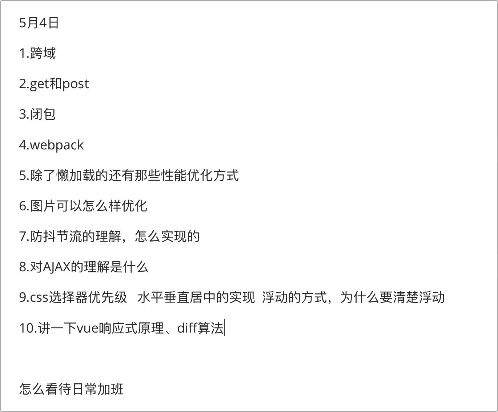
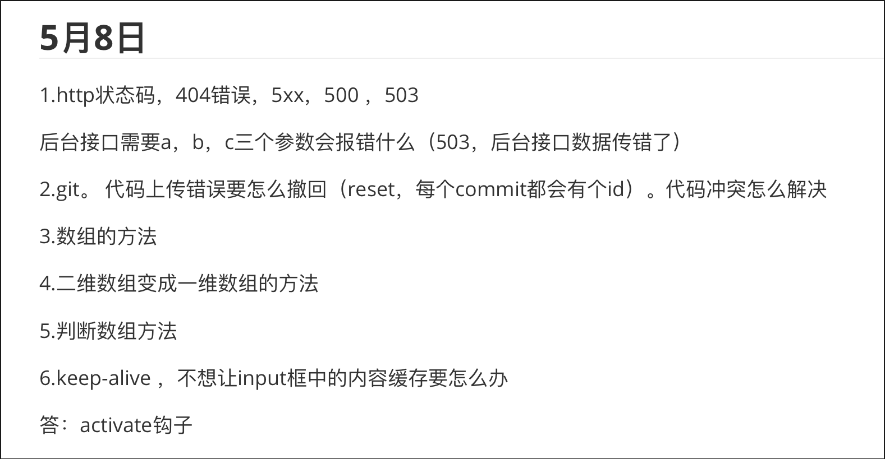
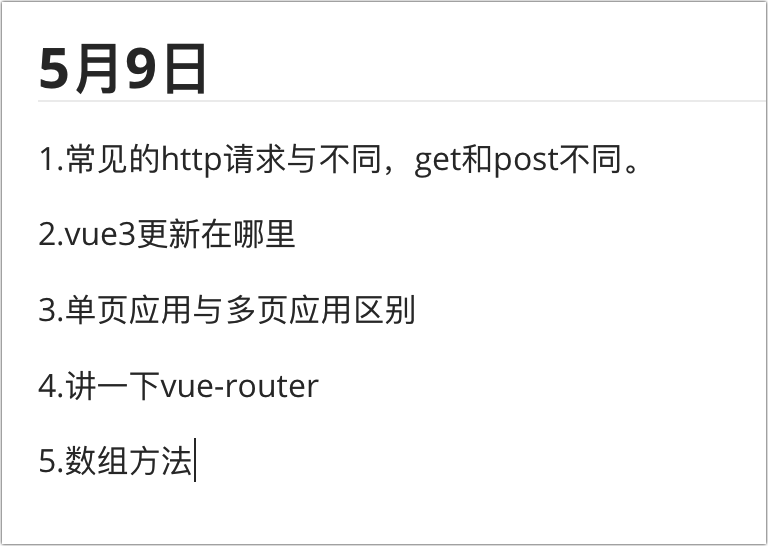

# 5月4日

## 怎么理解AJAX

> 原文链接：https://www.runoob.com/ajax/ajax-intro.html

### AJAX 简介

------

AJAX 是一种在无需重新加载整个网页的情况下，能够更新部分网页的技术。

### 什么是 AJAX ？

AJAX = 异步 JavaScript 和 XML。

AJAX 是一种用于创建快速动态网页的技术。

通过在后台与服务器进行少量数据交换，AJAX 可以使网页实现异步更新。这意味着可以在不重新加载整个网页的情况下，对网页的某部分进行更新。

传统的网页（不使用 AJAX）如果需要更新内容，必需重载整个网页面。

有很多使用 AJAX 的应用程序案例：新浪微博、Google 地图、开心网等等。

AJAX在Web开发中被广泛应用，例如实现无刷新的表单提交、实时聊天功能、自动补全搜索框、动态加载内容等。它为Web应用程序带来了更好的用户体验和更高的交互性，成为现代Web开发不可或缺的一部分。

------

### AJAX 工作原理


------

### AJAX是基于现有的Internet标准

AJAX是基于现有的Internet标准，并且联合使用它们：

- XMLHttpRequest 对象 (异步的与服务器交换数据)
- JavaScript/DOM (信息显示/交互)
- CSS (给数据定义样式)
- XML (作为转换数据的格式)

 AJAX应用程序与浏览器和平台无关的！

​	

## 讲一下webpack

Webpack是一个现代化的静态模块打包工具，广泛用于构建前端应用程序。它将前端项目中的各种资源，如JavaScript、CSS、图像等，视为模块，并通过依赖关系进行静态分析和打包。

Webpack的主要功能包括：

1. 模块打包：Webpack通过模块化的方式处理项目中的各种资源，将它们打包成最终的静态文件。它支持各种模块类型，包括CommonJS、ES Modules、AMD等，使开发者能够以模块化的方式组织代码。
2. 依赖管理：Webpack通过分析模块之间的依赖关系，可以准确地确定哪些模块被引用，以及它们的加载顺序。这使得开发者可以使用`import`或`require`语句引入其他模块，并确保它们在正确的时间被加载。
3. 打包优化：Webpack具有强大的打包优化功能，可以通过各种插件和加载器来处理和优化不同类型的资源。例如，它可以压缩和混淆JavaScript代码、提取CSS到单独的文件、优化图像等。
4. 开发服务器：Webpack提供了一个内置的开发服务器，可以在开发过程中实时监听文件变化，并自动重新构建和刷新页面。这样可以提高开发效率，同时支持热模块替换（Hot Module Replacement），可以在不刷新整个页面的情况下实时更新修改的模块。
5. 插件系统：Webpack具有丰富的插件系统，开发者可以通过插件扩展Webpack的功能。有很多社区提供的插件可用于各种用途，如代码分割、资源缓存、代码分析等。

Webpack的配置文件通常是一个JavaScript文件，用于定义Webpack的打包规则、插件配置和其他相关设置。通过配置文件，开发者可以根据项目需求进行个性化的配置和定制。

总而言之，Webpack是一个功能强大的静态模块打包工具，它通过模块化的方式处理各种前端资源，并提供了丰富的插件和优化功能，使开发者能够更高效地构建和管理前端应用程序。

​	

## 防抖节流怎么理解？它是怎么实现的？

防抖（Debounce）和节流（Throttle）都是前端开发中常用的性能优化技术，用于控制事件的触发频率，避免过度频繁的执行。

1. 防抖（Debounce）： 防抖的基本思想是在事件触发后，等待一段时间（例如100毫秒），如果在这段时间内没有再次触发事件，才执行相应的操作。如果在等待时间内再次触发了事件，则重新计时。这样可以避免在短时间内多次触发事件导致频繁执行操作的问题。

   以输入框搜索为例，当用户连续输入时，可以使用防抖来延迟发送请求，只在用户停止输入一段时间后才发送请求，减少不必要的请求次数。

2. 节流（Throttle）： 节流的基本思想是在一段时间内只执行一次事件操作。例如，设置一个间隔时间（例如200毫秒），当事件触发后，立即执行操作，并在这段时间内禁用事件，防止在短时间内多次触发事件。

   以滚动事件为例，当用户滚动页面时，可以使用节流来限制触发频率，例如每200毫秒只执行一次滚动处理函数，避免频繁触发滚动事件造成性能问题。

实现防抖和节流的方法有多种，其中常见的方法包括：

1. 使用计时器（setTimeout）：
   - 防抖：每次触发事件时，先清除之前的计时器，再设置新的计时器。
   - 节流：每次触发事件时，判断是否存在计时器，如果存在则不执行操作，否则执行操作并设置计时器。
2. 使用时间戳：
   - 防抖：记录上次触发事件的时间戳，每次触发事件时，判断与上次触发时间的间隔是否超过设定的等待时间，如果超过则执行操作。
   - 节流：记录上次执行操作的时间戳，每次触发事件时，判断当前时间与上次执行时间的间隔是否超过设定的间隔时间，如果超过则执行操作并更新执行时间。

具体实现方式会根据项目需求和使用的编程语言而有所不同。可以使用原生JavaScript编写防抖和节流函数，也可以使用第三方库（如lodash）提供的工具函数来实现。在实际开发中，根据具体场景选择适合的防抖和节流策略，以提高用户体验和性能优化。

​                  

                                    

# 5月8日

## Http状态码（404、5xx、500、503）

[](https://camo.githubusercontent.com/fe2bf6c2397ad07b2797599ac585a45e3debffe5f84f2da6f5b631d2f7032ce1/68747470733a2f2f7374617469632e7675652d6a732e636f6d2f30333838333164302d626263392d313165622d616239302d6439616538313462323430642e706e67)

### 一、是什么

HTTP状态码（英语：HTTP Status Code），用以表示网页服务器超文本传输协议响应状态的3位数字代码

它由 RFC 2616规范定义的，并得到 `RFC 2518`、`RFC 2817`、`RFC 2295`、`RFC 2774`与 `RFC 4918`等规范扩展

简单来讲，`http`状态码的作用是服务器告诉客户端当前请求响应的状态，通过状态码就能判断和分析服务器的运行状态

### 二、分类

状态码第一位数字决定了不同的响应状态，有如下：

- 1 表示消息
- 2 表示成功
- 3 表示重定向
- 4 表示请求错误
- 5 表示服务器错误

#### 1xx

代表请求已被接受，需要继续处理。这类响应是临时响应，只包含状态行和某些可选的响应头信息，并以空行结束

常见的有：

- 100（客户端继续发送请求，这是临时响应）：这个临时响应是用来通知客户端它的部分请求已经被服务器接收，且仍未被拒绝。客户端应当继续发送请求的剩余部分，或者如果请求已经完成，忽略这个响应。服务器必须在请求完成后向客户端发送一个最终响应
- 101：服务器根据客户端的请求切换协议，主要用于websocket或http2升级

#### 2xx

代表请求已成功被服务器接收、理解、并接受

常见的有：

- 200（成功）：请求已成功，请求所希望的响应头或数据体将随此响应返回
- 201（已创建）：请求成功并且服务器创建了新的资源
- 202（已创建）：服务器已经接收请求，但尚未处理
- 203（非授权信息）：服务器已成功处理请求，但返回的信息可能来自另一来源
- 204（无内容）：服务器成功处理请求，但没有返回任何内容
- 205（重置内容）：服务器成功处理请求，但没有返回任何内容
- 206（部分内容）：服务器成功处理了部分请求

#### 3xx

表示要完成请求，需要进一步操作。 通常，这些状态代码用来重定向

常见的有：

- 300（多种选择）：针对请求，服务器可执行多种操作。 服务器可根据请求者 (user agent) 选择一项操作，或提供操作列表供请求者选择
- **301（永久移动）：请求的网页已永久移动到新位置。 服务器返回此响应（对 GET 或 HEAD 请求的响应）时，会自动将请求者转到新位置**
- 302（临时移动）： 服务器目前从不同位置的网页响应请求，但请求者应继续使用原有位置来进行以后的请求
- 303（查看其他位置）：请求者应当对不同的位置使用单独的 GET 请求来检索响应时，服务器返回此代码
- **304（Not Modified）：未修改。所请求的资源未修改，服务器返回此状态码时，不会返回任何资源。客户端通常会缓存访问过的资源，通过提供一个头信息指出客户端希望只返回在指定日期之后修改的资源**
- 305 （使用代理）： 请求者只能使用代理访问请求的网页。 如果服务器返回此响应，还表示请求者应使用代理
- 307 （临时重定向）： 服务器目前从不同位置的网页响应请求，但请求者应继续使用原有位置来进行以后的请求

#### 4xx

代表了客户端看起来可能发生了错误，妨碍了服务器的处理

常见的有：

- 400（错误请求）： 服务器不理解请求的语法
- 401（未授权）： 请求要求身份验证。 对于需要登录的网页，服务器可能返回此响应。
- **403（禁止）： 服务器拒绝请求**
- **404（未找到）： 服务器找不到请求的网页**
- 405（方法禁用）： 禁用请求中指定的方法
- 406（不接受）： 无法使用请求的内容特性响应请求的网页
- 407（需要代理授权）： 此状态代码与 401（未授权）类似，但指定请求者应当授权使用代理
- 408（请求超时）： 服务器等候请求时发生超时

#### 5xx

表示服务器无法完成明显有效的请求。这类状态码代表了服务器在处理请求的过程中有错误或者异常状态发生

常见的有：

- **500（服务器内部错误）：服务器遇到错误，无法完成请求**
- 501（尚未实施）：服务器不具备完成请求的功能。 例如，服务器无法识别请求方法时可能会返回此代码
- 502（错误网关）： 服务器作为网关或代理，从上游服务器收到无效响应
- **503（服务不可用）： 服务器目前无法使用（由于超载或停机维护）**
- 504（网关超时）： 服务器作为网关或代理，但是没有及时从上游服务器收到请求
- 505（HTTP 版本不受支持）： 服务器不支持请求中所用的 HTTP 协议版本

### 三、适用场景

下面给出一些状态码的适用场景：

- 100：客户端在发送POST数据给服务器前，征询服务器情况，看服务器是否处理POST的数据，如果不处理，客户端则不上传POST数据，如果处理，则POST上传数据。常用于POST大数据传输
- 206：一般用来做断点续传，或者是视频文件等大文件的加载
- 301：永久重定向会缓存。新域名替换旧域名，旧的域名不再使用时，用户访问旧域名时用301就重定向到新的域名
- 302：临时重定向不会缓存，常用 于未登陆的用户访问用户中心重定向到登录页面
- 304：**协商缓存**，告诉客户端有缓存，直接使用缓存中的数据，返回页面的只有头部信息，是没有内容部分
- 400：参数有误，请求无法被服务器识别
- 403：告诉客户端进制访问该站点或者资源，如在外网环境下，然后访问只有内网IP才能访问的时候则返回
- 404：服务器找不到资源时，或者服务器拒绝请求又不想说明理由时
- 503：服务器停机维护时，主动用503响应请求或 nginx 设置限速，超过限速，会返回503
- 504：网关超时

> 程序员最想看到的：200-OK。
>
> 程序员不想看到的：500-Internal-Server-Error。
>
> 用户不想看到的：401-Unauthorized、403-Forbidden、408-Request-Time-out、404-not-found。

### 参考文献

- [https://zh.wikipedia.org/wiki/HTTP状态码](https://zh.wikipedia.org/wiki/HTTP状态码)
- https://kebingzao.com/2018/10/05/http-status-code/
- https://vue3js.cn/interview

- 其他可参考学习文献
  - [https://www.runoob.com/http/http-status-codes.html](https://www.runoob.com/http/http-status-codes.html)
  - [https://kebingzao.com/2018/10/05/http-status-code/](https://kebingzao.com/2018/10/05/http-status-code/)
  - https://developer.mozilla.org/zh-CN/docs/Web/HTTP/Status

​	

## 关于HTTP状态码的知识，后台接口需要a，b，c三个参数会报什么错

根据您提供的信息，无法确定具体的错误类型，因为错误类型取决于后台接口的实现和设计。以下是一些可能的错误类型，当后台接口需要参数 a、b 和 c，但未提供时可能出现的情况：

1. **缺少参数错误**：后台接口可能会验证参数的完整性，如果缺少参数 a、b 或 c 中的任何一个，可能会返回一个表示缺少参数的错误状态码。常见的状态码是 **400 Bad Request**，表示请求有误。
2. **参数验证错误**：即使提供了参数 a、b 和 c，后台接口可能会对参数进行验证，确保其满足一定的条件或格式。如果参数不符合要求，后台接口可能会返回一个表示参数验证失败的错误状态码，例如 **422 Unprocessable Entity**。
3. **权限错误**：某些情况下，后台接口可能会要求特定的权限或角色才能访问，如果没有提供足够的权限或角色，可能会返回一个表示权限不足的错误状态码，如 **401 Unauthorized**。

请注意，以上仅是一些常见的错误类型示例，具体的错误类型和状态码取决于后台接口的实现和设计。为了准确了解后台接口返回的错误信息和状态码，建议查阅后台接口的文档或与后台开发人员进行沟通。

​	

## 当后台接口返回 503 错误时，需要如何处理

如果后台接口返回的是 503 错误，它表示 "Service Unavailable"，即服务不可用。这通常意味着后台服务器无法处理当前请求，可能是由于服务器过载、维护或临时故障等原因导致。

当后台接口返回 503 错误时，一般情况下客户端需要做以下处理：

1. **重试请求**：由于 503 错误是暂时的，客户端可以尝试重新发送相同的请求。可以使用指数退避策略，即每次重试时等待的时间逐渐增加，以避免对服务器造成过大的压力。
2. **显示友好提示**：在用户界面上显示一个友好的提示，告知用户当前服务不可用，建议稍后再试或联系管理员。
3. **监控和日志记录**：对于开发人员和运维团队来说，重要的是监控服务器的健康状态，并记录相关日志，以便进一步分析和调试故障原因。

需要注意的是，503 错误是一个服务器端错误，与客户端传递的参数无关。如果遇到持续的 503 错误，建议与后台团队或服务器管理员联系，以便解决问题。

> 一般情况下，数据传输错误会使用其他的状态码进行表示，例如 400 错误（Bad Request）或者 500 错误（Internal Server Error）等。

​	

## git 代码上传错误要怎么撤回

如果您在 Git 中提交了错误的代码，您可以使用以下方法撤销或修正提交：

1. **撤销最新的提交并保留修改**：

   ```bash
   git reset HEAD~1
   ```

   这会撤销最新的提交，并将更改保留在工作目录中。您可以在撤销的基础上进行修改和重新提交。

2. **撤销最新的提交并删除修改内容**：

   ```bash
   git reset --hard HEAD~1
   ```

   这会撤销最新的提交并删除所有相应的更改。请注意，此操作是不可逆的，慎用。

3. **修改最新的提交信息**：

   ```bash
   git commit --amend
   ```

   这会打开一个文本编辑器，允许您编辑最新的提交信息。您可以修改提交信息后保存并关闭编辑器。

4. **创建新的提交来覆盖错误提交**：

   ```bash
   git commit -a --amend
   ```

   这会将工作目录中的修改添加到最新的提交中，同时也会允许您修改提交信息。

5. 撤销特定的提交，指定提交的 ID（commit ID 可以通过 `git log` 查看）：

   ```bash
   git reset <commit ID>
   ```

6. 撤销最近的多个提交：

   ```bash
   git reset HEAD~<num>
   ```

   其中 `<num>` 代表要回退的提交数量。

请注意，使用 `git reset` 命令撤销提交会改变提交历史记录，这些操作可能会影响历史记录和共享存储库中的其他开发人员。如果您已经将错误提交推送到远程存储库，并且其他人已经基于该提交进行了更改，那么修改历史记录可能会导致问题。在这种情况下，最好与团队成员一起协商并确定正确的操作方法。

在撤销提交之后，你可能需要使用 `git push --force` 命令将本地的分支推送到远程仓库，以更新远程分支的历史记录。请确保在执行任何 Git 操作之前备份重要的代码或提交，以防意外情况发生。

在任何情况下，在执行这些操作之前，请确保您理解其潜在影响，并在必要时备份代码以防止数据丢失。

​	

## git提交出现代码冲突怎么解决

当您在 Git 中提交代码时遇到冲突，通常是因为多个分支或多个开发人员对同一部分代码进行了修改，并且这些修改无法自动合并。下面是解决代码冲突的一般步骤：

1. **查看冲突**：首先，运行 `git status` 命令可以查看哪些文件存在冲突。冲突的文件会在文件中显示标记，指示冲突的位置。

2. **打开冲突文件**：使用文本编辑器打开存在冲突的文件。在文件中，您将看到类似于以下示例的冲突标记：

   ```markdown
   <<<<<<< HEAD
   本地修改内容
   =======
   远程修改内容
   >>>>>>> branch_name
   ```

3. **解决冲突**：手动编辑冲突文件，根据您的需求选择保留哪个修改或将两者结合起来。您需要删除冲突标记（`<<<<<<< HEAD`、`=======`、`>>>>>>> branch_name`），并将文件修改为您期望的最终状态。

4. **保存文件**：完成对冲突文件的编辑后，保存文件并关闭文本编辑器。

5. **添加解决冲突的文件**：运行 `git add <冲突文件>` 将解决冲突的文件标记为已解决。

6. **完成提交**：运行 `git commit` 完成提交。Git 会生成一条新的提交，包含解决冲突后的文件。

如果在解决冲突过程中遇到困难或不确定如何处理冲突，请与团队中的其他开发人员协商并寻求帮助。解决冲突时，沟通和合作是非常重要的，以确保所有人的修改得到正确地合并。

​	

## 数组方法

> 已输出文章到掘金 ：[讲一下JS数组方法(总结篇)](https://juejin.cn/post/7234716071986806841)

​	

## 二维数组变成一维数组的三种方法

将二维数组转换为一维数组的方法有多种。下面介绍几种常见的方法：

1. **使用`flat`方法**：`flat` 方法是数组的原生方法，可以将多维数组转换为一维数组。示例代码如下：

   ```js
   const twoDimArray = [[1, 2], [3, 4], [5, 6]];
   const oneDimArray = twoDimArray.flat();
   console.log(oneDimArray); // [1, 2, 3, 4, 5, 6]
   ```

2. **使用`concat`+展开运算符方法**：`concat` 方法可以将多个数组合并成一个新的数组。通过将多维数组作为参数传递给 `concat` 方法，可以将其转换为一维数组。示例代码如下：

   ```js
   const twoDimArray = [[1, 2], [3, 4], [5, 6]];
   const oneDimArray = [].concat(...twoDimArray);
   console.log(oneDimArray); // [1, 2, 3, 4, 5, 6]
   ```

3. **使用`reduce`+concat方法**：`reduce` 方法可以将数组中的元素通过指定的回调函数进行累积处理。在这种情况下，可以将二维数组转换为一维数组。示例代码如下：

   ```js
   const twoDimArray = [[1, 2], [3, 4], [5, 6]];
   const oneDimArray = twoDimArray.reduce((acc, curr) => acc.concat(curr), []);
   console.log(oneDimArray); // [1, 2, 3, 4, 5, 6]
   ```

这些方法都可以将二维数组转换为一维数组，您可以根据自己的需求选择最适合的方法来处理。

### 解释一下这一句代码 twoDimArray.reduce((acc, curr) => acc.concat(curr), []);

这段代码使用了数组的 `reduce` 方法来将二维数组 `twoDimArray` 转换为一维数组。

- `reduce` 方法接受两个参数：回调函数和初始值。
- 回调函数接受两个参数：累加器（`acc`）和当前值（`curr`）。
- 初始值参数设置为一个空数组 `[]`，作为累加器的初始值。

在每次迭代中，回调函数将当前值 `curr` 使用 `concat` 方法连接到累加器 `acc` 上，并返回新的累加器。最后，`reduce` 方法返回最终的累加器值，即转换后的一维数组。

这段代码的执行过程如下：

1. 初始时，累加器 `acc` 的值为 `[]`。
2. 第一次迭代时，当前值 `curr` 是二维数组中的第一个子数组 `[1, 2]`。回调函数使用 `concat` 方法将其连接到累加器 `acc` 上，得到 `[1, 2]`。
3. 第二次迭代时，当前值 `curr` 是二维数组中的第二个子数组 `[3, 4]`。回调函数将其连接到累加器 `acc` 上，得到 `[1, 2, 3, 4]`。
4. 第三次迭代时，当前值 `curr` 是二维数组中的第三个子数组 `[5, 6]`。回调函数将其连接到累加器 `acc` 上，得到 `[1, 2, 3, 4, 5, 6]`。
5. 最后，`reduce` 方法返回最终的累加器值 `[1, 2, 3, 4, 5, 6]`，即转换后的一维数组。

通过这种方式，使用 `reduce` 方法可以将二维数组中的所有子数组连接成一个一维数组。

​	

## 判断是否为数组的4种方法

在 JavaScript 中，有多种方法可以判断一个变量是否为数组。以下是几种常见的方法：

1. **Array.isArray() 方法**：`Array.isArray()` 是 JavaScript 数组的静态方法，用于判断一个变量是否为数组。它返回一个布尔值，如果变量是数组则返回 `true`，否则返回 `false`。示例代码如下：

   ```js
   const arr = [1, 2, 3];
   const isArr = Array.isArray(arr);
   console.log(isArr); // true
   ```

2. **instanceof 运算符**：`instanceof` 运算符用于检测对象是否属于特定的类型。对于数组来说，可以使用 `instanceof Array` 来判断一个变量是否为数组。示例代码如下：

   ```js
   const arr = [1, 2, 3];
   const isArr = arr instanceof Array;
   console.log(isArr); // true
   ```

3. **Array.prototype.isPrototypeOf() 方法**：`Array.prototype.isPrototypeOf()` 是 Array 原型对象上的方法，可以判断一个对象是否为数组的原型。示例代码如下：

   ```js
   const arr = [1, 2, 3];
   const isArr = Array.prototype.isPrototypeOf(arr);
   console.log(isArr); // true
   ```

4. **Object.prototype.toString.call() 方法**：通过使用 `Object.prototype.toString.call()` 方法，可以获取一个对象的内部属性 `[[Class]]` 的值，从而判断对象的类型。对于数组来说，其 `[[Class]]` 值为 "[object Array]"。示例代码如下：

   ```js
   const arr = [1, 2, 3];
   const isArr = Object.prototype.toString.call(arr) === "[object Array]";
   console.log(isArr); // true
   ```

以上方法中，`Array.isArray()` 是推荐使用的方法，因为它是专门用于判断数组的方法，并且在大多数现代浏览器中得到良好的支持。其他方法可以根据需要选择使用。

### 数组的原型是什么

在 JavaScript 中，数组的原型是 `Array.prototype`。`Array.prototype` 是一个对象，它包含了对数组对象的方法和属性的定义，可以通过原型链机制访问和使用这些方法和属性。

当我们创建一个数组时，JavaScript 引擎会自动将该数组的原型设置为 `Array.prototype`。这意味着该数组对象可以继承 `Array.prototype` 上定义的所有方法和属性。

通过数组的原型，我们可以使用一些常见的数组方法，如 `push()`、`pop()`、`slice()` 等，以及一些属性，如 `length`。我们也可以在原型上添加自定义的方法，以扩展数组的功能。

下面是一个示例，展示如何使用数组的原型方法 `push()` 和属性 `length`：

```js
const arr = [1, 2, 3];

console.log(arr.length); // 输出：3

arr.push(4);
console.log(arr); // 输出：[1, 2, 3, 4]
console.log(arr.length); // 输出：4
```

在这个示例中，我们创建了一个数组 `arr`，它继承了 `Array.prototype` 上的方法和属性。通过使用 `push()` 方法向数组末尾添加一个元素，我们改变了数组的内容，并可以通过 `length` 属性获取数组的长度。

因此，数组的原型 `Array.prototype` 是一个重要的概念，它提供了许多用于操作和处理数组的方法和属性。

### 为什么下面arr数组是数组的原型，我不理解 

> const arr = [1, 2, 3]; 
>
> const isArr = Array.prototype.isPrototypeOf(arr); 
>
> console.log(isArr); // true

在给定的代码中，`Array.prototype.isPrototypeOf(arr)` 是用来判断 `Array.prototype` 是否是 `arr` 的原型对象。它返回的结果是 `true`，因为 `Array.prototype` 确实是 `arr` 的原型对象。

让我们来解释一下这个过程：

1. 首先，`Array.prototype` 是所有数组对象的原型。它定义了一系列用于操作数组的方法和属性，比如 `push()`、`pop()`、`length` 等等。
2. 当我们创建一个数组对象时，JavaScript 引擎会自动将该数组的原型设置为 `Array.prototype`。这意味着数组对象可以通过原型链机制访问和使用 `Array.prototype` 上定义的方法和属性。
3. 在给定的代码中，我们创建了一个数组 `arr`，它包含了一些元素 `[1, 2, 3]`。
4. 接着，我们使用 `Array.prototype.isPrototypeOf()` 方法来检查 `Array.prototype` 是否是 `arr` 的原型对象。该方法会检查原型链，确定一个对象是否继承了给定的原型对象。
5. 由于 `arr` 是一个数组对象，它的原型被设置为 `Array.prototype`。因此，`Array.prototype.isPrototypeOf(arr)` 返回 `true`，表示 `Array.prototype` 确实是 `arr` 的原型对象。

总结起来，给定的代码是用来验证 `Array.prototype` 是否是 `arr` 的原型对象。由于 JavaScript 中的数组对象的原型都是 `Array.prototype`，所以结果是 `true`。

​	

## 讲一下keep-alive

`keep-alive` 是 Vue.js 中的一个内置组件，用于在组件间缓存和复用组件实例。

当使用 `keep-alive` 组件包裹一个动态组件时，该组件的实例将会被缓存，而不是每次都重新创建。这样可以在组件切换时，保持之前组件的状态，避免重复的创建和销毁操作，提高性能和用户体验。

`keep-alive` 组件的主要特性包括：

1. 缓存组件：当 `keep-alive` 包裹的组件切换时，之前缓存的组件实例将会被保留，不会销毁。
2. 复用组件：当切换回之前缓存的组件时，组件实例将被复用，不会重新创建，可以保持之前的状态和数据。
3. 生命周期钩子：`keep-alive` 提供了一些生命周期钩子函数，用于处理缓存组件的激活和停用事件，如 `activated` 和 `deactivated`。

使用 `keep-alive` 的示例代码如下：

```vue
<template>
  <div>
    <keep-alive>
      <component :is="currentComponent"></component>
    </keep-alive>
    <button @click="toggleComponent">Toggle Component</button>
  </div>
</template>

<script>
export default {
  data() {
    return {
      currentComponent: 'ComponentA'
    };
  },
  methods: {
    toggleComponent() {
      this.currentComponent = this.currentComponent === 'ComponentA' ? 'ComponentB' : 'ComponentA';
    }
  }
};
</script>
```

在这个示例中，我们使用 `keep-alive` 组件包裹了一个动态组件 `<component>`。当点击按钮时，切换当前组件的展示。由于使用了 `keep-alive`，在组件切换时，之前缓存的组件实例将会被保留，不会销毁，可以保持之前的状态和数据。

总结一下，`keep-alive` 组件在 Vue.js 中提供了一种方便的方式来缓存和复用组件实例，减少不必要的组件创建和销毁操作，提高性能和用户体验。

### keep-alive相关的问题，不想让input框中的内容缓存要怎么办(方法一)

如果你不想让 `<input>` 框中的内容被 `keep-alive` 缓存，可以使用 `key` 属性来唯一标识每个 `<input>` 元素，从而阻止缓存。

当使用 `keep-alive` 组件包裹一个动态组件时，Vue.js 默认会根据组件类型来决定是否进行缓存。而使用 `key` 属性可以告诉 Vue.js 每个组件都是唯一的，不应该被缓存。

示例代码如下：

```vue
<template>
  <div>
    <keep-alive>
      <component :is="currentComponent" :key="currentComponent"></component>
    </keep-alive>
    <button @click="toggleComponent">Toggle Component</button>
  </div>
</template>

<script>
export default {
  data() {
    return {
      currentComponent: 'ComponentA'
    };
  },
  methods: {
    toggleComponent() {
      this.currentComponent = this.currentComponent === 'ComponentA' ? 'ComponentB' : 'ComponentA';
    }
  }
};
</script>
```

在这个示例中，我们给 `<component>` 添加了 `:key="currentComponent"`，这样每次组件切换时，`currentComponent` 的值改变，相应的组件实例就会被重新创建，不会使用之前的缓存实例。这样 `<input>` 框中的内容也不会被缓存。

通过设置唯一的 `key` 属性，你可以控制组件是否被缓存，以及防止 `<input>` 框内容的缓存。

#### 也可以使用时间戳的方式

例如，在使用 `keep-alive` 组件包裹 `<input>` 框的父组件中，你可以将 `key` 设置为唯一的值，如当前时间戳，以确保每次切换都会重新创建 `<input>` 组件实例：

```vue
<template>
  <div>
    <keep-alive>
      <input :key="currentTime" v-model="inputValue" type="text" />
    </keep-alive>
  </div>
</template>

<script>
export default {
  data() {
    return {
      inputValue: '',
      currentTime: 0
    };
  },
  methods: {
    // 在需要重新创建组件实例时调用该方法
    resetInput() {
      this.currentTime = Date.now();
    }
  }
};
</script>
```

在上述示例中，每当调用 `resetInput` 方法时，会更新 `currentTime` 的值为当前时间戳，从而改变 `<input>` 组件的 `key`，触发重新创建组件实例。

请注意，这种方式只适用于当前组件内的缓存控制，如果需要在其他组件中停止缓存，仍然需要使用其他方式，例如移除 `keep-alive` 包裹或其他自定义逻辑。

### 不想让input框中的内容缓存，那么在keep-alive中每次切换都会创建或销毁input框吗(方法二)

在使用 `keep-alive` 组件包裹时，`keep-alive` 会缓存已经渲染过的组件实例，以提高性能和复用性。这意味着当组件被切换时，并不会销毁和重新创建组件实例，而是将其缓存起来以供下次使用。

如果你不想让 `<input>` 框中的内容缓存，可以在每次组件激活时重置输入框的值，而不是销毁和重新创建整个组件实例。你可以通过在组件的 `activated` 钩子函数中重置输入框的值来实现。例如：

```vue
<template>
  <div>
    <input v-model="inputValue" type="text" />
  </div>
</template>

<script>
export default {
  data() {
    return {
      inputValue: ''
    };
  },
  activated() {
    this.inputValue = '';
  }
};
</script>
```

在上述示例中，每当组件被激活时（切换到该组件），`activated` 钩子函数会被调用，将 `<input>` 框的值重置为空，从而达到清除缓存的效果。

请注意，这种方式仅适用于单个组件中的 `<input>` 框。如果你希望在多个组件中禁用缓存，并且每次切换都需要重新创建整个组件实例，可以考虑不使用 `keep-alive` 组件，或者在需要缓存的组件上移除 `keep-alive` 包裹。

​	

### keep-alive 组件停用缓存的4种方法

使用 `keep-alive` 组件停用缓存有两种常见的方式，分别是：

1. 设置不同的 `key`：通过为每个需要停用缓存的组件设置不同的 `key` 值，使其被视为不同的组件，从而触发重新创建组件实例。
2. 使用 `activated` 钩子函数：在被缓存的组件中定义 `activated` 钩子函数，并在该钩子函数中执行需要的操作，例如重置输入框的值、重新加载数据等。这种方式可以在每次组件激活时执行一些特定的行为，而不是销毁和重新创建整个组件实例。

这两种方式可以单独使用，也可以同时使用。使用不同的 `key` 值可以在组件切换时停用缓存，而使用 `activated` 钩子函数可以在每次组件激活时执行特定的操作。

所以，在需要停用 `keep-alive` 缓存时，你可以选择其中一种方式或结合使用，具体取决于你的需求和场景。

除了设置不同的 `key` 和使用 `activated` 钩子函数之外，还可以通过以下方式停用 `keep-alive` 组件的缓存：

3. 设置 `include` 属性：在 `keep-alive` 组件上使用 `include` 属性，指定需要被缓存的组件名称或组件的选择器。其他组件将不会被缓存，每次切换都会重新创建实例。

```vue
<template>
  <div>
    <keep-alive :include="['ComponentA']">
      <router-view />
    </keep-alive>
  </div>
</template>
```

在上述示例中，只有名称为 `ComponentA` 的组件会被缓存，其他组件会在切换时重新创建。

4. 设置 `exclude` 属性：与 `include` 相反，使用 `exclude` 属性可以指定不被缓存的组件名称或组件的选择器。被指定的组件将在切换时重新创建。

```vue
<template>
  <div>
    <keep-alive :exclude="['ComponentB']">
      <router-view />
    </keep-alive>
  </div>
</template>
```

在上述示例中，名称为 `ComponentB` 的组件不会被缓存，其他组件会继续被缓存。

请注意，设置 `include` 或 `exclude` 属性时，可以使用组件的名称或者选择器。选择器可以是组件的标签名、CSS 类名、组件的自定义属性等。

这些方式可以根据你的需求选择使用，用于更精确地控制 `keep-alive` 组件的缓存行为。

​	



# 5月9日

## 说一下常见的HTTP请求

1. **GET**：用于从服务器**获取资源**。GET 请求是幂等的，多次执行相同的 GET 请求会返回相同的结果，而不会对服务器产生副作用。*GET 请求可以将参数附加在 URL 的查询字符串中，也可以在请求头中发送一些元数据。*
2. **POST**：用于向服务器**提交数据，通常用于创建新的资源**。POST 请求不是幂等的，多次执行相同的 POST 请求会在服务器上创建多个相同的资源。*POST 请求将数据放在请求体中，而不是在 URL 中。*
3. **PUT**：用于向服务器更新资源，通常用于**替换整个资源或创建新的资源**。PUT 请求是幂等的，多次执行相同的 PUT 请求会产生相同的结果。*PUT 请求也将数据放在请求体中，类似于 POST 请求。*
4. **PATCH**：用于向服务器更新资源，**但只更新资源的一部分**。PATCH 请求通常用于部分更新资源，而不是替换整个资源。PATCH 请求*将更新的数据放在请求体中*。
5. **DELETE**：用于从服务器删除资源。DELETE 请求用于删除指定的资源。

​	

## GET请求跟POST请求的区别

1. **数据位置**：GET 请求的数据是通过 URL 的查询字符串传递的，将数据附加在 URL 后面，例如 `http://example.com/api?param1=value1&param2=value2`。而 POST 请求的数据是放在请求体中传递的，不会显示在 URL 中。
2. **安全性**：GET 请求的数据会显示在 URL 中，因此可能会被保存在浏览器的历史记录、服务器的日志文件等地方，有一定的安全风险。而 POST 请求的数据在请求体中，不会直接显示在 URL 中，相对来说更安全。
3. **数据长度限制**：GET 请求对 URL 的长度有限制，不同浏览器和服务器对 URL 长度的限制有所不同，通常在几千个字符左右。而 POST 请求没有对数据长度的限制，可以发送大量数据。
4. **幂等性**：GET 请求是幂等的，即多次执行相同的 GET 请求会返回相同的结果，不会对服务器产生副作用。而 POST 请求不是幂等的，多次执行相同的 POST 请求可能会在服务器上创建多个相同的资源。
5. **缓存**：GET 请求可以被浏览器缓存，可以利用缓存提高性能，因为 GET 请求是幂等的。而 POST 请求不会被浏览器缓存。
6. **请求语义**：GET 请求用于获取资源，不应对服务器产生任何副作用。而 POST 请求用于向服务器提交数据，可以用于创建新的资源或对现有资源进行修改。

​	

## Vue3更新在哪里

Vue 3 是 Vue.js 的下一个主要版本，带来了一些重要的更新和改进。以下是 Vue 3 的一些主要更新：

1. **==Composition API（组合式 API）==**：Vue 3 引入了 Composition API，它是一种新的组件组织方式，允许开发者将逻辑按照功能进行组合和复用，而不是依赖于传统的选项对象。Composition API 使用函数式的方式编写组件逻辑，使代码更加模块化和可维护。
2. **更好的类型支持**：Vue 3 使用了 TypeScript 2.9+ 的强大类型系统，提供了更好的类型支持。这意味着在 Vue 3 中使用 TypeScript 编写代码将会更加顺畅，并提供更准确的类型检查和自动补全功能。
3. **更高的性能**：Vue 3 在虚拟 DOM 渲染和响应式系统方面进行了优化，提供了更高的性能。通过使用编译时优化、静态标记和增强的响应式追踪算法，Vue 3 在渲染速度和内存占用方面得到了显著改进。
4. **==Tree-shaking 支持==**：Vue 3 采用了更细粒度的模块组织，使得打包工具能够更好地进行 Tree-shaking，减少最终构建包的体积。
5. **==Fragment（片段）==**：Vue 3 支持使用 `<template>` 标签以外的元素作为组件的根节点，这被称为 Fragment。Fragment 可以帮助开发者更灵活地组织组件结构，不再需要额外的父级包装器。
6. **==Teleport（传送门）==**：Vue 3 引入了 Teleport 组件，它可以在组件的模板中将内容渲染到 DOM 树的其他位置，而不是当前组件所在的位置。Teleport 可以帮助开发者实现像弹出框、模态框等功能。

除了上述的主要更新，Vue 3 还带来了其他一些改进，例如更好的 TypeScript 支持、响应式 API 的改进、自定义指令的变化等。

需要注意的是，由于 Vue 3 引入了一些重要的更新，与 Vue 2.x 版本存在一些不兼容的变化。因此，在迁移现有项目或开始新的项目时，需要仔细了解 Vue 3 的变化和文档，以确保正确使用和理解新的特性和 API。

总结：Vue 3 引入了 Composition API、更好的类型支持、性能优化、Tree-shaking 支持、Fragment、Teleport 等重要的更新和改进。这些更新带来了更好的开发体验、更高的性能和更好的可维护性。在迁移或开始新的项目时，需要了解 Vue 3 的变化和文档，并适应新的特性和 API。

​	

## 单页应用和多页应用的区别

单页应用（Single-Page Application，SPA）和多页应用（Multiple-Page Application，MPA）是两种常见的 web 应用程序架构。

**单页应用 (SPA)**：

- SPA 是一种前端应用程序架构，其核心思想是**在加载初始 HTML 页面后，后续的页面切换和内容更新都通过异步加载数据和更新 DOM 的方式来实现，而不需要完全重新加载整个页面。**
- SPA 使用 JavaScript、HTML 和 CSS 来动态地更新页面内容，通常通过 ==AJAX 或 WebSocket==与后端进行数据交互。
- **SPA 通常只有一个初始 HTML 页面，其余的页面内容都通过前端路由（例如 Vue Router、React Router）来加载和切换**。
- SPA 提供了更流畅的用户体验，**页面切换无需刷新，只更新部分内容**，可以实现快速响应和无缝导航。
- 由于 SPA **在初始加载后只需要与后端交换数据，而不需要重新加载整个页面**，因此可以减轻服务器的负担。

**多页应用 (MPA)**：

- MPA 是一种传统的 web 应用程序架构，**每个页面都是独立的 HTML 文件，每次导航或操作都会重新加载整个页面。**
- MPA 中的每个页面通常对应一个服务器路由，并与后端进行完整的页面请求和响应。
- MPA 的**页面切换会导致页面的完全刷新**，因此用户体验可能会稍差，页面加载时间较长。
- MPA 适合那些**需要独立页面和传统页面导航**的应用程序，例如多个静态页面的网站或多个功能模块的企业应用。

总结：

- 单页应用 (SPA) 是一种通过异步加载数据和更新 DOM 的方式来实现页面切换和内容更新的前端应用程序架构，提供了更流畅的用户体验。
- 多页应用 (MPA) 是一种传统的 web 应用程序架构，每个页面都是独立的 HTML 文件，每次导航或操作都会重新加载整个页面。
- **SPA 适合需要快速响应、无缝导航和交互性强的应用程序，而 MPA 适合需要独立页面和传统页面导航的应用程序。**
- 选择 SPA 还是 MPA 取决于应用程序的需求、性能需求以及开发团队的偏好和技术栈。

​	

## 讲一下vue-router

Vue Router 是 Vue.js 官方提供的路由管理器，用于实现单页应用中的路由功能。它允许你在 Vue 应用程序中通过定义路由来组织和管理不同的视图，并在不同的 URL 下显示相应的组件。

以下是 Vue Router 的一些主要特性和用法：

1. **路由定义**：通过 Vue Router，你可以定义路由映射，将不同的 URL 路径映射到相应的 Vue 组件。你可以在 Vue Router 的路由配置中定义路由，指定路径和组件的关系。
2. **路由导航**：Vue Router 提供了一些导航方法，例如 `router-link` 组件和编程式导航方法（如 `router.push`、`router.replace`）来实现页面之间的跳转和导航。你可以通过点击链接或调用方法来触发路由的切换。
3. **动态路由**：Vue Router 支持动态路由，即路由路径中的一部分可以是动态的，使用冒号 `:` 来指定参数。你可以通过在路由配置中定义参数，然后在组件中通过 `$route.params` 访问路由参数。
4. **嵌套路由**：Vue Router 支持嵌套路由，即一个路由可以包含另一个路由。你可以在组件中定义嵌套的 `<router-view>` 标签来渲染嵌套的组件。
5. **路由守卫**：Vue Router 提供了路由守卫机制，**允许你在路由切换前、切换后或在路由组件内部进行一些逻辑处理**。你可以使用全局的前置守卫、后置守卫，也可以在路由配置中定义组件级别的守卫。
6. **命名路由**：Vue Router 支持给路由配置起一个名字，称为命名路由。你可以通过命名路由在程序中方便地进行路由导航，而不是直接使用路径。
7. **懒加载**：Vue Router 支持懒加载，即在需要时才加载路由组件。你可以使用 `import` 函数配合 `component` 配置来实现按需加载，提高应用程序的性能。

Vue Router 是 Vue.js 应用程序中常用的路由管理工具，它可以帮助你构建单页应用，实现页面之间的导航和组件的动态切换。通过定义路由、导航方法、路由守卫等功能，你可以更好地组织和管理你的应用程序的不同视图和功能模块。

要使用 Vue Router，你需要先安装它，并将其配置为 Vue 应用程序的一部分。然后，在 Vue 组件中可以使用 `<router-link>` 来生成路由链接，使用 `<router-view>` 来渲染对应的组件，并通过编程式导航方法来进行页面跳转。详细的使用方法和配置可以参考 Vue Router 的官方文档。

​	

## 讲一下JS数组方法(总结篇)

随着`JavaScript`的发展，`JavaScript`的`Array`也增加了许多方法。有必要全面了解一下。本文基本涵盖了`Array`所有的方法介绍。

### 一、 检测方法

#### `Array.isArray()`

判断传入的值是否是一个数组。

```javascript
// true
Array.isArray([1, 2, 3])
// false
Array.isArray({foo: 123})
// false
Array.isArray('foobar')   
// false
Array.isArray(undefined)  
```

### 二、 创建数组方法（ES6）

#### `Array.from()`

`Array.from()`方法用于将`类数组对象`和`可迭代对象`转为真正的数组，并且返回一个新的，`浅拷贝`的数组实例。

语法：

```js
Array.from(arrayLike)
Array.from(arrayLike, mapFn)
Array.from(arrayLike, mapFn, thisArg) // 参数列表：原数据 回调函数 this指向
```

```javascript
// 报错
Array.from(undefined)
// 报错
Array.from(null)
// ["f", "o", "o"]
console.log(Array.from('foo'))
// []
console.log(Array.from(''))
// []
console.log(Array.from(123))
// []
console.log(Array.from(NaN))

// arguments对象转为数组
function foo() {
  const args = Array.from(arguments)
  //true
  console.log(Array.isArray(args))
}
foo(1, 2, 3)

// NodeList对象转为数组
Array.from(document.querySelectorAll('p'))

// Set对象转为数组：['a','b']
Array.from(new Set(['a', 'b'])) 

// Map对象转为数组：[[1, 2], [2, 4]]
Array.from(new Map([[1, 2], [2, 4]])) 
```
```js
// 传入第二个参数回调函数：[2, 4, 6]
Array.from([1, 2, 3], x => x + x)
```

```js
let obj = {
  num: 1,
  handle: function(value){
    return value + this.num
  }
}
// 传入第三个参数修改this指向：[2, 3, 4, 5, 6]
const arrs = Array.from([1, 2, 3, 4, 5], obj.handle, obj)
// 会遍历原数组的所有元素，并进行obj.handle函数的处理加工并返回组成一个新的数组
console.log(arrs);
```

```javascript
// 得到数组对象里的id属性：[1, 2]
const obj = [{id: 1,name: 'zhangsan'},{id: 2,name: 'lisi'}]
Array.from(obj,(el) => {
  return el.id
})
console.log(arrs);
```

> 注意： `Array.from(null)`或者`Array.from(undefined)`会抛出异常

​	

#### `Array.of()`

`Array.of()`创建一个包含所有传入参数的数组，不考虑参数的数量或类型，返回一个新数组。

使用`Array.of() `创建新数组：

```javascript
Array.of()                  // []
Array.of(undefined)         // [undefined]
Array.of(null)              // [null]
Array.of(NaN)               // [NaN]
Array.of(1)                 // [1]
Array.of(1, 2)              // [1, 2]
Array.of([1,2,3])           // [[1,2,3]]
Array.of({id: 1},{id: 2})   // [{id:1}, {id:2}]
```

​	

### 三、 遍历（迭代）方法

#### `forEach()`（ES5）

对数组中的每一项运行指定的函数。这个方法返回`undefined`，即使你`return`了一个值。

`Array.forEach()`参数语法：

1. 第一个参数（必填）： `callback`在数组每一项上执行的函数。该函数接收三个参数：

| `element` |        `index`        |    `array`     |
| :-------: | :-------------------: | :------------: |
| 当前元素  | 当前元素的索引 (可选) | 数组本身(可选) |

1. 第二个参数（可选）：当执行回调函数时用作 this 的值。

```javascript
const arr = [{id: 1,name: 'zhangsan'},{id: 2,name: 'lisi'}]
// 1 - zhangsan
// 2 - lisi
arr.forEach(el => {
    console.log(`${el.id} - ${el.name}`);
});

const obj = {
  handle: function(n){
    return n + 2
  }
};
// true 1
[{id: 1,name: 'zhangsan'},{id: 2,name: 'lisi'}].forEach(function(el,index,arr){
  if(el.id === 1) {
    return
  }
  console.log(this === obj, index);
},obj);
```

> `Array.forEach()`不能中断循环(使用`break`，或`continue`语句)。只能用`return`退出本次回调，进行下一次回调。

​	

#### `map()`（ES5）

返回一个新数组，结果是该数组中的每个元素都调用提供的函数后返回的结果。

`Array.map()`参数语法：

1. 第一个参数（必填）： `callback`生成新数组元素的函数。该函数接收三个参数：

| `element` |        `index`        |    `array`     |
| :-------: | :-------------------: | :------------: |
| 当前元素  | 当前元素的索引 (可选) | 数组本身(可选) |

1. 第二个参数（可选）：当执行回调函数时用作 `this` 的值。

```js
const arr = [{id: 1},{id: 2},{id: 3}]
const newArr = arr.map((el,index,arr) => {
  el.age = 20
  return el
});
//[{id: 1,age: 20},{id: 2,age: 20},{id: 3,age: 20}]
console.log(newArr);
```

​	

#### `filter()`（ES5）

对数组中的每一项运行指定的函数，返回该函数会返回`true`的项组成的新的数组。如果没有任何数组元素通过测试，则返回空数组。

`Array.filter()`参数语法：

1. 第一个参数（必填）： `callback`用来测试数组的每个元素的函数。返回`true` 表示该元素通过测试，保留该元素，`false` 则不保留。该函数接收三个参数：

| `element` |        `index`        |    `array`     |
| :-------: | :-------------------: | :------------: |
| 当前元素  | 当前元素的索引 (可选) | 数组本身(可选) |

1. 第二个参数（可选）：当执行回调函数时用作 `this` 的值。

```js
const arr = [{id: 1},{id: 2},{id: 3}]
const newArr = arr.filter((el,index,arr) => {
  if (el.id === 2) return;
  el.age = 20
  return el
});
// [{id: 1,age: 20},{id: 3,age: 20}]
console.log(newArr);
```

​	

#### `some()`（ES5）

检测数组中的是否有满足判断条件的元素。

对数组中的每一项运行指定的函数，如果该函数对任一项返回`true`，则返回`true`，并且剩余的元素不会再执行检测。如果没有满足条件的元素，则返回`false`。

`Array.some()`参数语法：

1. 第一个参数（必填）： `callback`用来测试每个元素的函数。该函数接收三个参数：

| `element` |        `index`        |    `array`     |
| :-------: | :-------------------: | :------------: |
| 当前元素  | 当前元素的索引 (可选) | 数组本身(可选) |

1. 第二个参数（可选）：当执行回调函数时用作 `this` 的值。

```js
const arr = [{id: 1},{id: 2},{id: 3}]
const someResult = arr.some((el,index,arr) => {
  return el.id === 1
});
// true
console.log(someResult)
```

​	

#### `every()`（ES5）

检测数组所有元素是否都符合判断条件。

对数组中的每一项运行指定的函数，如果该函数对每一项都返回`true`，则返回`true`。若收到一个空数组，此方法在一切情况下都会返回`true`。如果数组中检测到有一个元素不满足，则返回 `false`，且剩余的元素不会再进行检测。

`Array.every()`参数语法：

1. 第一个参数（必填）： `callback`用来测试每个元素的函数。该函数接收三个参数：

| `element` | `index`               | `array`        |
| --------- | --------------------- | -------------- |
| 当前元素  | 当前元素的索引 (可选) | 数组本身(可选) |

1. 第二个参数（可选）：当执行回调函数时用作 `this` 的值。

```less
// true
[].every(() => {}) // 没有不符合的，所以返回true
```

```javascript
const arr = [{id: 1},{id: 2},{id: 3}]
const everyResult = arr.every((el,index,arr) => {
  return el.id > 0 // true
  // return el.id > 1; // false
});
// true
console.log(everyResult)
```

​	

#### `find()`（ES6）

返回数组中匹配的第一个元素的值，否则返回`undefined`。

`Array.find()`参数语法：

1. 第一个参数（必填）： `callback`在数组每一项上执行的函数。该函数接收三个参数：

| `element` |        `index`        |     `array`     |
| :-------: | :-------------------: | :-------------: |
| 当前元素  | 当前元素的索引 (可选) | 数组本身 (可选) |

1. 第二个参数（可选）：当执行回调函数时 `this` 的值。

```js
const arr = [{ id: 1 }, { id: 1, age: 21 }, { id: 3 }];
const findResult = arr.find((el,index,arr) => {
  return el.id  === 1
},obj);
// {id: 1}
console.log(findResult)
```

​	

#### `findIndex()`（ES6）

返回数组中匹配的第一个元素的索引。否则返回`-1`。

`Array.findIndex()`参数语法：

1. 第一个参数（必填）： `callback`在数组每一项上执行的函数。该函数接收三个参数：

| `element` |     `index`      | `array`  |
| :-------: | :--------------: | :------: |
| 当前元素  | 当前元素的索引值 | 数组本身 |

1. 第二个参数（可选）：当执行回调函数时 `this` 的值。

```js
const arr = [{ id: 1 }, { id: 2 }, { id: 3 }];
const findResult = arr.findIndex((el, index, arr) => {
    return el.id === 3;
}, arr);

console.log(findResult); // 2
```

​	

#### `entries()`、`keys()`、`values()`（ES6）

用于遍历数组，它们都返回一个遍历器`Array Iterator`对象。可以用`for...of`循环进行遍历，他们的区别是`keys()`是对键名的遍历、`values()是对键值的遍历`，`entries()`是键值对的遍历。

```javascript
// 0
// 1
for (let i of ['a', 'b'].keys()) {
  console.log(i)
}

// a
// b
for (let el of ['a', 'b'].values()) {
  console.log(el)
}

// 0-a
// 1-b
for (let [i, el] of ['a', 'b'].entries()) {
  console.log(`${i}-${el}`)
}
```

可以手动调用遍历器对象的`next`方法，进行遍历。

```js
const arr = ['a', 'b', 'c']
const tempIterator = arr.entries()
// [0, "a"]
console.log(tempIterator.next().value)

// [1, "b"]
console.log(tempIterator.next().value)
```

​	

### 四、操作方法

#### `push()`（ES5）

将一个或多个元素添加到数组的末尾，**并返回该数组的新长度**。

```javascript
var numbers = [1, 2, 3]
// 5
console.log(numbers.push(4,5)) // 并返回该数组的新长度
// [1,2,3,4,5]
console.log(numbers)
```

​	

#### `pop()`（ES5）

从数组中删除最后一个元素，**并返回删除的元素**。

```js
const arr = ['a', 'b', 'c']
// c
console.log(arr.pop())
// ["a", "b"]
console.log(arr);
```

​	

#### `shift()`（ES5）

shift() 方法从数组中删除第一个元素，**并返回删除的元素**。

```js
const arr = ['a', 'b', 'c']
// a
console.log(arr.shift())
// ["b", "c"]
console.log(arr)
```

​	

#### `unshift()`（ES5）

将一个或多个元素添加到数组的开头，**并返回该数组的新长度(该方法修改原有数组)**。

```js
const arr = ['a', 'b', 'c']
// 5
console.log(arr.unshift('d', 'e'))
// ["d", "e", "a", "b", "c"]
console.log(arr)
```

​	

#### `concat()`（ES5）

用于合并两个或多个数组。此方法不会更改现有数组，而是**返回一个新数组**。**如果省略参数，则concat会返回当前数组的浅拷贝**。

```js
const arr = [{ name: "张三" }, { name: "李四" }, { name: "王五" }];
const newArr = arr.concat();
arr[0].name = "ben"; // 浅拷贝对数组中引用类型的属性进行修改，arr和newArr都会发现变化，值类型的修改则不会影响另一个数组
// [1,2,3]
console.log(newArr);
// false
console.log(newArr === arr); // false 是因为它是一个数组，包含值类型，有非引用的部分
```

```js
const arr = [1, 2, 3]
const newArr = arr.concat([4, 5])
// [1, 2, 3, 4, 5]
console.log(newArr)
```

​	

#### `indexOf()`、`lastIndexOf()`（ES5）

这两个方法都返回要查找的元素在数组中的位置，或者在没找到的情况下返回`-1`。`indexOf()`方法从数组的开头开始向后查找，`lastIndexOf()`方法则从数组的末尾开始向前查找。

`Array.indexOf()、Array.lastIndexOf()`参数语法：

1. 第一个参数 `searchElement`（可选）：被查找的元素。
2. 第二个参数 `fromIndex`（可选）：`indexOf()`方法表示开始向后查找的位置。默认值为`0`。`lastIndexOf()`方法表示从此位置开始逆向查找。默认为数组的长度减 1 (`arr.length - 1`)。

`indexOf()` 

```js
const numbers = [1, 2, 3, 4, 5, 4]
// 3
console.log(numbers.indexOf(4))
// 5
console.log(numbers.indexOf(4, 4)) 
```

`lastIndexOf()`

```js
const numbers = [1, 2, 3, 4, 5, 4]
// 5
console.log(numbers.lastIndexOf(4))
// 3
console.log(numbers.lastIndexOf(4, 4))
```

​	

#### `slice()`（ES5）

创建一个新的数组并返回。该方法接受两个参数：是一个由起始索引和结束索引的提取出来的原数组的浅拷贝。**原始数组不会被改变**。

```js
//取值类似于
arr.slice[begin, end);
```

`Array.slice()`参数语法：

1. 第一个参数（可选）：起始索引 `begin`（默认从 `0` 开始），从该索引开始提取原数组元素。
2. 第二个参数（可选）：结束索引 `end` 在该索引结束提取原数组元素。如果该参数省略，则一直提取到原数组末尾结束。`slice` 会提取原数组中`begin`到`end`的所有元素（**包含 `begin`，但不包含`end`**）。

```js
const arr = [1, 2, 3, 4]
const newArr = arr.slice(1)
// [2,3,4]
console.log(newArr);
const newArr1 = arr.slice(1, 3)
// [2,3]
console.log(newArr1)
```

如果结束位置小于起始位置，则返回空数组。

```js
const arr = [1, 2, 3, 4]
const newArr = arr.slice(2, 1)
// []
console.log(newArr)
```

​	

#### `splice()`（ES5）

向数组的中`删除`、`插入`、`替换元素`。返回值是被删除的元素组成的一个数组。如果没有删除元素，则返回空数组。**此方法会改变原数组**。

`splice()`  方法接受三个参数：

1. index：表示从哪个位置开始进行添加或删除操作。
2. deleteCount：表示要删除的元素个数。如果该参数为 0，则不会删除任何元素。如果该参数省略，则从起始索引位置开始，删除所有元素。
3. item1，item2，...：可选参数，表示要添加进数组的元素。

如果 `splice()` 方法仅传入第一个参数 `index`，则可以通过删除 0 个元素并插入新元素来实现向数组中插入元素。

如果 `splice()` 方法只传入 `index` 和 `deleteCount` 参数，则可以通过删除元素并不插入新元素的方式来删除数组中的元素。

```js
const arr = [{ id: 1 }, { id: 2 }, { id: 3 }]
//删除前两个元素
arr.splice(0, 2)
// [{id: 3}]
console.log(arr)
```

向指定位置插入任意数量的元素，传入`3`个参数：起始位置、`0`(要删除的元素个数) 和要插入的元素。如果要插入多个元素，可以再传入第四、第五，以至任意多个元素。

```js
const arr = [{ id: 1 }, { id: 2 }, { id: 3 }]
// 从索引 1 开始插入两个元素
arr.splice(1, 0, { id: 4 }, { id: 5 })
// [{ id: 1 }, { id: 4 }, { id: 5 },{ id: 2 }, { id: 3 }]
console.log(arr)
```

向指定位置插入任意数量的元素，且同时删除任意数量的元素。传入`3`个参数:起始位置、要删除的元素个数和要插入的元素。

```js
const arr = [{ id: 1 }, { id: 2 }, { id: 3 }]
// 从索引 1 开始，删除一个元素，并切插入两个元素
arr.splice(1, 1, { id: 4 }, { id: 5 })
// [{ id: 1 }, { id: 4 }, { id: 5 },{ id: 3 }]
console.log(arr)
```

​	

#### `copyWithin()`（ES6）

在数组内部替换自身元素，返回修改后的当前数组。(**会修改原数组**)

`Array.copyWithin()`参数语法：

1. 第一个参数（必填）：从该位置开始替换元素。
2. 第二个参数（可选）：从该位置开始复制数据，默认为 `0`。
3. 第三个参数（可选）：停止复制的索引(不包含自身)，默认值为数组的长度。

```scss
// 将数组的前两个元素替换数组的最后两个位置：[1,2,1,2]
// 从索引2的位置开始替换
// 从索引0的位置开始复制数据
[1, 2, 3, 4].copyWithin(2,0)

const arr = [{id: 1},{id: 2},{id: 3}]
// [{id: 3},{id: 2},{id: 3}]
arr.copyWithin(0, 2)

// 从索引2的位置开始替换
// 从索引0的位置开始复制
// 在遇到索引1的时候停止复制(不包含自身)
// [1,2,1,4]
[1, 2, 3, 4].copyWithin(2,0)
```

​	

#### `fill()`（ES6）

使用固定值填充一个数组中一个或多个元素。

1. 第一个参数：用来填充数组元素的值。
2. 第二个参数（可选）：起始索引，默认值为`0`。
3. 第二个参数（可选）：终止索引，默认值为数组的长度。

> 相当于arr.fill(fillValue,[begin,end)

当传入一个参数的时候，会用这个参数的值填充整个数组：

```js
const arr = [{ id: 1 }, { id: 2 }, { id: 3 }]

arr.fill({ id: 4 })
// [{ id: 4 }, { id: 4 }, { id: 4 }]
console.log(arr)
// true
console.log(arr[0] === arr[1])
```

当传入多个个参数的时候，用这个参数的值填充部分数组：

```scss
const arr = [{ id: 1 }, { id: 2 }, { id: 3 }]
// 从数组下标索引为1的元素开始填充
arr.fill({ id: 4 }, 1)
// [{ id: 1 }, { id: 4 }, { id: 4 }]
console.log(arr)

// 填充的元素不包括终止的索引元素。
const numbers = [1, 2, 3, 4]
numbers.fill(0, 1, 2)
// [1, 0, 3, 4]
console.log(numbers)
```

​	

#### `flat()`（ES10）

将嵌套的数组，变成一维的数组。返回一个新数组。

`Array.flat()`参数语法：

1. 第一个参数（可选）：指定要提取嵌套数组的结构深度，默认值为 1。

展开一层

```js
const arr = [1, 2, [3, 4]]
const newArr = arr.flat() // flat 平铺的意思
//[1,2,3,4]
console.log(newArr)
```

展开两层

```js
const arr = [1, 2, [3, [4, 5]]]
const newArr = arr.flat(2)
// [1, 2, 3, 4, 5]
console.log(newArr)
```

使用 Infinity，可展开任意深度的嵌套数组

```js
var arr = [1, 2, [3, 4, [5, 6, [7, 8, [9, 10]]]]];
const newArr = arr.flat(Infinity) // Infinity 无穷的意思
// [1, 2, 3, 4, 5, 6, 7, 8, 9, 10]
console.log(newArr)
```

移除数组中的空项

```js
var arr = [1, 2, , 4, 5]
const newArr = arr.flat()
// [1, 2, 4, 5]
console.log(newArr)
```

​	

#### `flatMap()`（ES10）

对原数组的每个成员执行一个函数，然后对返回值组成的数组执行flat()方法。该方法返回一个新数组，不改变原数组。

`Array.flatMap()`参数语法：

1. 第一个参数（必填）： `callback`遍历函数。该函数接收三个参数：

| `element` |       `index`        |      `array`       |
| :-------: | :------------------: | :----------------: |
| 当前元素  | 当前元素的索引(可选) | 数组对象本身(可选) |

1. 第二个参数（可选）：当执行回调函数时this的值。

```js
var arr = [1, 2]
const newArr = arr.flatMap(el => [el, el * 2])
[1,2,2,4]
console.log(newArr)
```

`flatMap()`只能展开一层数组

```js
var arr = [1, 2]
const newArr = arr.flatMap(el => [[el, el * 2]])
// [[1,2],[2,4]]
console.log(newArr)
```

​	

#### `includes()`（ES7）

判断一个数组是否包含一个指定的值，如果包含则返回`true`，否则返回`false`。使用 `includes()`比较字符串和字符时是区分大小写的。

`Array.includes()`参数语法：

1. 第一个参数：需要查找的元素值。
2. 第二个参数：表示搜索的起始位置，默认为`0`。

```js
const obj = { id: 1 }
var arr = [obj, { id: 2 }]
// true
console.log(arr.includes(obj))
```

传入第二个参数

```js
console.log([1, 2, 3].includes(3));    // true
console.log([1, 2, 3].includes(3, 3))  // false
console.log([1, 2, 3].includes(3, 2))  // true
```

​	

### 五、排序方法

#### `sort()`（ES5）

对数组的元素进行排序，并返回排序后的原数组。

`Array.sort()`参数语法：

1. 第一个参数（可选）：用来指定按某种顺序进行排列的函数。如果省略，元素按照转换为的字符串的各个字符串的`ASCII`码进行排序。该函数接收二个参数：

|       `first`        |       `second`       |
| :------------------: | :------------------: |
| 第一个用于比较的元素 | 第二个用于比较的元素 |

##### 重点（掌握）

>  Array的sort()方法默认把所有元素先转换为String再排序，结果'10'排在了'2'的前面，因为字符'1'比字符'2'的ASCII码小。

```js
// Array的sort()方法默认把所有元素先转换为String再排序，结果'10'排在了'2'的前面，因为字符'1'比字符'2'的ASCII码小。
const arr = [10, 20, 1, 2].sort()
//[1, 10, 2, 20]
console.log(arr);
```

可以接收一个比较函数作为参数，实现**自定义的排序**。该函数接收两个参数，如果第一个参数应该位于第二个之前则`返回一个负数`，如果两个参数相等返回`0`，如果第一个参数应该位于第二个之后`则返回一个正数`。

```javascript
const arr = [10, 20, 1, 2]
arr.sort((value1, value2) => {
  if (value1 < value2) {
    return -1
  }
  if (value1 > value2) {
    return 1
  }
  return 0
})
// [1, 2, 10, 20]
console.log(arr)
```

​	

#### `reverse()`

将数组中元素的反转，并返回该数组。该方法会改变原数组。

```scss
const values = [1, 2, 3, 4, 5]
values.reverse()
//[5, 4, 3, 2, 1]
console.log(values)
```

​	

### 六、 转换方法

#### `toLocaleString()`

`toLocaleString()` 返回一个字符串表示数组中的元素。数组中的元素将使用各自的 `toLocaleString` 方法转成字符串，这些字符串将使用一个特定语言环境的字符串，并用逗号隔开。

```css
const array1 = [1, 'a', { id: 1 }, new Date()]
// 1,a,[object Object],2020/1/15 上午7:50:38
console.log(array1.toLocaleString())
```

​	

#### `toString()`

返回一个由逗号连接起来的字符串。

```js
const array1 = [1, 'abc', { id: 1 }]
// 1,abc,[object Object]
console.log(array1.toString())
```

​	

#### `join()`

将一个数组的所有元素连接成一个字符串并返回这个字符串。如果数组只有一个元素，那么将返回该元素，而不使用分隔符。（不会影响原数组）

`Array.join()`参数语法：

1. 第一个参数（可选）：指定一个字符串来分隔数组的每个元素。如果不传，默认数组元素用逗号（`,`）分隔。如果是空字符串("")，则所有元素之间都没有任何字符。

```js
const arr = [1, 2, 3]
// 1,2,3
console.log(arr.join())
// 123
console.log(arr.join(''))
// 1+2+3
console.log(arr.join('+'))
```

#### join & split（ES5）

```js
const colors = 'green, red, black';
const colorsArr = colors.split(',');
console.log(colorsArr); // [ 'green', ' red', ' black' ]
const colorsStr = colorsArr.join(',');
console.log(colorsStr); // green, red, black
```

​	

### 七、 归并方法（迭代数组的所有项，然后构建一个最终返回的值）（ES5）

#### `reduce()`

`reduce()`方法从数组的第一项开始，迭代数组的所有元素，构建一个最终返回的值，返回函数累计处理的结果。

`Array.reduce()`参数语法：

1. 第一个参数（必填）： `callback`执行数组中每个值的函数。该函数接收四个参数：

|                     `prev`                     |       `cur`       |         `index`          |      `array`       |
| :--------------------------------------------: | :---------------: | :----------------------: | :----------------: |
| 初始值, 或者上一次调用回调函数返回的值（必填） | 当前元素值 (必填) | 当前元素的索引值（可选） | 数组对象本身(可选) |

这个函数返回的任何值都会作为第一个参数自动传给下一项。

1. 第二个参数（可选）： `initialValue`作为第一次调用`callback`函数时的第一个参数的值。如果没有提供初始值，则将使用数组中的第一个元素。在没有初始值的空数组上调用`reduce`将报错。

```less
//Uncaught TypeError: Reduce of empty array with no initial value
 [].reduce(() => {})
```

```javascript
const arr = ['L', 'O', 'V', 'E'].reduce((prev, cur) => {
  console.log('prev: ', prev)
  console.log('cur: ', cur)
  return prev + cur
})
// LOVE
console.log(arr)
```

> 第一次执行回调函数，prev 是  L，cur 是  O。第二次，prev 是 LO，cur 是 V(数组的第三项)。这个过程会持续到把数组中的每一项都访问一遍，最后返回结果LOVE。

​	

#### `reduceRight()`

`reduceRight()`和`reduce()`作用类似，使用`reduce()`还是`reduceRight()`，主要取决于要从哪头开始遍历数组。除此之外，它们完全相同。

```javascript
javascript复制代码var values = [1,2,3,4,5]
var sum = values.reduceRight(function(prev, cur, index, array){
  return prev + cur
});
//15
alert(sum)
```

> 第一次执行回调函数，prev 是 5，cur 是 4。第二次，prev 是 9(5 加 4 的结果)，cur 是 3(数组的第三项)。这个过程会持续到把数组中的每一项都访问一遍，最后返回结果。

​	

### 八、demo

#### 实现由短划线分隔的单词变成骆驼式的

`camelize("background-color") === 'backgroundColor'`

```js
function camelize(str) {
  return str
    .split('-') // my-long-word -> ['my', 'long', 'word']
    .map(
      (word, index) => index == 0 ? word : word[0].toUpperCase() + word.slice(1) // 这里是有return的
    ) // ['my', 'long', 'word'] -> ['my', 'Long', 'Word']
    .join(''); // ['my', 'Long', 'Word'] -> myLongWord
}
```

​	

#### 数组去重

```js
function unique(arr) {
  let result = [];
  for (let str of arr) { // for...of遍历的是值 | for...in遍历的是键(下标值)
    if (!result.includes(str)) {
      result.push(str)
    }
  }
  return result
}
```

​	

#### 在已有的数组上创建一个对象，`id`作为键，数组的每一项作为值。

```js
let users = [
  { id: '111', name: "zhangsan", age: 20 },
  { id: '222', name: "lisi", age: 24 },
  { id: '333', name: "wangwu", age: 31 },
]
function groupById(array) {z
  return array.reduce((obj, value) => {
    obj[value.id] = value
    return obj
  }, {}) // this指向一个空对象
}
/* 
  {
    111: { id: "111", name: "zhangsan", age: 20 },
    222: { id: "222", name: "lisi", age: 24 },
    333: { id: "333", name: "wangwu", age: 31 }
  } 
*/
console.log(groupById(users))
```

​	

### 参考链接

- [全面介绍JavaScript数组方法](https://juejin.cn/post/6844904048106143757#heading-35)

- [JS数组方法总结](https://juejin.cn/post/6844903925775237127#heading-8)

​	

# 5月12日(1)

## 讲一下做前端项目的时候与后台对接过程中遇到了什么问题

在前端项目与后台对接的过程中，可能会遇到以下一些常见问题：

1. **接口定义和文档不清晰**: 后台提供的接口定义和文档可能不够清晰或不完整，导致前端开发人员无法准确理解接口的输入输出以及如何正确使用接口。
2. **跨域问题**: 前端项目通常运行在一个域名下，而后台接口可能运行在不同的域名或端口上。由于浏览器的同源策略限制，可能会出现跨域访问的问题，需要通过设置后台接口的响应头或使用代理等方式解决跨域问题。
3. **数据格式不一致**: 后台返回的数据格式与前端期望的数据格式不一致，可能需要进行数据转换或处理，以便前端能够正确解析和使用数据。
4. **请求参数处理**: 后台接口可能需要特定的请求参数格式或加密方式，前端需要根据接口要求进行参数处理，如参数序列化、加密等。
5. **接口错误处理**: 后台接口可能返回不同的错误码或错误信息，前端需要根据接口定义的错误码进行适当的错误处理和展示，例如弹窗提示错误信息或进行页面跳转等。
6. **性能优化**: 后台接口的性能可能会对前端应用的加载速度和响应时间产生影响。前端开发人员需要考虑接口的请求方式、数据量、缓存策略等，以优化前端应用的性能。
7. **安全性考虑**: 在与后台对接时，需要注意安全性的问题，如接口权限校验、参数验证、防止 SQL 注入、XSS 攻击等。
8. **接口变动和版本管理**: 后台接口可能会随着业务需求的变化而进行调整和修改，前端需要及时了解接口的变动，并进行相应的适配和版本管理。

以上只是一些常见的问题，具体还会根据项目和后台接口的特点有所不同。解决这些问题需要前后端的密切沟通与合作，确保接口的定义、数据格式、安全性等方面的一致性，以实现良好的前后端对接。

​	

## 讲一下HTTP状态码

HTTP 状态码是由服务器在响应请求时返回的三位数字代码，用于表示请求的处理结果。每个状态码具有特定的含义，可以帮助客户端了解请求的执行情况。以下是一些常见的 HTTP 状态码及其含义：

1. **1xx - 信息性状态码**：
   - 100 Continue：表示服务器接收到请求的初始部分，客户端应继续发送剩余部分。
   - 101 Switching Protocols：表示服务器已经理解请求，并正在切换到不同的协议进行通信。
2. **2xx - 成功状态码**：
   - 200 OK：表示请求已成功，服务器正常返回请求的内容。
   - 201 Created：表示请求已成功，并且在服务器上创建了新资源。
   - 204 No Content：表示请求已成功，但响应中不包含任何内容。
3. **3xx - 重定向状态码**：
   - 301 Moved Permanently：表示请求的资源已永久移动到新位置。
   - 302 Found：表示请求的资源临时移动到不同的位置。
   - 304 Not Modified：表示客户端的缓存资源仍然有效，可以直接使用缓存。
4. **4xx - 客户端错误状态码**：
   - 400 Bad Request：表示服务器无法理解请求的语法。
   - 401 Unauthorized：表示请求需要身份验证或登录凭证未提供。
   - 403 Forbidden：表示服务器理解请求，但拒绝执行。
5. **5xx - 服务器错误状态码**：
   - 500 Internal Server Error：表示服务器在执行请求时遇到了意外错误。
   - **503 Service Unavailable：表示服务器暂时无法处理请求，通常是因为过载或维护。**

这只是一小部分常见的 HTTP 状态码，实际上还有更多状态码用于不同的情况。了解和正确解释 HTTP 状态码对于调试和理解网络请求的结果非常重要。在编写前端代码或进行 Web 开发时，处理适当的状态码是确保应用程序正常运行和提供良好用户体验的关键。

​	

## 当你在做前端项目时，登录的操作是如何存储起来的，并讲一下流程以及如何拿到令牌

在前端项目中，登录操作通常涉及将用户凭据（如用户名和密码）发送到后台服务器进行验证。如果凭据验证成功，服务器会生成一个令牌（Token）作为登录凭证，并将其返回给前端。

以下是登录操作的一般流程：

1. 用户在前端页面输入用户名和密码，然后点击登录按钮。
2. 前端将用户名和密码等登录凭据发送到后台服务器，通常是通过发送一个 POST 请求到登录接口。
3. 后台服务器接收到登录请求后，会对接收到的凭据进行验证，通常会校验用户名和密码是否匹配。
4. 如果凭据验证成功，后台服务器会生成一个令牌（Token），该令牌包含用户的身份信息和其他相关信息。令牌可以使用一种加密算法生成，并具有一定的时效性。
5. 后台服务器将生成的令牌作为响应返回给前端。通常是在响应体中的某个字段（如 JSON 对象中的 `token` 字段）。
6. 前端接收到登录成功的响应后，会将令牌存储起来。通常可以使用浏览器提供的 Web Storage（如 localStorage 或 sessionStorage）或者在内存中进行临时存储。
7. 存储了令牌后，前端可以在后续的请求中携带该令牌来证明用户的身份。通常是通过在请求头中添加一个字段（如 `Authorization`）并将令牌放入其中。
8. 后台服务器在接收到带有令牌的请求后，会对令牌进行解析和验证，以确认用户的身份和权限。如果验证成功，服务器会处理请求并返回相应的数据。

在前端代码中，可以通过访问存储的令牌来获取并将其放入请求头中，示例代码如下：

```javascript
// 获取令牌
const token = localStorage.getItem('token');

// 发送请求时，在请求头中添加令牌
axios.get('/api/data', {
  headers: {
    'Authorization': `Bearer ${token}`
  }
})
  .then(response => {
    // 处理响应
  })
  .catch(error => {
    // 处理错误
  });
```

需要注意的是，令牌的安全性非常重要。在设计和实施登录和令牌机制时，需要采取适当的安全措施，如使用 HTTPS 协议传输数据、对令牌进行加密和签名、设置令牌的有效期限等，以确保用户凭据和令牌的安全性和可靠性。

​	

## token的生命周期设置，前端怎么做？

前端可以通过以下方式对令牌的生命周期进行设置和管理：

1. **令牌的存储**: 前端可以选择将令牌存储在浏览器的 Web Storage（如 localStorage 或 sessionStorage）中，或者存储在内存中。localStorage 存储的数据在关闭浏览器后依然有效，而 sessionStorage 存储的数据在关闭浏览器后会被清除。内存中的存储会在页面刷新或关闭后消失，适用于临时性的数据存储。
2. **令牌的过期时间**: 令牌通常具有一定的有效期限。前端可以将令牌的过期时间存储在令牌本身或其他地方，以便在后续的请求中判断令牌是否过期。一旦令牌过期，前端需要重新向服务器请求新的令牌。
3. **自动续期**: 前端可以在令牌快要过期时发送续期请求，向服务器请求更新的令牌。这可以通过设置定时器或使用轮询机制实现。在收到更新的令牌后，前端可以替换旧令牌并更新过期时间。
4. **过期令牌的处理**: 当令牌过期或无效时，前端应及时采取相应的处理措施。可以强制用户重新进行登录，或者跳转到一个重新获取令牌的页面。

需要注意的是，对令牌的生命周期进行设置和管理仅仅是前端的一种策略，最终的令牌验证和控制仍然需要在后台服务器进行。前端仅负责存储和发送令牌，并根据令牌的过期状态进行相应的操作。

同时，安全性也是令牌管理的重要考虑因素。令牌需要通过加密和签名等手段来保证其安全性，以防止被恶意篡改或伪造。建议在设计和实施令牌管理时，参考安全最佳实践，并遵循相关的安全标准和规范。

​	

## 讲一下vue，为什么要用vue？用vue的目的是什么？它的底层是怎样的？

Vue.js 是一款流行的 JavaScript 前端框架，用于构建交互式的用户界面。以下是使用 Vue.js 的一些常见目的和优势：

1. **响应式数据绑定**：Vue.js 提供了响应式数据绑定的能力，使得数据的变化能够自动更新到用户界面上。这简化了开发过程，减少了手动操作 DOM 的工作量。
2. **组件化开发**：Vue.js 支持组件化开发，将页面拆分为多个可复用的组件，使代码更加模块化、可维护性更高。组件可以嵌套和组合，使得开发者可以更加灵活地构建复杂的应用程序。
3. **简单易学**：Vue.js 的 API 设计简洁明了，文档清晰易懂，上手门槛低，使得新手能够快速上手并开始构建应用程序。
4. **高效性能**：Vue.js 在底层实现了虚拟 DOM（Virtual DOM），通过比对前后两个虚拟 DOM 的差异，只对变化的部分进行更新，从而提高了渲染性能。此外，Vue.js 也对列表渲染和异步更新等场景做了优化。
5. **生态系统丰富**：Vue.js 拥有庞大的生态系统，有大量的插件和第三方库可供选择，可以方便地与其他工具和框架（如 Vuex、Vue Router、axios 等）集成，提供全面的解决方案。

Vue.js 的底层实现采用了以下关键技术：

- **虚拟 DOM**：Vue.js 使用虚拟 DOM 实现高效的更新机制。当数据发生变化时，Vue.js 会生成一个新的虚拟 DOM，并与旧的虚拟 DOM 进行对比，然后只更新变化的部分到实际的 DOM 中，从而提高性能。
- **数据响应式**：Vue.js 使用了双向绑定和依赖追踪的机制来实现数据的响应式。通过使用 Object.defineProperty 或 ES6 的 Proxy，Vue.js 能够捕获数据的变化，并自动更新相关的视图。
- **模板编译**：Vue.js 使用基于 HTML 的模板语法，将模板编译为渲染函数。模板中可以使用指令、表达式和插值等，使得开发者能够直观地描述视图和数据之间的关系。

总之，Vue.js 作为一款现代化的前端框架，通过其响应式数据绑定、组件化开发、简单易学和高效性能等特点，为开发者提供了一种快速、灵活和可维护的方式来构建交互式的前端应用程序。

​	

## 图片懒加载优化是怎么做的？实现逻辑是什么？为什么图片懒加载重要？

图片懒加载是一种优化技术，它的目的是延迟加载页面上的图片，以提升页面的加载速度和性能。下面是图片懒加载的一般实现逻辑：

1. 初始状态下，页面上的图片不直接加载真实的图片资源，而是使用一个占位符（如一张小的 loading 图片）代替真实的图片。
2. 当页面滚动到图片所在的可视区域时，检测到该图片进入视口。
3. 通过 **JavaScript 监听滚动事件**或使用 **Intersection Observer API** 等技术，判断图片是否进入可视区域。如果图片进入可视区域，则触发加载真实的图片资源的操作。
4. 加载真实的图片资源时，可以使用异步加载的方式，通过修改 `src` 属性或设置 CSS 背景图来加载图片。
5. 一旦图片资源加载完成，将真实的图片替换占位符，使其在页面上显示。

图片懒加载的重要性在于它可以显著改善网页的加载性能和用户体验：

1. **减少初始加载时间**：当页面中有大量图片时，一次性加载所有图片可能导致页面加载速度缓慢。通过懒加载，只有当用户真正需要浏览到图片时才会加载，从而减少初始加载时间。
2. **节省带宽和资源**：对于页面中的长页面或图片较多的页面，懒加载可以减少不必要的网络请求，节省带宽和服务器资源。
3. **提升用户体验**：懒加载可以使页面快速显示，用户可以更快地浏览和交互。同时，懒加载还可以避免页面中出现空白或错位的图片，提升整体的视觉效果和用户满意度。
4. **节省用户流量**：对于移动端用户来说，懒加载可以减少不必要的数据流量消耗，节省用户的流量费用。

总之，通过图片懒加载技术，我们可以优化网页的加载速度和性能，提升用户体验，并节省带宽和资源的使用。

​	

## 当用户进入页面，内容增加，这个过程做了什么？整个页面的逻辑是什么？页面一直往下滚，滚到没有数据，做了什么？

1. **初始加载**：用户首次进入页面时，页面会请求并加载初始的内容，可能是静态的内容或从后台获取的部分数据。这些内容通常是页面的骨架结构，用于展示基本的布局和样式。
2. **异步加载更多内容**：随着用户滚动页面，当用户接近页面底部时，可以触发异步加载更多内容的操作。这一般通过监听滚动事件或使用 Intersection Observer API 来实现。当达到触发加载的条件时，前端会向后台发送请求，获取额外的数据或页面片段。
3. **数据合并或渲染**：一旦异步请求返回了新的数据，前端会将新获取的数据与已有的内容进行合并或渲染。这可以通过将新数据追加到现有内容的末尾，或使用模板引擎等技术进行页面片段的渲染。
4. **更新页面状态**：在内容增加的过程中，前端可能需要跟踪页面状态以确保正确的加载和展示。这可能包括记录已加载的数据数量、判断是否还有更多数据可加载等。这样可以在用户滚动到页面底部时，判断是否需要继续加载更多数据。
5. **滚动到没有数据**：当用户滚动到没有更多数据可加载时，前端通常会进行一些处理，例如展示“没有更多内容”的提示信息或隐藏加载更多的按钮。

整个页面的逻辑是根据用户的滚动行为来触发异步加载更多内容的操作，并将新数据进行合并或渲染。通过不断加载新内容，用户可以无限滚动浏览页面，获取更多的信息。

需要注意的是，整个页面的逻辑和实现方式可能因具体的前端框架、库或业务需求而有所不同。上述步骤是一种常见的实现方式，但具体的实现细节可能因项目而异。

​	

# 5月12日(2)

## Vue3使用过吗？

> 看5月9日有相关回答

​	

## 如何做到手机端缩放比是一样的。除了引用别人的包的方法之外，自己做的话应该怎么做？

> 提示：不同手机端是有分辨率去识别的，依据分辨率使用rem，做实时的单位换算
>
> 1. **使用rem单位**: rem单位是相对于根元素（通常是`<html>`标签）字体大小的单位。通过设置根元素的字体大小，可以实现基于分辨率的实时单位换算。例如，你可以在CSS中设置根元素的字体大小为屏幕宽度的一定比例，使得rem单位能够根据屏幕分辨率进行动态换算。
>
>    ```css
>    /* 在CSS中设置根元素的字体大小为屏幕宽度的1/10 */
>    html {
>      font-size: calc(100vw / 10);
>    }
>    ```
>
>    这样，你可以使用rem单位来定义页面元素的尺寸，它们将根据屏幕宽度进行自适应缩放。
>
> 2. **使用CSS媒体查询**: 使用CSS的媒体查询可以根据不同的屏幕尺寸设置样式。通过定义不同的媒体查询，并根据分辨率设置不同的字体大小或元素尺寸，可以实现对不同设备的适配。
>
>    ```css
>    @media screen and (max-width: 480px) {
>      /* 当屏幕宽度小于等于480px时的样式设置 */
>      html {
>        font-size: calc(100vw / 10);
>      }
>    }
>    ```
>
>    使用媒体查询结合rem单位，可以根据不同的屏幕分辨率实现一致的缩放比例。
>
>    ### font-size: calc(100vw / 10); 这里的vm是什么单位
>
>    > 在CSS中，`vw`表示相对于视口宽度的百分比单位。它表示视口宽度的1/100。类似地，`vh`表示相对于视口高度的百分比单位，`vmin`表示相对于视口宽度和高度中较小值的百分比单位，`vmax`表示相对于视口宽度和高度中较大值的百分比单位。
>    >
>    > 在给定的例子中，`calc(100vw / 10)`表示将视口宽度的10%作为根元素的字体大小。通过使用`vw`单位，根元素的字体大小将根据视口宽度进行动态调整，从而实现基于分辨率的实时单位换算。

如果你想在手机端实现缩放比例一致的效果，除了使用现有的第三方包外，你还可以考虑以下方法：

1. **使用Viewport标签**: 在网页的`<head>`标签中添加`<meta>`标签，并设置`viewport`属性来控制缩放比例。例如，可以使用以下代码来设置初始缩放比例为1：

```html
<meta name="viewport" content="width=device-width, initial-scale=1">
```

这样可以确保网页在手机上以一致的比例显示。

1. **使用CSS Media Queries（CSS媒体查询）**: 使用CSS的`@media`规则，根据不同的屏幕尺寸设置样式。你可以根据手机屏幕的宽度和高度来设置相应的缩放比例。例如：

```css
@media screen and (max-width: 480px) {
  /* 手机屏幕宽度小于等于480px时的样式设置 */
  body {
    zoom: 0.8;
    /* 或者使用 transform: scale(0.8); */
  }
}

zoom: 0.8; 是一种CSS属性，用于控制元素的缩放比例。设置 zoom 属性为 0.8 时，元素的缩放比例将为 0.8，即元素的尺寸会缩小为原始尺寸的 80%。

这个属性通常用于改变元素的显示大小，而不会影响其布局。与使用 transform: scale(0.8); 相比，zoom 属性可以更方便地控制元素的缩放，但它可能对一些浏览器不完全兼容。

需要注意的是，zoom 属性作用于元素自身以及其子元素，所以当你将 zoom 应用于某个元素时，该元素及其内部的所有内容都会被缩放。此外，zoom 属性是非标准的CSS属性，不是所有浏览器都支持。在使用 zoom 属性时，最好进行兼容性测试以确保在各种浏览器中正常工作。
```

根据不同的屏幕宽度，设置合适的缩放比例来达到一致显示的效果。

1. **使用CSS Flexbox 或 Grid 布局**: 使用CSS的Flexbox或Grid布局可以帮助你更好地控制页面元素的布局和排列，以适应不同的屏幕尺寸，从而减少对缩放的需求。
2. **使用响应式设计**: 采用响应式设计的方法，使用==CSS媒体查询和弹性布局==，使页面能够自适应不同的屏幕尺寸，从而无需手动缩放。

这些方法可以帮助你在手机端实现一致的缩放比例。但请注意，在实践中，需要根据具体的需求和设计考虑合适的方案，并进行测试以确保在不同设备和屏幕上的兼容性和一致性。

​	

## Typescript中的interface和class有什么不同？都可以被实例化吗？Typescript要怎么定义类型？

在 TypeScript 中，`interface` 和 `class` 是两个不同的概念，具有不同的用途和特性。

1. `interface`（接口）是用于定义对象的**类型和结构**，它描述了对象应该具有的**属性和方法**。`interface` 提供了一种约定，用于定义对象之间的契约，但它本身不会生成任何实际的 JavaScript 代码，也**不能被直接实例化**。它只用于**类型检查和编译时的静态分析**。

   ```typescript
   interface Person {
     name: string;
     age: number;
     greet(): void;
   }
   ```

2. `class`（类）是用于创建对象的蓝图，它定义了对象的**属性和方法**，并**可以被实例化**。`class` 可以有**构造函数、实例方法、静态方法**等。它用于创建**具体的对象实例**，并**提供了对象的行为和状态**。

   ```typescript
   class Person {
     constructor(public name: string, public age: number) {}
   
     greet(): void {
       console.log(`Hello, my name is ${this.name} and I am ${this.age} years old.`);
     }
   }
   
   const person = new Person("John", 25);
   person.greet(); // 输出: Hello, my name is John and I am 25 years old.
   ```

3. TypeScript 可以使用**类型注解**和**类型推断**来定义变量、函数、参数等的类型。通过类型注解，可以**显式地指定变量的类型**，而类型推断则是**根据变量的初始化值自动推导出其类型**。

   ```typescript
   let name: string = "John";
   let age = 25; // 类型推断为 number
   
   function greet(person: Person): void {
     console.log(`Hello, ${person.name}!`);
   }
   ```

   此外，TypeScript 还提供了其他高级的类型定义方式，如联合类型、交叉类型、==泛型==等，用于更灵活和精确地定义类型。

总结起来，`interface` 用于描述对象的类型和结构，不生成实际的代码，而 `class` 用于创建对象的实例，具有行为和状态。在 TypeScript 中，通过类型注解和类型推断，可以定义变量、函数、参数等的类型。

​	

## 讲一下TypeScript 泛型

在 TypeScript 中，泛型（Generics）是一种用于在编译时期间提供类型安全性的机制。它允许我们编写可以适用于多种类型的代码，以增加代码的灵活性和重用性。

使用泛型，我们可以定义参数类型、返回值类型或者整个函数/类的类型参数化，从而在不同的上下文中使用不同的类型。通过使用泛型，我们可以编写更通用、更灵活的代码，并且在编译时进行类型检查，以确保类型的一致性。

泛型可以应用于函数、类和接口。

**函数中的泛型：**

```tsx
function identity<T>(arg: T): T {
  return arg;
}

let result = identity<string>("Hello, TypeScript");
console.log(result); // 输出: Hello, TypeScript

// 或者可以使用类型推断，省略类型参数的显式指定
let result2 = identity("Hello, TypeScript");
console.log(result2); // 输出: Hello, TypeScript
```

在上述例子中，`<T>` 表示一个类型参数，我们可以在函数的参数列表、返回值类型或者函数体中使用这个类型参数。通过类型参数 `T`，我们可以传入不同的类型，并且返回相同类型的结果。

**类中的泛型：**

```ts
class ArrayWrapper<T> {
  private array: T[];

  constructor() {
    this.array = [];
  }

  push(item: T): void {
    this.array.push(item);
  }

  getArray(): T[] {
    return this.array;
  }
}

let stringArray = new ArrayWrapper<string>();
stringArray.push("Apple");
stringArray.push("Banana");
console.log(stringArray.getArray()); // 输出: ["Apple", "Banana"]

let numberArray = new ArrayWrapper<number>();
numberArray.push(1);
numberArray.push(2);
console.log(numberArray.getArray()); // 输出: [1, 2]
```

在上述例子中，`ArrayWrapper<T>` 是一个类，`T` 是一个类型参数，用于定义数组的元素类型。通过类型参数，我们可以在类的方法中使用类型 `T`，并且在创建实例时指定具体的类型。

**接口中的泛型：**

```tsx
interface Pair<T, U> {
  first: T;
  second: U;
}

let pair: Pair<number, string> = {
  first: 1,
  second: "two"
};

console.log(pair); // 输出: { first: 1, second: "two" }
```

在上述例子中，`Pair<T, U>` 是一个接口，它有两个类型参数 `T` 和 `U`，用于定义一对值的类型。通过类型参数，我们可以在创建变量时指定具体的类型，并且保持一对值的类型一致性。

通过泛型，我们可以编写更加灵活和通用的代码，使得代码能够适应不同类型的需求，并且在编译时进行类型检查，提供更好的类型安全性。

​	

## 数组字符串的去重方法

> 原文链接：https://juejin.cn/post/7152759573978284040

*您或许会疑惑，网上那么多去重方法，这篇文章还有什么意义？*

别着急，这篇文章只节选了简单的，好玩的，古老的，有实际讲解意义的去重方法,*除了去重的实现以外，我还将和您分享这其中的其他细节和拓展*。

*您或许不理解，为什么只有五种？*

当然，我可以举例出更多的例子来，但那有什么意义呢？工作中用不到那么多，会其中一二就可以。即使是面试，能说出五种也是完全足够的。所以，我们完全没有必要去记忆更多的去重方式。

### 最简单的方法，ES6的Set去重(最推荐)

这个方法是我日常开发中最喜欢用的方法，因为，他的使用方法是所有去重中最简单的。而我是一个懒癌患者。

new Set是ES6新推出的一种类型。他和数组的区别在于，Set类型中的数据不可以有重复的值。当然，数组的一些方法Set也无法调用。

使用方法:其实很简单，将一个数组转化为Set数据，再转化回来，就完成了去重。

```js
// 数组去重
const arr = [1,1,2,2,3,3,4,4,5,5];
const setData = Array.from(new Set(arr));
// const setData = [...new Set(arr)]; // 除了Array.from() 用数组和展开运算符也可以
console.log(setData);

// 字符串去重
const str = "hello";
const uniqueStr = [...new Set(str)].join("");
```

图例↓ 


*但是Set去重有一个弊端，他无法去重引用类型的数据。比如对象数组。*

图例:


所以如果您的数组中都是值类型的数据（比如全string或者全number），那么使用Set进行去重一定是首选，会为您减少很多的麻烦。

### 最古老的方法，双重for循环去重

在很早以前，还没有Set，没有map，filter的时候，双重for循环几乎是去重的唯一方式。

```js
//双重循环去重
const handleRemoveRepeat = (arr) => {
    for (let i=0,len = arr.length; i < len; i++) {
        for (let j = i + 1; j < len; j++) {
            if (arr[i] === arr[j]) {
                arr.splice(j, 1);
                j--;
                len--;
            }
        }
    }
    return arr;
};
```

图例: 

这里有一个有意思的地方，或许您不太明白，为什么我的for循环的初始表达式中声明了两个东西:*let i = 0;len = arr.length*;

我来给您解答:


被圈起来的三个表示的是for循环的三个表达式,依次分别是:**初始表达式**，**判断表达式**，**自增表达式**。其中，**初始表达式**在for循环开始的时候会执行一次，以后就不会再执行了，但是**判断表达式**和**自增表达式**会在每一次循环的时候都去执行。

如果您不太理解文字表达，没关系，我画了张图。  

您或许已经发现，后一个圈中的内容会陷入一个循环。

但这和我们一开始*len = arr.length*有什么关系呢？

值得注意的是,如果一开始定义，那么每一次循环，都需要走 *arr.length*,length可是个方法，虽然他的消耗并不大，但在for循环中这个消耗会被方法，假设这个循环需要循环10000次呢，length就会被执行10000次。

### 最鸡肋的去重方式，indexOf去重

indexOf还是相对简单又鸡肋。为什么说他鸡肋呢?说难吧，indexOf方法确实比上文的双重for循环简单。说简单吧，嘿，他没Set方法去重来的更简单。所以鸡肋。

```js
//去重
const handleRemoveRepeat = (arr) => {
    let repeatArr = [];
    for (let i = 0,len = arr.length ; i < len; i++) 
     if (repeatArr.indexOf(arr[i]) === -1)  repeatArr.push(arr[i])
    return repeatArr;
}
```

图例： 

同样的，这个方法也有一个细节点，您或许已经发现了，上文的if和for没有花括号；是的；*for和if都默认对下面一条语句负责*。在没有必要的情况下，不用多加一个{}。

或许您会觉得这不可读，这就是有意思的地方了，这是一个工具类方法，注定被藏在utils中的一个方法，他无关业务逻辑，并不需要有太大可读性。

而且，这么写还有一个很原因:给人的视觉冲击会比较大。说点人话就是  -----*很装逼*;

### 一种类似于indexOf的去重方法，includes去重

使用includes的去重方法和indexOf不能说很像，基本上一模一样。变换的仅仅只是判断方法。

includes的判断方法更简单了。循环数组的每一样，用新数组检测当前数组中是否包含数组项，如果不包含，则追加该元素

```js
const handleRemoveRepeat = (arr) => {
    let repeatArr = [];
    for (let i = 0,len = arr.length ; i < len; i++)
        if (!repeatArr.includes(arr[i])) repeatArr.push(arr[i])
    return repeatArr;
}
```

图例 

includes方法在除了去重以外的场景，还是很好用的。

### 讲一下indexOf()

`indexOf()` 是 JavaScript 数组的一个方法，用于查找指定元素在数组中的索引位置。它接受一个参数作为要查找的元素，并返回该元素在数组中首次出现的索引值。如果数组中不存在该元素，则返回 -1。

语法：

```js
array.indexOf(searchElement[, fromIndex])
```

参数解释：

- `searchElement`：要查找的元素。
- `fromIndex`（可选）：指定开始查找的起始索引位置。如果不提供该参数，则从数组的起始位置开始查找。

`indexOf()` 方法执行以下操作：

1. 从指定的起始索引位置开始，依次遍历数组元素。
2. 对每个元素进行严格相等性比较（===）与要查找的元素进行比较。
3. 如果找到匹配的元素，则返回该元素的索引值。
4. 如果遍历整个数组仍然没有找到匹配的元素，则返回 -1。

示例：

```js
const fruits = ['apple', 'banana', 'orange', 'grape'];
console.log(fruits.indexOf('banana')); // 输出: 1
console.log(fruits.indexOf('watermelon')); // 输出: -1
console.log(fruits.indexOf('orange', 2)); // 输出: 2
```

需要注意的是，`indexOf()` 方法使用严格相等性比较（===）来判断元素是否相等。如果数组中包含对象或复杂类型的元素，需要注意对象引用的比较。如果需要根据对象的某个属性进行查找，可以考虑使用 `findIndex()` 方法或自定义的查找逻辑。

### 最有趣的去重方法，使用filter去重。

使用filter配合indexOf进行的去重过程，真的可以非常的简单且富含趣味性。

```js
//去重
const handleRemoveRepeat = (arr) => arr.filter((item,index) => arr.indexOf(item,0) === index);
// arr.indexOf(item, 0)返回的是item值第一次出现的下标位置，===index说明是第一次出现，返回该值，否则就是重复出现的值，过滤掉
console.log(handleRemoveRepeat([2, 0, 0, 5, 2, 0, 3, 7])); // (5) [2, 0, 5, 3, 7]
```

是的，没了，就一行。

图例


您是否没有反应过来？乍一看，不知道他是怎么完成去重的。

小问题，我为您解答疑惑。

*indexOf的特性是返回被查找的目标中包含的第一个位置的索引*


如图，下标为0和下标为4的位置存储的都是“1”。但是indexOf()只返回了0。因为indexOf的特性是返回被查找的目标中包含的第一个位置的索引。

同样的，我们可以利用这个特性。来完成去重，文字描述恐怕很难表达准确，您可以看看下面的这张图。


### 您或许会问:如果要去重对象数组怎么办？

去除对象数组的方式他并不是很稳定，这不像我们去重值类型数据的数组，上面的五种方法随便复制一种，往里面一调用就好了。绝对不会出问题。

但是对象数组去重，需要有一个去重条件，也就是根据哪个字段进行去重。

用双重循环去重举个例子：


图例


如上图，我们就是拿数据的id作为去重条件的。

像这样的对象数组就不能直接提供方法，因为每一个场景下的对象数组都不一定一样。我这是根据id去重，万一其他地方需要根据其他字段去重呢。

所以，*如果您需要去重对象*，根据上方的截图中的代码。使用双重for循环的方法，自己自定义一个可以满足您当前业务需求的去重方法。

END


## 讲一下跨域方法

在 Web 开发中，跨域是指在浏览器中访问一个不同域名（或端口、协议）的资源。由于浏览器的同源策略（Same-Origin Policy），默认情况下，JavaScript 代码只能访问同源的资源，而无法直接访问其他域的资源。跨域问题常见于前端与后端接口交互、资源加载等场景。

以下是常用的跨域方法：

1. JSONP（JSON with Padding）：JSONP 是一种通过动态创建 `<script>` 标签来实现跨域请求的方法。服务器返回的数据包裹在一个 JavaScript 函数调用中，并在前端页面中定义该函数，从而实现跨域数据的获取。但 ***JSONP 只支持 GET 请求***，且存在安全性和可维护性的问题。
2. CORS（Cross-Origin Resource Sharing）：CORS 是一种基于 HTTP 头部的机制，用于允许服务器在响应中告知浏览器是否允许跨域请求。通过在服务器设置合适的响应头部，如 `Access-Control-Allow-Origin`，`Access-Control-Allow-Methods`，`Access-Control-Allow-Headers` 等，来实现跨域请求的控制。*CORS 是**目前推荐**的跨域解决方案，**支持各种类型的 HTTP 请求***。
3. 代理服务器：可以通过设置一个代理服务器，**将前端请求转发到后端接口，并在代理服务器上进行跨域处理。**前端直接请求代理服务器，由代理服务器转发请求并将响应返回给前端，实现跨域访问。这种方法需要额外的服务器资源，并且增加了系统的复杂性。
4. WebSocket：WebSocket 是一种双向通信协议，通过建立持久化的连接，在服务端和客户端之间进行实时通信。**WebSocket 不受同源策略限制，可以在不同域名之间进行跨域通信。**
5. Nginx 反向代理：通过配置 Nginx 反向代理服务器，将前端请求转发到后端接口，并在 Nginx 配置中进行跨域处理。这种方法需要对服务器进行额外的配置，适用于生产环境部署。

以上方法都有各自的适用场景和注意事项，根据实际需求选择合适的跨域解决方案。在使用这些方法时，需要确保安全性和合法性，并遵守跨域请求的相关规范和约束。

​	

## Vue2中如何配置代理服务

在 Vue 2 中配置代理服务可以通过使用 webpack 的 `devServer` 配置来实现。以下是配置代理服务的步骤：

1. 在项目根目录下找到 `config` 文件夹，里面包含了开发环境的相关配置。
2. 打开 `index.js` 文件，在 `module.exports` 中添加以下代码：

```js
dev: {
  // ...
  proxyTable: {
    '/api': {
      target: 'http://api.example.com', // 代理的目标地址
      changeOrigin: true, // 是否改变源地址
      pathRewrite: {
        '^/api': '' // 路径重写，将 /api 替换为空字符串
      }
    }
  },
  // ...
}
```

1. 在上述配置中，`/api` 是你在前端代码中请求的接口前缀，`target` 是代理的目标地址，可以是一个完整的 URL，`changeOrigin` 指定是否改变请求的源地址，`pathRewrite` 可以对请求路径进行重写。
2. 保存文件，重新运行开发服务器。

现在，所有以 `/api` 开头的请求将会被代理到 `http://api.example.com`，从而实现了代理服务。例如，你可以在前端代码中使用 `/api/user` 来请求 `http://api.example.com/user`。

请注意，以上配置是针对 Vue CLI 2.x 版本的配置方式，在 Vue CLI 3.x 中，配置项可能会有所不同。另外，代理服务的配置也可以通过其他方式实现，如使用 Nginx 反向代理等。具体的配置方式可以根据项目的实际情况和需求进行调整。

​	

## a++和++a

`a++` 和 `++a` 都是 JavaScript 中的自增操作符，用于增加变量 `a` 的值。

- `a++` 是**后置自增操作符**，表示先使用变量 `a` 的值，然后再将 `a` 的值加 1。
- `++a` 是**前置自增操作符**，表示先将 `a` 的值加 1，然后再使用增加后的值。

示例：

```js
let a = 5;
let b = a++; // 先将 a 的值赋给 b，再将 a 的值加 1
console.log(a); // 输出 6
console.log(b); // 输出 5

let c = 5;
let d = ++c; // 先将 c 的值加 1，再将增加后的值赋给 d
console.log(c); // 输出 6
console.log(d); // 输出 6
```

在大多数情况下，`a++` 和 `++a` 的效果是一样的，都会将变量的值加 1。但在某些特定的应用场景下，它们的行为可能会有所不同。注意在表达式中使用这两个操作符时，要根据具体的需求和逻辑来选择合适的方式。

​	


## 文字居中怎么做

在前端开发中，可以通过以下几种方式实现文字居中的效果：

1. 使用 CSS 居中技术：
   - 对于单行文本，可以使用 `text-align: center;` 将文本水平居中。
   - 对于多行文本，可以使用 Flexbox 或 Grid 布局来实现居中对齐。

```css
/* 水平居中 */
.text-center {
  text-align: center;
}

/* 多行文本居中（使用 Flexbox） */
.container {
  display: flex;
  justify-content: center; /* 水平居中 */
  align-items: center; /* 垂直居中 */
}

/* 多行文本居中（使用 Grid） */
.container {
  display: grid;
  place-items: center; /* 水平垂直居中 */
}
```

1. 使用内联样式（在 HTML 元素上直接应用样式）：

```html
<p style="text-align: center;">居中文本</p>
```

1. 使用 JavaScript 动态计算并调整文本位置：
   - 通过 JavaScript 获取文本元素的宽度或高度，并根据容器元素的宽度或高度进行计算，然后设置合适的边距或定位值来实现居中效果。

```js
const textElement = document.querySelector('.text');
const containerElement = document.querySelector('.container');

const containerWidth = containerElement.offsetWidth;
const textWidth = textElement.offsetWidth;
const marginLeft = (containerWidth - textWidth) / 2;

textElement.style.marginLeft = `${marginLeft}px`;
```

以上是一些常用的方法来实现文字居中的效果。具体使用哪种方式取决于你的具体需求和项目情况。

​	

## Promise跟asncy/await的区别

Promise 和 async/await 都是 JavaScript 中处理异步操作的方式，但它们有一些区别。

1. 语法形式：
   - Promise 是一种基于回调函数的异步编程模式，使用 `then` 和 `catch` 方法来处理异步操作的结果或错误。
   - async/await 是基于 Promise 的语法糖，使用 `async` 关键字声明异步函数，内部使用 `await` 关键字等待异步操作的结果。
2. 错误处理：
   - 在 Promise 中，错误处理通过 `catch` 方法链式处理，或者使用 `try-catch` 包裹整个 Promise 链。
   - 在 async/await 中，错误处理使用 `try-catch` 来捕获异步操作中的错误。
3. 可读性：
   - async/await 基于**同步**的写法，代码更加简洁、易读，更接近于传统的同步编程方式，易于理解和维护。
   - Promise 的链式调用可能会导致回调地狱（callback hell），需要在多个 `then` 方法中嵌套处理结果，代码结构相对复杂。
4. 异步控制：
   - Promise 具有更细粒度的异步控制能力，可以通过 `Promise.all`、`Promise.race` 等方法来处理多个异步操作。
   - async/await 通常用于串行的异步操作，一个 await 表达式执行完成后才能执行下一个。

综上所述，*Promise 是一种基于回调的异步编程模式，而 async/await 是基于 Promise 的更高级的异步编程语法。async/await 在可读性上更强，处理错误更方便，但在复杂的异步控制方面不如 Promise 灵活。选择使用 Promise 还是 async/await 取决于具体的项目需求和个人偏好。*

### 能举个代码示例帮我理解吗

当我们使用 Promise 和 async/await 来处理异步操作时，可以通过一个简单的代码示例来演示它们的用法和区别。

首先，我们创建一个模拟的异步操作，返回一个 Promise 对象，延时一定时间后返回一个结果或错误。假设我们有一个异步函数 `fetchData`，它模拟从服务器获取数据：

```js
function fetchData() {
  return new Promise((resolve, reject) => {
    setTimeout(() => {
      const data = { message: 'Data fetched successfully' };
      // 模拟成功返回数据
      resolve(data);
      // 模拟错误
      // reject(new Error('Failed to fetch data'));
    }, 2000);
  });
}
```

现在，我们将使用 Promise 和 async/await 来处理这个异步操作。

1. 使用 Promise：

```js
fetchData()
  .then((data) => {
    console.log(data.message);
  })
  .catch((error) => {
    console.log(error.message);
  });
```

在上述代码中，我们通过 `then` 方法处理 Promise 的成功状态，并获取到返回的数据。如果出现错误，我们通过 `catch` 方法捕获并处理错误。

1. 使用 async/await：

```js
async function fetchDataAsync() {
  try {
    const data = await fetchData();
    console.log(data.message);
  } catch (error) {
    console.log(error.message);
  }
}

fetchDataAsync();
```

在上述代码中，我们定义了一个异步函数 `fetchDataAsync`，使用 `async` 关键字声明。在函数内部，我们使用 `await` 关键字等待异步操作的结果，并使用 `try-catch` 块处理可能的错误。

通过上述代码示例，我们可以看到 Promise 和 async/await 的用法和区别。使用 Promise，我们可以通过链式调用的方式处理异步操作的结果和错误。而使用 async/await，则更接近于传统的同步编程方式，使用 `await` 等待异步操作的结果，并通过 `try-catch` 来处理错误，使代码更加简洁易读。

请注意，在使用 async/await 时，我们需要将其放在一个异步函数内部，或者使用立即执行的匿名异步函数来调用。

​	

## 讲一下父子组件通信和bus总线

父子组件通信是指在 Vue.js 中，父组件和子组件之间进行数据传递和通信的方式。Vue.js 提供了多种方式来实现父子组件通信，其中包括 Props 和事件机制。

1. Props：
   - Props 是父组件向子组件传递数据的一种方式。
   - 父组件通过在子组件上定义属性（Props），并将数据作为属性值传递给子组件。
   - 子组件可以通过在组件定义中声明 Props，然后在组件内部使用这些 Props 来接收父组件传递的数据。
   - 父组件可以在使用子组件的地方通过绑定属性的方式将数据传递给子组件。
2. 事件机制：
   - 通过事件机制，子组件可以向父组件发送消息或触发事件，从而实现与父组件的通信。
   - 子组件可以通过 `$emit` 方法触发一个自定义事件，并传递数据给父组件。
   - 父组件可以在子组件上监听这个自定义事件，并在相应的方法中处理接收到的数据。

总线（Bus）是一种用于在非父子组件之间进行通信的机制。它实质上是一个空的 Vue 实例，可以用作事件中心，充当中介者的角色。

在 Vue.js 中，可以通过创建一个空的 Vue 实例作为事件总线，然后在组件中使用这个总线来发送和接收事件。可以通过给总线实例添加方法来触发和监听自定义事件。这样，不直接关联的组件之间就可以通过总线进行通信。

使用总线的好处是可以在应用程序的任何地方发送和接收事件，而不仅仅局限于父子组件之间。

以下是一个使用总线进行非父子组件通信的示例：

```js
// 创建总线实例
const bus = new Vue();

// 组件A
const componentA = {
  methods: {
    sendMessage() {
      bus.$emit('message', 'Hello from Component A');
    }
  }
};

// 组件B
const componentB = {
  created() {
    bus.$on('message', (message) => {
      console.log(message); // 输出：Hello from Component A
    });
  }
};
```

在上述示例中，组件A通过调用 `sendMessage` 方法触发一个自定义事件，并将消息作为参数传递给总线。组件B在创建时监听这个事件，并在接收到事件时输出消息。

总线提供了一种方便的方式来实现非父子组件之间的通信，但在使用时需要注意总线的作用范围和数据的隔离，以避免产生意外的副作用。

完整运行代码如下：

```html
<!DOCTYPE html>
<html lang="en">
  <head>
    <meta charset="UTF-8" />
    <meta name="viewport" content="width=device-width, initial-scale=1.0" />
    <title>Vue Bus Example</title>
    <!-- 引入 Vue 2.x 的 CDN 链接 -->
    <script src="https://cdn.jsdelivr.net/npm/vue/dist/vue.js"></script>
  </head>
  <body>
    <div id="app">
      <component-a></component-a>
      <component-b></component-b>
    </div>

    <script>
      // 创建总线实例
      const bus = new Vue();

      // 组件A
      const componentA = {
        template: `
        <div>
          <button @click="sendMessage">Send Message</button>
        </div>
      `,
        methods: {
          sendMessage() {
            bus.$emit("message", "Hello from Component A");
          },
        },
      };

      // 组件B
      const componentB = {
        template: `
        <div>
          <!-- 组件B的内容 -->
        </div>
      `,
        created() {
          bus.$on("message", (message) => {
            console.log(message); // 输出：Hello from Component A
          });
        },
      };

      // 实例化 Vue 应用
      new Vue({
        el: "#app",
        components: {
          "component-a": componentA,
          "component-b": componentB,
        },
      });
    </script>
  </body>
</html>
```

**[Vue warn]: Failed to mount component: template or render function not defined. found in ---> <ComponentB>       <Root>**

> 出现在
>
> ---> <ComponentB> <Root>
>
> 这个警告通常表示组件缺少模板或渲染函数的定义。在Vue中，每个组件需要指定一个模板或者一个渲染函数来描述组件的结构和内容。
>
> 请确保组件 `<ComponentB>` 中定义了一个模板或者渲染函数，例如：
>
> ```js
> const ComponentB = {
>   template: `
>     <div>
>       <!-- 组件B的内容 -->
>     </div>
>   `,
>   // 或者
>   // render() {
>   //   return h('div', {}, '组件B的内容');
>   // }
> };
> ```
>
> 请检查你的代码，确认 `<ComponentB>` 中有正确的模板或渲染函数的定义。

​	

## git中merge和rebase区别

在Git中，merge（合并）和rebase（变基）是两种常用的分支合并策略。它们的主要区别在于合并的方式和结果。

1. Merge（合并）：
   - 合并操作会**创建一个新的合并提交**（merge commit），**将两个或多个分支的修改合并到一个新的分支或当前分支**。
   - 合并会保留各个分支的提交历史，合并提交会包含所有合并的分支的改动，并保留每个分支的独立性。
   - 合并操作适合用于多人协作的项目或在需要保留分支独立性的情况下。
2. Rebase（变基）：
   - 变基操作**将当前分支的提交移动到另一个分支的末端**，通过重新应用提交来整合分支的修改。
   - 变基会重写提交历史，创建新的提交对象，并将当前分支的提交应用到目标分支的末端。
   - 变基操作可以**使提交历史更加线性和整洁**，**减少合并提交的数量**。
   - 变基操作适合用于个人开发或需要保持整洁的提交历史的项目。

选择使用merge还是rebase取决于项目的需求和团队的开发流程。**在多人协作时，merge更常见**，而**在个人开发或维护干净的提交历史时，rebase更常用**。需要注意的是，**变基操作会改变提交历史**，因此在与他人共享分支时需要小心使用，以免引起混淆或冲突。

​	

## 如何对对象进行代理监听

在 JavaScript 中，你可以使用 Proxy 对象来代理和监听其他对象的操作。Proxy 对象允许你拦截并定义自定义的操作，比如读取属性、写入属性、调用方法等。下面是一个简单的示例，演示如何对对象进行代理监听：

```js
// 目标对象
const target = {
  name: 'Alice',
  age: 25,
};

// 创建代理对象
const proxy = new Proxy(target, {
  get(target, property) {
    console.log(`正在读取属性：${property}`);
    return target[property];
  },
  set(target, property, value) {
    console.log(`正在设置属性：${property}，值为：${value}`);
    target[property] = value;
  },
});

// 通过代理对象访问属性
console.log(proxy.name); // 输出：正在读取属性：name，Alice

// 通过代理对象设置属性
proxy.age = 30; // 输出：正在设置属性：age，值为：30
console.log(proxy.age); // 输出：正在读取属性：age，30
```

在上面的示例中，我们创建了一个代理对象 `proxy`，通过这个代理对象访问属性时会触发 `get` 方法，设置属性时会触发 `set` 方法。你可以根据需要在这些方法中添加你自己的逻辑，实现对对象的监听和拦截操作。

### proxy是vue2的还是vue3的？

Proxy 是 JavaScript 的原生对象，与 Vue 版本无关。它是在 ECMAScript 6 中引入的特性，可用于代理和拦截对象的操作。因此，Proxy 不是 Vue2 或 Vue3 特有的功能，而是可以在任何支持 ECMAScript 6 的环境中使用。在 Vue 中，Proxy 对象也被用于一些内部实现，但它并不是 Vue 特有的功能。无论是 Vue2 还是 Vue3，都可以使用 Proxy 对象来代理和监听其他对象的操作。

​	

## css中怎么做背景渐变

在 CSS 中可以使用 `background-image` 属性以及渐变函数来创建背景渐变效果。常见的渐变函数有 `linear-gradient()` 和 `radial-gradient()`。

下面是一个使用线性渐变的例子：

```css
.element {
  background-image: linear-gradient(to right, #ff0000, #00ff00);
}
```

上述代码表示创建一个从左到右的线性渐变背景，从红色 (#ff0000) 渐变到绿色 (#00ff00)。

你可以根据需要自定义渐变的起止颜色、方向和色标位置，创建不同样式的背景渐变效果。更多关于 CSS 渐变的用法可以参考 MDN 的文档：[CSS 渐变（Gradients）](https://developer.mozilla.org/zh-CN/docs/Web/CSS/CSS_Images/Using_CSS_gradients)。

​	

## css动画中transition和animation动画的区别

在 CSS 中，`transition` 和 `animation` 是用于创建动画效果的两个不同的属性。

**Transition**（过渡）是指在元素状态发生变化时，通过过渡动画平滑地过渡到新的状态。它通过定义元素属性的变化过程来实现动画效果。`transition` 属性可以指定元素属性的变化以及变化的时长、延迟和缓动函数。

以下是一个使用 `transition` 的示例：

```css
.element {
  transition: width 0.3s ease-in-out;
}

.element:hover {
  width: 200px;
}
```

上述代码表示在鼠标悬停在元素上时，元素的宽度将从初始状态平滑地过渡到 200px 的宽度，过渡时长为 0.3 秒，使用缓动函数进行平滑过渡。

**Animation**（动画）是指通过关键帧来定义动画效果，可以控制元素从一种状态到另一种状态的多个阶段。它通过定义关键帧的属性值和动画时长、延迟、重复次数等来实现动画效果。`animation` 属性可以指定动画的名称、时长、延迟、重复次数和缓动函数。

以下是一个使用 `animation` 的示例：

```css
@keyframes slide-in {
  from {
    transform: translateX(-100%);
  }
  to {
    transform: translateX(0);
  }
}

.element {
  animation: slide-in 0.5s ease-in-out;
}
```

上述代码定义了一个名为 `slide-in` 的动画，从元素完全位于左侧（`translateX(-100%)`）到元素位于原始位置（`translateX(0)`）的过程。元素将以 0.5 秒的时长，使用缓动函数进行动画。

总结来说，`transition` 适合在元素状态变化时添加过渡效果，而 `animation` 适合定义更复杂的动画效果，可以通过关键帧来控制元素的多个阶段变化。

​	

## 盒子模型有哪些？

盒子模型分为两种，W3C 标准盒模型和 IE 盒模型（怪异模式）

在网页布局中，每个HTML元素的尺寸由其内容区域（content）、内边距（padding）、边框（border）和外边距（margin）组成。在标准盒模型中，元素的宽度和高度**只包含了内容区域**的尺寸，而内边距、边框和外边距会增加元素的实际尺寸。而在 border-box 盒模型中，元素的宽度和高度包含了内边距、边框和内容区域的尺寸。

border-box 盒模型通常被认为是更直观和更易于使用的盒模型，因为它遵循了我们通常对一个盒子的认知方式。当我们指定一个元素的宽度和高度时，我们通常是希望这个元素的内容区域具有指定的宽度和高度，而不是包括了内边距、边框和外边距。

在 CSS 中，我们可以通过 `box-sizing` 属性来指定盒模型的类型，其取值可以是 `content-box` 或 `border-box`：

- `content-box` 表示标准盒模型，此时设置元素的宽度和高度只包含了元素的内容，不包含内边距、边框和外边距。
- `border-box` 表示 IE 盒模型，此时设置元素的宽度和高度包含了元素的内容、内边距和边框，不包含外边距。

默认情况下，box-sizing 属性的值是 content-box，表示标准盒模型。

### border-box盒模型包括margin外边距吗

> 不包括。`border-box` 盒模型包括元素的内容框（content）、内边距（padding）和边框（border），但不包括外边距（margin）。外边距是在元素的边框之外的空间，不属于盒模型的一部分。

### border-box盒模型外边距会不会增加元素的实际尺寸

> 是的，`border-box` 盒模型中的外边距会增加元素的实际尺寸。外边距是在元素的边框之外的空间，如果设置了外边距，它会将元素与周围元素之间的距离增加。因此，当使用 `border-box` 盒模型时，设置外边距会增加元素的总宽度或总高度。

​	

## 浏览器的缓存机制有哪几种

> 浏览器的缓存机制主要有以下几种：
>
> 1. 强缓存（Cache-Control 和 Expires）：浏览器在发送请求前会先检查缓存，如果缓存有效，则直接使用缓存，不发送请求到服务器。缓存的有效性由响应头中的 `Cache-Control` 和 `Expires` 字段指定。
> 2. 协商缓存（ETag 和 Last-Modified）：当缓存过期或者需要强制刷新时，浏览器发送请求到服务器，并附带上上一次缓存的标识，如 `If-None-Match` 和 `If-Modified-Since` 字段。服务器根据这些标识判断资源是否有更新，如果没有更新，则返回状态码 304 Not Modified，浏览器继续使用缓存；如果有更新，则返回最新的资源。
> 3. Service Worker 缓存：Service Worker 是在浏览器和网络之间的代理层，它可以拦截和处理网络请求。开发者可以使用 Service Worker 缓存数据，并在离线状态下使用缓存数据来响应请求。
> 4. IndexedDB 和 Web Storage：IndexedDB 是一种浏览器提供的客户端数据库，可以存储大量的结构化数据。Web Storage（包括 localStorage 和 sessionStorage）是用于在浏览器端存储键值对的简单存储机制。这些存储机制可以在浏览器中缓存数据供后续使用。
>
> 这些缓存机制可以根据需要选择合适的方式来缓存静态资源或者动态数据，提高网页加载速度和用户体验。
>
> ### Web Storage 和 IndexedDB 是什么？
>
> > Web Storage 和 IndexedDB 都是 HTML5 中新增的 Web 存储技术，它们可以在浏览器端存储数据，用于持久化保存客户端的数据。
> >
> > Web Storage 分为两种类型：**localStorage 和 sessionStorage**。它们都允许开发者在浏览器端**存储键值对数据**。其中，localStorage 存储的数据会一直保存在浏览器中，直到用户手动清除或浏览器自动清除为止；而 sessionStorage 存储的数据只在当前会话期间有效，一旦用户关闭了当前标签页或浏览器窗口，数据就会被清除。
> >
> > **IndexedDB** 则是一种 NoSQL 数据库，它提供了一个类似于**关系型数据库**的 API 接口，用于在浏览器中存储结构化的数据。相比于 Web Storage，IndexedDB 更加强大和灵活，**支持存储复杂的数据结构和查询**，同时还可以处理大规模数据的存储和读取。
> >
> > 需要注意的是，Web Storage 和 IndexedDB 存储的数据都是以**字符串**的形式**保存**的，因此在存储之前需要将==数据进行序列化==，而在读取数据时则需要将其反序列化。此外，由于 Web Storage 和 IndexedDB 存储的数据都是**在浏览器端保存**的，因此在使用时需要注意数据安全问题，避免存储敏感信息和数据泄露等问题。
>
> ### 将数据进行序列化是什么意思？
>
> > ```html
> > <!DOCTYPE html>
> > <html lang="en">
> > <head>
> >  <meta charset="UTF-8" />
> >  <meta http-equiv="X-UA-Compatible" content="IE=edge" />
> >  <meta name="viewport" content="width=device-width, initial-scale=1.0" />
> >  <title>Document</title>
> > </head>
> > <body>
> >  <script>
> >    /**
> >        * 将数据进行序列化是指将数据转换为一个字符串的过程，以便在网络传输、存储或其他操作中进行传递和处理。
> >        * 在 Web 开发中，常见的数据序列化方式有两种：JSON 和 URL 编码。
> >        * 
> >          1、JSON 序列化：使用 JSON.stringify() 方法将 JavaScript 对象序列化为一个字符串，
> >          以便在网络传输或存储中传递和处理数据。JSON 序列化后的数据格式为字符串，
> >          可以轻松地转换为 JavaScript 对象进行操作和处理。
> > 
> >          2、URL 编码：使用 encodeURIComponent() 方法将字符串编码为 URL 安全格式，
> >          以便在 URL 中传递和处理数据。URL 编码后的数据格式为字符串，
> >          可以通过 decodeURIComponent() 方法进行解码。
> >        */
> > 
> >       // 例如，将 JavaScript 对象序列化为 JSON 字符串的示例代码如下：
> >       const data = {
> >         name: "Tom",
> >         age: 18,
> >         gender: "male",
> >       };
> > 
> >       const jsonString = JSON.stringify(data);
> > 
> >       console.log(jsonString);
> >       // 输出结果为：{"name":"Tom","age":18,"gender":"male"}
> > 
> >       console.log("-------分割线---------");
> > 
> >       // 例如，将字符串编码为 URL 格式的示例代码如下：
> >       const data_ = {
> >         name: "Ben",
> >         age: 19,
> >         gender: "male",
> >       };
> > 
> >       const encodedData = encodeURIComponent(JSON.stringify(data_));
> > 
> >       console.log(encodedData);
> >       // 输出结果为：%7B%22name%22%3A%22Tom%22%2C%22age%22%3A18%2C%22gender%22%3A%22male%22%7D  (data的信息)
> >       // %7B%22name%22%3A%22Ben%22%2C%22age%22%3A19%2C%22gender%22%3A%22male%22%7D  (data_的信息)
> >       const new_encodedData = decodeURIComponent(encodedData);
> > 
> >       console.log(new_encodedData);
> >       // 输出结果为：{"name":"Ben","age":19,"gender":"male"}
> >     </script>
> >   </body>
> > </html>
> > ```
> >
> > 序列化数据可以使数据在不同系统、应用程序之间传递和处理更加方便和可靠。在 Web 开发中，经常需要将 JavaScript 对象或其他数据格式序列化为字符串，以便在 AJAX 请求、浏览器存储、跨页面传递数据等场景中使用。
>
> 参考链接🔗
>
> [彻底理解浏览器的缓存机制](https://juejin.cn/post/6844903593275817998#heading-8)
>
> [浏览器的缓存机制](https://www.cnblogs.com/suihang/p/12855345.html)

​	

## 图片懒加载自己制作包要如何实现

要实现图片懒加载，你可以自己制作一个简单的包，以下是一个基本的实现思路：

1. 首先，为需要懒加载的图片添加一个占位符，例如使用一张小的loading图片或者一个空白的占位图。
2. 获取页面上所有需要懒加载的图片元素。
3. 监听页面滚动事件，在滚动事件触发时判断图片是否在可视区域内。
4. 如果图片在可视区域内，将图片的`src`属性设置为真实的图片地址，从而加载图片。

下面是一个简单的示例代码，展示了如何实现图片懒加载的基本逻辑：

```javascript
// 获取所有需要懒加载的图片元素
const lazyImages = document.querySelectorAll('.lazy-image');

// 监听页面滚动事件
window.addEventListener('scroll', lazyLoadImages);

function lazyLoadImages() {
  // 遍历每个需要懒加载的图片元素
  lazyImages.forEach(image => {
    // 判断图片是否在可视区域内
    if (isInViewport(image)) {
      // 设置图片的src属性为真实的图片地址
      image.src = image.dataset.src;
      // 移除懒加载的类名
      image.classList.remove('lazy-image');
    }
  });
}

function isInViewport(element) {
  const rect = element.getBoundingClientRect();
  return (
    // 元素顶部是否在视窗上边界之下
    rect.top >= 0 &&
    // 元素左侧是否在视窗左边界之右
    rect.left >= 0 &&
    // 元素底部是否在视窗下边界之上
    rect.bottom <= (window.innerHeight || document.documentElement.clientHeight) &&
    // 元素右侧是否在视窗右边界之左
    rect.right <= (window.innerWidth || document.documentElement.clientWidth)
  );
}
```

> ### isInViewport函数我看不太懂，麻烦写一下注释并解释一下
>
> 解释：
>
> 1. `element.getBoundingClientRect()` 方法用于获取元素相对于视窗的位置信息，返回一个 `DOMRect` 对象，包含了元素的位置、尺寸等信息。
> 2. `rect.top >= 0`：判断元素顶部是否在视窗上边界之下，即元素是否在视窗的可见范围内。
> 3. `rect.left >= 0`：判断元素左侧是否在视窗左边界之右，即元素是否在视窗的可见范围内。
> 4. `rect.bottom <= (window.innerHeight || document.documentElement.clientHeight)`：判断元素底部是否在视窗下边界之上，即元素是否在视窗的可见范围内。`window.innerHeight` 获取视窗的高度，`document.documentElement.clientHeight` 获取文档根元素的可见高度，两者取较小值，以确保在不同浏览器中的兼容性。
> 5. `rect.right <= (window.innerWidth || document.documentElement.clientWidth)`：判断元素右侧是否在视窗右边界之左，即元素是否在视窗的可见范围内。`window.innerWidth` 获取视窗的宽度，`document.documentElement.clientWidth` 获取文档根元素的可见宽度，两者取较小值，以确保在不同浏览器中的兼容性。
>
> 通过判断元素的位置信息，我们可以确定元素是否在可视区域内，从而决定是否触发图片加载的操作。如果元素在可视区域内，我们可以将其 `src` 属性设置为真实的图片地址，从而加载图片。

在上述示例代码中，`.lazy-image` 是一个自定义的类名，用于标记需要懒加载的图片元素。你可以根据实际情况自行调整和扩展代码。

注意，上述代码只是一个简单的实现示例，还可以根据需求进行优化和改进，例如添加延迟加载、预加载等功能，以提高图片懒加载的效果和性能。

​	

## 浏览器如何快速显示一百张图片

浏览器在显示一百张图片时，可以采用以下方法来提高加载速度和性能：

1. 图片优化：确保图片文件大小尽可能小，采用适当的压缩和优化方式，例如使用合适的图片格式（如JPEG、PNG）和压缩工具。
2. 图片懒加载：使用图片懒加载技术，只在图片进入可视区域时加载图片，而不是一次性加载全部图片。这样可以减少初始加载的资源量，提高页面的加载速度。
3. 图片预加载：如果在页面加载后需要立即展示大量图片，可以通过图片预加载的方式提前加载这些图片。预加载可以通过隐藏图片、使用 JavaScript 动态加载或者使用 CSS `background-image` 属性来实现。
4. 响应式图片：根据设备屏幕大小和分辨率，提供适合的图片版本，以避免在不同设备上加载过大或过小的图片。
5. 图片 CDN：使用内容分发网络（CDN）来加速图片的加载。CDN 可以将图片缓存在全球不同的服务器上，从离用户较近的服务器加载图片，减少网络延迟。
6. 延迟加载：如果一次性加载大量图片会影响初始页面加载速度，可以采用延迟加载的方式，例如使用 JavaScript 或异步加载的方式，在用户需要时再加载图片。
7. 图片缓存：浏览器会自动缓存已经加载过的图片，利用浏览器缓存机制，可以减少后续访问时的加载时间。
8. 并行加载：浏览器通常会并行下载多个资源，包括图片。合理利用并行下载的特性，可以提高图片加载速度。可以通过合理的资源分布、资源域名分片等方式来实现。

综合使用上述方法，可以快速显示一百张图片，并提供较好的用户体验。具体应该根据实际情况和需求来选择和实施适合的优化策略。

​	

## 讲一下递归、伪递归和二叉树

递归是一种在函数中调用自身的编程技巧。它是通过将一个大问题划分成一个或多个相同或相似的子问题来解决的。递归函数通常具有两个关键要素：基本情况和递归调用。基本情况是指递归函数能够直接解决的最简单情况，而递归调用则是指在函数中调用自身来解决更小规模的问题。递归函数在解决问题时可以更简洁、优雅，但需要注意控制递归的深度，避免无限循环。

伪递归是指在函数内部模拟递归的行为，而实际上并没有真正调用自身。在某些编程语言中，不支持真正的递归调用或者递归调用效率低下时，可以使用循环结构来模拟递归的效果。通过使用栈或队列等数据结构，保存中间状态，以实现类似递归的算法。

二叉树是一种常见的树形数据结构，其中每个节点最多有两个子节点。二叉树通常由根节点、左子树和右子树组成，每个子树也是一个二叉树。二叉树可以为空树（没有节点），也可以是只有一个根节点的单节点树，或者是具有多个节点的复杂树。二叉树在算法和数据结构中有广泛的应用，例如在搜索、排序、图算法等领域。

二叉树具有一些重要的特性，包括：

- 每个节点最多有两个子节点，分别称为左子节点和右子节点。
- 左子树和右子树也是二叉树，它们也遵循相同的规则。
- 二叉树可以是空树，即没有节点。
- 二叉树可以是单节点树，即只有一个根节点。

二叉树的遍历是指按照一定的顺序访问二叉树的所有节点。常见的二叉树遍历方式包括前序遍历（根-左-右）、中序遍历（左-根-右）和后序遍历（左-右-根）。这些遍历方式在不同的应用场景中有不同的应用，可以用于搜索、排序、构建表达式树等操作。

通过递归或迭代的方式，可以实现二叉树的遍历和其他操作。递归的方式相对简单直观，但在处理大规模二叉树时可能导致栈溢出等问题。迭代的方式

​	

## 如何实现ts的接口继承

在 TypeScript 中，接口之间可以通过继承实现接口的继承关系。接口继承可以让一个接口继承另一个接口的成员，从而实现成员的复用和扩展。

接口继承使用关键字 `extends`。下面是一个示例：

```typescript
// 定义一个基础接口
interface Shape {
  color: string;
}

// 定义一个继承 Shape 接口的子接口
interface Circle extends Shape {
  radius: number;
}

// 使用接口
const myCircle: Circle = {
  color: 'red',
  radius: 5
};

console.log(myCircle.color); // 输出：red
console.log(myCircle.radius); // 输出：5
```

在上面的示例中，我们定义了一个 `Shape` 接口，它包含一个 `color` 属性。然后，我们定义了一个 `Circle` 接口，它通过 `extends` 关键字继承了 `Shape` 接口，并新增了一个 `radius` 属性。

通过接口继承，`Circle` 接口继承了 `Shape` 接口的成员，因此在使用 `Circle` 接口时，可以访问 `color` 属性。

接口继承可以形成多层继承关系，允许接口之间的层级结构。同时，一个接口可以继承多个接口，通过逗号分隔即可实现多个接口的继承。

```typescript
// 定义基础接口
interface Shape {
  color: string;
}

// 定义继承 Shape 接口的子接口
interface Circle extends Shape {
  radius: number;
}

// 定义继承 Circle 接口的子接口
interface ColoredCircle extends Circle {
  borderColor: string;
}

// 使用接口
const myColoredCircle: ColoredCircle = {
  color: 'red',
  radius: 5,
  borderColor: 'blue'
};

console.log(myColoredCircle.color); // 输出：red
console.log(myColoredCircle.radius); // 输出：5
console.log(myColoredCircle.borderColor); // 输出：blue
```

在上面的示例中，我们定义了一个 `ColoredCircle` 接口，它通过 `extends` 关键字继承了 `Circle` 接口，并新增了一个 `borderColor` 属性。通过多层继承，`ColoredCircle` 接口继承了 `Shape` 和 `Circle` 接口的成员。

​	

## v-if和v-show的区别

在 Vue.js 中，`v-if` 和 `v-show` 是两个常用的指令，用于条件性地显示或隐藏元素。它们之间的区别如下：

1. 编译时机：`v-if` 在编译阶段会**完全移除或添加**元素及其子组件，而 `v-show` 则只是使用 CSS 的 `display` 属性来控制元素的显示或隐藏。
2. 初始渲染开销：`v-if` 的**初始渲染开销较高**，因为它需要根据条件动态创建或销毁元素及其子组件。而 `v-show` 的初始渲染开销较低，因为元素始终存在于 DOM 中，只是通过 CSS 控制其显示或隐藏。
3. 切换开销：当条件发生改变时，`v-if` 会销毁或创建元素及其子组件，而 `v-show` 只是修改 CSS 的 `display` 属性。**因此，`v-show` 在切换时的开销较小，而 `v-if` 的开销相对较高。**
4. 条件复杂度：如果条件很少改变，或者初始渲染的开销较低，那么可以使用 `v-if`。**如果需要频繁切换显示状态，或者初始渲染的开销较高，那么可以使用 `v-show`。**

综上所述，*`v-if` 适用于需要频繁切换显示状态的情况，而 `v-show` 则适用于需要频繁显示或隐藏元素的情况。根据具体的使用场景和需求，选择适合的指令可以提高性能和用户体验*。

> 参考链接🔗
>
> [面试官：v-show和v-if有什么区别？使用场景分别是什么？](https://vue3js.cn/interview/vue/show_if.html#%E4%B8%80%E3%80%81v-show%E4%B8%8Ev-if%E7%9A%84%E5%85%B1%E5%90%8C%E7%82%B9)

​	

# 5月15日 英视瑞达 北京丰台区

## 讲一下懒加载的实现方式

懒加载（Lazy Loading），也称为延迟加载，是一种优化策略，用于在需要时再加载资源，而不是在页面加载时一次性加载所有资源。懒加载可以提高页面的加载速度和性能，并减少不必要的网络请求。

以下是几种常见的懒加载实现方式：

1. **图片懒加载：** 在页面初始化时，将图片的`src`属性设置为一个占位符（例如空白图或loading图），而真实的图片地址保存在自定义的属性（例如`data-src`）中。当图片进入可视区域时，通过JavaScript将`data-src`中的真实地址赋给`src`属性，从而实现图片的延迟加载。
2. **无限滚动懒加载：** 在需要展示大量内容的页面（例如新闻列表、商品列表）中，初始时只加载部分内容，当用户滚动到页面底部时，通过Ajax请求加载更多内容并动态添加到页面中。这种方式可以实现无需翻页而连续加载内容，提升用户体验。
3. **按需加载模块：** 对于大型的JavaScript应用程序，可以将代码分割成多个模块，只在需要时才加载特定的模块。这可以通过模块打包工具（例如Webpack、Rollup）的代码分割功能来实现。当特定模块被需要时，通过动态导入语法或按需加载函数来异步加载该模块。
4. **字体懒加载：** 对于自定义字体或图标字体，可以使用字体加载器（例如Font Face Observer）来监测字体是否被使用，并在需要时异步加载字体文件，以避免阻塞页面渲染。

这些是懒加载的一些常见实现方式，具体的选择取决于应用程序的需求和技术栈。懒加载可以根据具体情况减少页面加载时间，提升用户体验，并优化网络资源的利用。

​	

## 路由懒加载的实现方式

路由懒加载是一种优化技术，用于按需加载应用程序的路由模块。它可以减小初始加载时间，提高页面响应速度，并优化网络资源的利用。下面是几种常见的路由懒加载实现方式：

1. **使用动态导入（Dynamic Import）：** 这是一种现代的 JavaScript 功能，可以将模块的导入延迟到运行时。在路由配置中，使用动态导入语法（如`import()`或`import().then()`）加载对应的路由组件。当用户访问该路由时，该组件会被动态地加载。

```javascript
const MyLazyComponent = () => import('./MyLazyComponent.vue');

const routes = [
  {
    path: '/lazy',
    component: MyLazyComponent
  }
];
```

1. **使用Vue的异步组件：** 如果你使用Vue.js作为前端框架，Vue提供了异步组件的功能，可以方便地实现路由懒加载。在路由配置中，使用`component`选项指定一个函数，该函数返回一个Promise对象，在Promise resolve后加载对应的路由组件。

```javascript
const routes = [
  {
    path: '/lazy',
    component: () => import('./MyLazyComponent.vue')
  }
];
```

1. **使用Webpack的代码分割功能：** 如果你使用Webpack作为模块打包工具，可以使用其代码分割功能实现路由懒加载。在路由配置中，将对应的路由组件作为单独的chunk（异步模块）进行打包。当用户访问该路由时，Webpack会动态加载该chunk。

```javascript
const routes = [
  {
    path: '/lazy',
    component: () => import(/* webpackChunkName: "my-lazy-component" */ './MyLazyComponent.vue')
  }
];
```

无论使用哪种方式，路由懒加载都是通过将路由组件按需加载，而不是在初始加载时一次性加载所有路由组件。这样可以减小初始加载的文件大小，提高应用程序的性能。根据具体的前端框架和工具链，选择适合的方式进行路由懒加载的实现。

​	

## 讲一下ES6的新特性

ES6（ECMAScript 2015）是JavaScript的一个重要版本，引入了许多新的语言特性和改进。下面是ES6的一些主要特性：

1. **块级作用域（Block Scope）：** 引入了`let`和`const`关键字，可以在块级作用域内声明变量，解决了使用`var`关键字引起的变量提升和作用域问题。
2. **箭头函数（Arrow Functions）：** 提供了一种更简洁的函数定义语法，使用箭头(`=>`)来声明匿名函数，并可以继承当前上下文的`this`值。
3. **模板字符串（Template Strings）：** 使用反引号（``）包裹字符串，可以在其中插入变量和表达式，以及实现多行字符串的定义。
4. **解构赋值（Destructuring Assignment）：** 允许从数组或对象中提取值并赋给变量，提供了一种便捷的方式来访问和使用复杂数据结构中的值。
5. **默认参数（Default Parameters）：** 允许在函数定义时为参数设置默认值，简化了函数的调用和参数处理。
6. **展开运算符（Spread Operator）：** 使用三个点（`...`）将数组或对象展开，可以在函数调用、数组字面量、对象字面量等场景中方便地操作和复制数据。
7. **类和模块（Classes and Modules）：** 引入了`class`关键字，可以更方便地定义面向对象的类。此外，也提供了模块化的语法，通过`import`和`export`关键字实现模块的导入和导出。
8. **迭代器和生成器（Iterators and Generators）：** 提供了可迭代对象和迭代器的概念，以及生成器函数的语法，使得处理和遍历数据集合变得更加灵活和可控。
9. **Promise和异步编程（Promises and Asynchronous Programming）：** 引入了`Promise`对象，用于更好地处理异步操作，解决了回调地狱问题，并提供了更可读和可维护的异步编程方式。
10. **模块化导入和导出（Module Import/Export）：** 提供了更灵活和可靠的模块化导入和导出语法，支持默认导出和命名导出，并允许按需导入模块中的特定内容。

这些只是ES6中的一些主要特性，ES6还包括其他一些功能，如箭头函数、新的数据类型（Symbol、Set、Map等）、强化的对象字面量语法、扩展运算符、尾调用优化等。ES6的引入大大丰富了JavaScript的语言特性，提升了开发效率和代码质量。

> 以下是一个完整的示例代码，展示了如何使用ES6的十个主要特性：
>
> ```js
> // 块级作用域
> {
>   let x = 10;
>   const y = 20;
>   console.log(x, y); // 10 20
> }
> 
> // 箭头函数
> const sum = (a, b) => a + b;
> console.log(sum(5, 3)); // 8
> 
> // 模板字符串
> const name = 'Alice';
> console.log(`Hello, ${name}!`); // Hello, Alice!
> 
> // 解构赋值
> const [first, second] = [1, 2];
> console.log(first, second); // 1 2
> 
> // 默认参数
> const greet = (name = 'Guest') => {
>   console.log(`Hello, ${name}!`);
> };
> greet(); // Hello, Guest!
> greet('Bob'); // Hello, Bob!
> 
> // 展开运算符
> const numbers = [1, 2, 3];
> const combined = [...numbers, 4, 5];
> console.log(combined); // [1, 2, 3, 4, 5]
> 
> // 类和模块
> class Person {
>   constructor(name) {
>     this.name = name;
>   }
>   sayHello() {
>     console.log(`Hello, ${this.name}!`);
>   }
> }
> 
> const person = new Person('Alice');
> person.sayHello(); // Hello, Alice!
> 
> // 迭代器和生成器
> function* countGenerator(start, end) {
>   for (let i = start; i <= end; i++) {
>     yield i;
>   }
> }
> 
> const generator = countGenerator(1, 5);
> for (const num of generator) {
>   console.log(num); // 1 2 3 4 5
> }
> 
> // Promise和异步编程
> function fetchData() {
>   return new Promise((resolve, reject) => {
>     setTimeout(() => {
>       resolve('Data fetched!');
>     }, 2000);
>   });
> }
> 
> fetchData().then(data => {
>   console.log(data); // Data fetched!
> });
> 
> // 模块化导入和导出
> // math.js
> export const add = (a, b) => a + b;
> export const multiply = (a, b) => a * b;
> 
> // main.js
> import { add, multiply } from './math.js';
> 
> console.log(add(2, 3)); // 5
> console.log(multiply(4, 5)); // 20
> 
> ```
>
> 以上代码示例中，展示了ES6的十个主要特性的应用，你可以将代码复制粘贴到JavaScript环境中执行，查看各个特性的运行结果。

​	

## js中的let和var有什么区别与联系

在JavaScript中，`let` 和 `var` 都是用来声明变量的关键字。它们的主要区别在于**作用域**和**变量提升**的行为。

### 作用域

在块级作用域内，使用`let`声明的变量只在当前作用域内有效，而在全局作用域中，`let`和`var`声明的变量具有相同的作用域。

```js
function foo() {
  if (true) {
    var x = 1;
    let y = 2;
  }
  console.log(x); // 1
  console.log(y); // Uncaught ReferenceError: y is not defined
}

foo();
```

在这个例子中，使用`var`声明的变量`x`可以在块级作用域外访问，而使用`let`声明的变量`y`只在当前块级作用域内有效。

### 变量提升

使用 `var` 声明的变量会被提升到作用域顶部，而使用 `let` 声明的变量则不会。

```js
function foo() {
  console.log(x); // undefined
  console.log(y); // Uncaught ReferenceError: Cannot access 'y' before initialization
  var x = 1;
  let y = 2;
}

foo();
```

在这个例子中，使用 `var` 声明的变量 `x` 被提升到函数作用域的顶部，因此在变量声明之前使用它不会报错，但是它的值为 `undefined`。而使用 `let` 声明的变量 `y` 在声明之前访问会抛出 `ReferenceError` 异常。

### 重复声明

在同一个作用域中，使用 `let` 重复声明一个已经存在的变量会抛出 `SyntaxError` 异常，而使用 `var` 则不会报错。

```js
function foo() {
  let x = 1;
  let x = 2; // Uncaught SyntaxError: Identifier 'x' has already been declared
  var y = 3;
  var y = 4;
  console.log(y); // 4
}

foo();
```

在这个例子中，使用 `let` 重复声明变量 `x` 会抛出异常，而使用 `var` 重复声明变量 `y` 不会报错，**后面的声明会覆盖前面的声明**。

### 小结

总的来说，`let `和 `var` 都是用来声明变量的关键字，它们的主要区别在于作用域和变量提升的行为。建议使用 `let` 来声明变量，因为它能够更好地控制作用域，避免变量提升和重复声明的问题。

​	

## 讲一下数组方法，forEach跟map区别

详情请前往：[讲一下JS数组方法(总结篇)](https://juejin.cn/post/7234716071986806841)

​	

## 讲一下for相关的循环

[一次性讲清JS中的所有for循环](https://juejin.cn/post/7234059110236995642)

​	

## 快速取得对象中的key和value要使用什么方法

要快速获取对象中的键（key）和值（value），可以使用以下方法：

1. **Object.keys()：** 这个方法返回一个包含对象中所有键的数组。例如：

```js
const obj = { a: 1, b: 2, c: 3 };
const keys = Object.keys(obj);
console.log(keys); // ["a", "b", "c"]
```

1. **Object.values()：** 这个方法返回一个包含对象中所有值的数组。例如：

```js
const obj = { a: 1, b: 2, c: 3 };
const values = Object.values(obj);
console.log(values); // [1, 2, 3]
```

1. **Object.entries()：** 这个方法返回一个包含对象中所有键值对的数组，每个键值对表示为一个包含两个元素的数组。第一个元素是键，第二个元素是对应的值。例如：

```js
const obj = { a: 1, b: 2, c: 3 };
const entries = Object.entries(obj);
console.log(entries); // [["a", 1], ["b", 2], ["c", 3]]
```

这些方法可以帮助您在操作对象时快速获取键和值的集合，根据您的需求选择适当的方法来处理对象的键值对。

​	

## 模块导入的方式有哪些

在 JavaScript 中，模块导入的方式有以下几种：

1. **ES6 模块导入：** ES6（ECMAScript 2015）引入了官方的模块系统。在 ES6 模块中，可以使用 `import` 关键字来导入其他模块的内容，并使用 `export` 关键字来导出本模块的内容。例如：

```javascript
// 导入单个成员
import { member } from './module';

// 导入并重命名
import { member as alias } from './module';

// 导入所有成员并命名为别名
import * as moduleAlias from './module';

// 导入默认导出
import defaultMember from './module';

// 导入默认导出并重命名
import { default as defaultAlias } from './module';

// 导入默认导出和其他成员
import defaultMember, { member } from './module';
```

1. **CommonJS 模块导入：** CommonJS 是一种模块化规范，主要用于服务器端的 JavaScript。在 CommonJS 模块中，可以使用 `require()` 函数来导入其他模块的内容。例如：

```javascript
// 导入整个模块
const module = require('./module');

// 导入指定成员
const { member } = require('./module');

// 导入默认导出
const defaultMember = require('./module');

// 导入默认导出并重命名
const { default: defaultAlias } = require('./module');
```

1. **AMD 模块导入：** AMD（Asynchronous Module Definition）是一种异步模块定义规范，用于浏览器环境。在 AMD 模块中，可以使用 `define()` 函数定义模块，并使用 `require()` 函数来导入其他模块的内容。例如：

```javascript
// 定义模块
define(['dependency'], function (dependency) {
  // 模块内容
  return {
    // ...
  };
});

// 导入模块
require(['module'], function (module) {
  // 使用模块
});
```

这些是 JavaScript 中常用的模块导入方式。具体使用哪种方式取决于您的开发环境和所使用的模块化规范。在现代的前端开发中，通常使用 ES6 模块导入方式更为常见和推荐。

​	

## Promise的使用场景

Promise 在 JavaScript 中的使用场景主要涉及异步操作和处理异步任务的结果。下面是一些常见的使用场景：

1. **AJAX 请求：** 当发送 AJAX 请求时，可以使用 Promise 对象来处理异步操作，并在请求完成后处理响应数据或错误。
2. **定时任务：** 当需要延迟执行或定时执行某个任务时，可以使用 Promise 的定时器函数（如 `setTimeout` 或 `setInterval`）来处理异步操作，以便在指定的时间后执行任务或定期执行任务。
3. **文件操作：** 当进行文件的读取、写入或处理时，可以使用 Promise 对象来管理异步操作，并在操作完成后处理结果。
4. **并发请求的协调：** 当需要同时发起多个异步请求，并在所有请求完成后进行一些处理时，可以使用 Promise 的并行处理能力，将多个 Promise 对象组合在一起，并等待它们全部完成。
5. **链式操作：** 当需要依次执行多个异步操作，并按照顺序处理它们的结果时，可以使用 Promise 的链式调用，通过 `.then()` 方法来连接多个异步操作。
6. **错误处理：** Promise 提供了 `.catch()` 方法用于捕获和处理异步操作过程中的错误，使得错误处理更加简洁和可控。
7. **异步流程控制：** 当需要按照一定的顺序和条件执行异步操作时，可以使用 Promise 的各种组合方式（如 `Promise.all()`、`Promise.race()`、`Promise.any()` 等）来控制异步流程。

以上仅是一些常见的使用场景，实际上 Promise 可以在各种需要处理异步操作的情况下发挥作用。它提供了一种结构化和可靠的方式来处理异步代码，并使得代码更具可读性和可维护性。

**以下是针对前述7个场景的简单示例代码：**

1. AJAX 请求：

```javascript
const fetchData = () => {
  return new Promise((resolve, reject) => {
    // 模拟 AJAX 请求
    setTimeout(() => {
      const data = { name: 'John Doe', age: 25 };
      resolve(data); // 请求成功，返回数据
      // reject(new Error('请求失败')); // 请求失败，返回错误信息
    }, 2000);
  });
};

fetchData()
  .then(data => {
    console.log('请求成功:', data);
  })
  .catch(error => {
    console.log('请求失败:', error);
  });
```

1. 定时任务：

```javascript
const delay = ms => {
  return new Promise(resolve => {
    setTimeout(resolve, ms);
  });
};

console.log('任务开始');
delay(2000)
  .then(() => {
    console.log('2秒后执行的任务');
    return delay(1000);
  })
  .then(() => {
    console.log('又过了1秒');
  });
```

1. 文件操作：（仅展示异步读取文件的例子）

```javascript
const fs = require('fs');

const readFile = file => {
  return new Promise((resolve, reject) => {
    fs.readFile(file, 'utf8', (err, data) => {
      if (err) {
        reject(err);
      } else {
        resolve(data);
      }
    });
  });
};

readFile('example.txt')
  .then(data => {
    console.log('文件内容:', data);
  })
  .catch(error => {
    console.log('读取文件时发生错误:', error);
  });
```

1. 并发请求的协调：

```javascript
const fetchData = url => {
  return new Promise((resolve, reject) => {
    // 模拟异步请求
    setTimeout(() => {
      const data = `Data from ${url}`;
      resolve(data);
    }, Math.random() * 2000);
  });
};

const urls = ['http://example.com', 'http://example.org', 'http://example.net'];

Promise.all(urls.map(url => fetchData(url)))
  .then(results => {
    console.log('所有请求完成:', results);
  })
  .catch(error => {
    console.log('请求出错:', error);
  });
```

1. 链式操作：

```javascript
const fetchData = () => {
  return new Promise(resolve => {
    setTimeout(() => {
      resolve(10);
    }, 1000);
  });
};

fetchData()
  .then(value => {
    console.log('初始值:', value);
    return value * 2;
  })
  .then(value => {
    console.log('第一次处理后:', value);
    return value + 5;
  })
  .then(value => {
    console.log('第二次处理后:', value);
  });
```

1. 错误处理：

```javascript
const fetchData = () => {
  return new Promise((resolve, reject) => {
    setTimeout(() => {
      // 模拟请求失败
      reject(new Error('请求失败'));
    }, 1000);
  });
};

fetchData()
  .then(data => {
    console.log('请求成功:', data);
  })
  .catch(error => {
    console.log('请求失败:', error);
  });
```

1. 异步流程控制：

```javascript
const task1 = () => {
  return new Promise(resolve => {
    setTimeout(() => {
      resolve('Task 1');
    }, 2000);
  });
};

const task2 = () => {
  return new Promise(resolve => {
    setTimeout(() => {
      resolve('Task 2');
    }, 1000);
  });
};

const task3 = () => {
  return new Promise((resolve, reject) => {
    setTimeout(() => {
      reject(new Error('Task 3 失败'));
      // resolve("Task 3");
    }, 1500);
  });
};

Promise.all([task1(), task2(), task3()])
  .then(results => {
    console.log('所有任务完成:', results);
  })
  .catch(error => {
    console.log('至少有一个任务失败:', error);
  });
```

这些示例代码只是简单展示了 Promise 在不同场景下的应用。根据具体需求和实际情况，可以进一步优化和扩展代码。

​	

## 讲一下CSS3的新特性有哪些

CSS3引入了许多令人兴奋的新特性，为前端开发提供了更多的设计和动画选项。以下是CSS3的一些主要新特性：

1. **选择器：** CSS3引入了一些新的选择器，如属性选择器（attribute selectors）、伪类选择器（pseudo-class selectors）和伪元素选择器（pseudo-element selectors），使得选择元素更加灵活和精确。
2. **盒模型：** CSS3中添加了`box-sizing`属性，允许开发者控制盒模型的尺寸计算方式，包括`content-box`、`border-box`和`padding-box`。
3. **渐变（Gradients）：** CSS3引入了线性渐变（linear gradients）和径向渐变（radial gradients），可以通过CSS来实现平滑的颜色过渡效果。
4. **阴影（Box Shadows）：** 使用`box-shadow`属性，可以为元素添加投影效果，包括水平阴影、垂直阴影、模糊和扩展效果。
5. **圆角（Border Radius）：** 使用`border-radius`属性，可以为元素的边框添加圆角效果，使得元素具有更加圆润的外观。
6. **过渡（Transitions）：** 使用过渡属性（`transition`），可以在元素状态发生变化时平滑地过渡到新状态，包括颜色、大小、位置等。
7. **动画（Animations）：** CSS3中引入了`@keyframes`规则，允许开发者创建自定义动画序列，包括关键帧、动画持续时间、动画延迟和动画曲线等。
8. **变换（Transformations）：** CSS3提供了一些变换属性，如旋转（`rotate`）、缩放（`scale`）、平移（`translate`）和倾斜（`skew`），可以对元素进行变形操作。
9. **多列布局（Multi-column Layout）：** 使用`column-count`和`column-width`等属性，可以将文本和内容分割为多个列，创建多列布局。
10. **媒体查询（Media Queries）：** 媒体查询允许根据设备的不同特性和屏幕尺寸应用不同的CSS样式，实现响应式设计。
11. **字体（Web Fonts）：** CSS3允许开发者通过`@font-face`规则引入自定义字体，以实现更丰富和多样化的字体选择。
12. **弹性盒子（Flexbox）：** 弹性盒子布局是一种灵活的布局模型，可以自动调整元素的大小和位置，使得容器内的元素能够更好地适应不同的屏幕尺寸。
13. **网格布局（Grid Layout）：** 网格布局是一种二维布局系统，允许开发者以网格形式对元素进行定位和排列，实现复杂的布局结构。

这些只是CSS3提供的一些新特性，通过这些特性，开发者可以实现更加复杂和丰富的界面效果，提升用户体验。在实际开发中，可以根据需求选择适合的特性来优化和美化页面。

### content-box、border-box和padding-box三者有什么区别

`content-box`、`border-box`和`padding-box`是CSS中盒模型计算方式的不同选项，它们影响了元素的尺寸计算方式和盒子模型的布局。

1. **content-box：** 默认情况下，元素的`width`和`height`属性只包含内容区域的尺寸，不包括边框和内边距。换句话说，`width`和`height`仅表示内容框的大小，边框和内边距会额外增加元素的尺寸。这是最常见的盒模型计算方式。
2. **border-box：** 使用`border-box`计算方式，元素的`width`和`height`属性将包括内容区域、边框和内边距的总尺寸。换句话说，`width`和`height`表示整个盒子模型的大小，边框和内边距不会增加元素的尺寸。这种计算方式更适合进行布局设计，可以方便地控制盒子的总尺寸。
3. **padding-box（实验性）：** `padding-box`是CSS Box Sizing Level 4中提出的新计算方式，目前尚未得到广泛支持。使用`padding-box`计算方式，元素的`width`属性将包括内容区域和内边距的尺寸，但不包括边框的尺寸。而`height`属性仍然包括内容、内边距和边框的总尺寸。

总结起来，`content-box`是默认的盒模型计算方式，`border-box`则将边框和内边距计算在内，而`padding-box`是实验性的计算方式，仅包括内边距，不包括边框。开发者可以根据具体需求和布局要求选择适合的盒模型计算方式。

​	

## 元素水平垂直居中的方式有哪些

在CSS中，有多种方式可以使元素水平和垂直居中，以下是一些常用的方式：

1. **使用 Flexbox（弹性盒子布局）：** 将父容器设置为`display: flex;`，然后使用`justify-content: center;`和`align-items: center;`属性来水平和垂直居中子元素。

```css
.container {
  display: flex;
  justify-content: center;
  align-items: center;
}
```

1. **使用 Grid（网格布局）：** 将父容器设置为`display: grid;`，然后使用`place-items: center;`属性来水平和垂直居中子元素。

```css
.container {
  display: grid;
  place-items: center;
}
```

1. **使用绝对定位和负边距：** 将要居中的元素设置为`position: absolute;`，然后使用`top: 50%; left: 50%; transform: translate(-50%, -50%);`来使元素水平和垂直居中。需要注意的是，父容器需要设置为`position: relative;`或其他带有定位属性的值。

   > （因为最开始，元素的左上角对准浏览器或父级元素的左上角，设置top: 50%; left: 50%;只是左上角的位置居中了而已，我们需要调整居中位置为目标元素的中心点而不是左上角）

```css
.container {
  position: relative;
}

.centered-element {
  position: absolute;
  top: 50%;
  left: 50%;
  transform: translate(-50%, -50%);
}
```

1. **使用表格布局：** 将父容器设置为`display: table;`，然后将子元素设置为`display: table-cell;`并使用`vertical-align: middle;`来垂直居中。

```css
.container {
  display: table;
}

.centered-element {
  display: table-cell;
  vertical-align: middle;
}
```

这些方法都是常用的水平和垂直居中的方式，可以根据具体的需求和布局要求选择适合的方法。

### 讲一下transform: translate(-50%, -50%);

`transform: translate(-50%, -50%);` 是CSS中的一个变换属性，用于对元素进行平移变换（Translation），将元素相对于其自身的中心点进行水平和垂直方向上的移动。

具体解释如下：

- `transform`：指定要应用的变换效果。
- `translate()` 函数：用于指定平移变换，接受两个参数：水平方向的位移值和垂直方向的位移值。
- `-50%`：表示元素自身宽度的一半，用于将元素在水平方向上向左移动半个自身宽度。
- `-50%`：表示元素自身高度的一半，用于将元素在垂直方向上向上移动半个自身高度。

使用`transform: translate(-50%, -50%);`可以将元素的中心点准确地定位在父容器的水平和垂直中心，实现水平和垂直居中的效果。

示例代码如下：

```css
.container {
  position: relative;
}

.centered-element {
  position: absolute;
  top: 50%;
  left: 50%;
  transform: translate(-50%, -50%);
}
```

在上述示例中，`.container`是父容器，`.centered-element`是要进行居中的元素。通过将其定位为绝对位置，并使用`transform: translate(-50%, -50%);`，元素会相对于其自身的中心点在父容器中居中显示。

​	

# 6月2日 深圳品阔


再看下axios的二次封装
